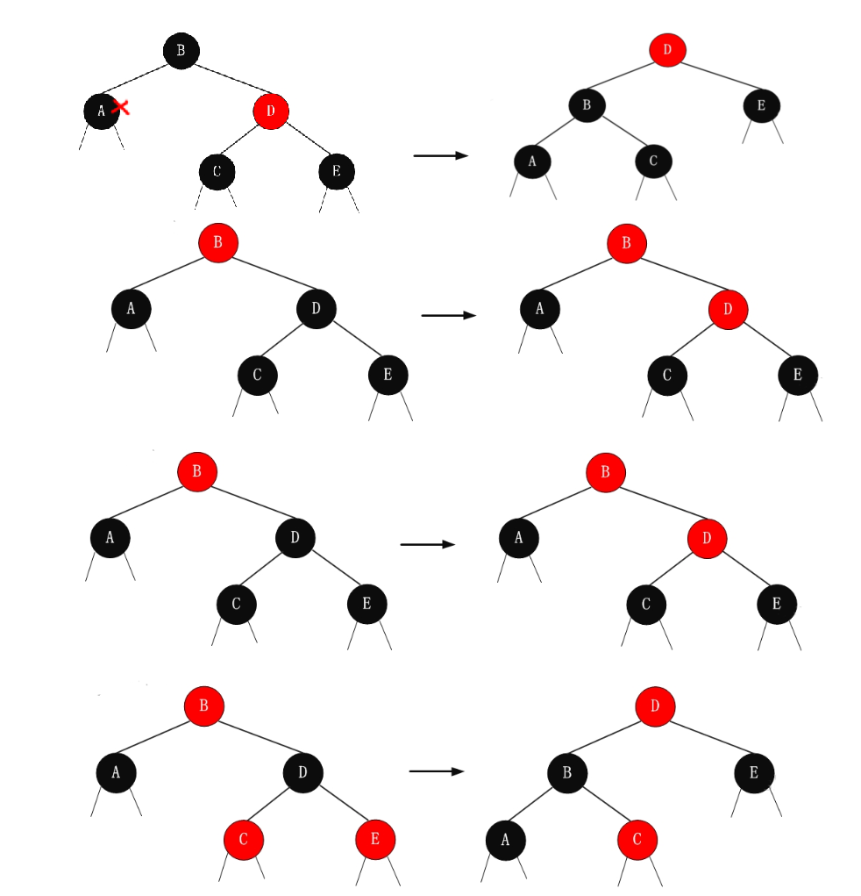
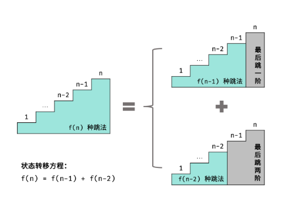

# 数据与算法绪论

本部分主要解决以下几个问题：

+ 什么是数据结构？
+ 什么是算法？如何进行算法分析？
+ 数据结构和算法之间具有怎样的关系？

## 数据结构

### 什么是数据

+ 数据(data)是描述客观事物且能被计算加工处理的数值、字符等符号的总称。

+ 数据元素(data element)是数据的基本单位，是数据集合中的一个个体。在计算机程序中通常作为一个整体来考虑和处理。它可以由一个或多个数据项data item组成(据此数据元素分为原子元素和结构元素) 。数据项是数据的最小单位，是”不可再分的”。
+ 数据对象(data object)是性质相同的数据元素的集合，它是数据的一个子集。

### 什么是数据结构

数据结构是相互之间存在一种或多种特定关系的数据元素的集合。数据结构是一个二元组[^1]，记为: **$\textcolor{red}{data\_structure=(D,S)}$**

+ D为数据元素的集合
+ S是D上关系的集合。 

数据元素相互之间的关系称为结构(structure)

 [^1]二元组是数学中的一个概念，表示由两个元素组成的有序对。它是集合论和数理逻辑中的基本概念，常用于描述和表示两个对象之间的关系或组合。

数据结构包括数据元素的逻辑结构、存储结构和相适应的数据运算三个方面的内容。

#### 逻辑结构

是指数据之间的逻辑关系。它与计算机无关，一般概念的数据结构是指数据的逻辑结构。
数据的逻辑结构通常有以下四种：

+ 集合结构：数据元素彼此之间 没有直接关系，只有“属于同  一集合”的联系。
+ 线性结构：数据元素之间存在一对一的关系。
+ 树形结构：数据元素之间存在一对多的关系。
+ 图状结构或网状结构：数据元素之间存在多对多的关系。


#### 存储结构

指数据元素及其关系在计算机存储器中的表示（映像）。其主要内容是指在存储空间中使用一个存储结点来存储一个数据元素；在存储空间中建立各存储结点的关联来表示数据元素之间的逻辑关系。

数据的存储结构有以下4种基本方式:

+ 顺序存储：所有的存储结点相继存储在连续的存储区内。用存储结点间的位置关系表示数据元素之间的逻辑关系。
+ 链式存储：每一个存储结点不仅含一个数据元素，还包括指针。每一个指针指向一个与本结点有逻辑关系的结点，即用指针表示逻辑关系。
+ 索引存储：通常用于存储线性结构时，另附设索引表，索引表项的一般形式(关键字,地址)，用于指示一个数据元素或一部分数据元素。
+ 散列存储：数据元素按散列(Hash)函数确定存储位置。

一种逻辑结构可映象成不同的存储结构：顺序存储结构和非顺序存储结构。

#### 数据运算

数据运算指在数据逻辑结构上定义的一组数据被使用的方式，其具体实现要在存储结构上进行。

常用的基本运算：

+ 建立数据结构：使一个数据结构可用并将其初始化。
+ 检索数据元素：从结构中找出满足某种条件的元素。
+ 插入数据元素：在结构中的某个指定位置增加一个元素。
+ 删除数据元素：撤消结构中指定位置的元素。
+ 更新数据元素：修改结构中某指定位置元素的内容。
+ 求长：计算结构中的数据元素个数。
+ 读取运算 ：读出结构中指定位置元素的内容。
+ 排序运算：使结构中的元素递增或递减有序。

### 什么是数据类型

数据类型(data type)是一个值的集合和定义在此集合上的一组操作。

抽象数据类型(abstract data type)数据类型概念的引伸。指一个数学模型以及在其上定义的操作集合。其特点在于将它的使用和实现分离，提高软件复用程度。抽象数据类型可以用以下三元组表示：
**$\textcolor{red}{ADT=（D，R，P）}$**

下面是对三个元素的解释：

+ D（Data）：ADT中的数据部分，它定义了数据对象的集合以及这些对象之间的关系。D描述了ADT中数据的抽象特性
  + 数据类型
  + 数据属性
  + 数据约束
  + ......

+ R（Relationship）：ADT中的关系部分，R描述了数据对象之间的关系和操作。R描述了数据对象之间的逻辑关联
  + 数据存取
  + 数据修改
  + 数据操作
  + ......

+ P（Property）：ADT中的操作部分，它定义了对数据对象进行操作的属性和约束。P描述了对数据对象进行操作的规则和行为
  + 数据创建
  + 数据销毁
  + 数据查询
  + 数据修改
  + ......

数据结构-->容器：装数据的一种结构

封装容器相关操作(增删改查......)

## 算法

### 什么是算法

算法是指解决问题或执行任务的一系列明确步骤的有序集合。它是一个用来描述计算过程的精确而又抽象的指导方针。算法可以被看作是一种计算模型，它描述了如何在输入数据上进行一系列的操作，以产生所需的输出结果。

算法具有以下特点：

+ 明确性：算法必须具有明确的步骤，每个步骤都要清晰、精确地描述，不会产生歧义。算法的每个步骤都应该能够被理解和执行。

+ 有限性(有穷性)：算法必须在有限的时间内完成。即使在处理大规模数据时，算法也应该能够在有限的时间内终止。

+ 输入：算法接受输入数据，这些数据可以是预先定义的、用户提供的或通过其他方式获取的。输入数据是算法执行的基础。

+ 输出：算法产生输出结果，这些结果可以是计算得到的值、修改后的数据、打印的信息等，根据具体问题的要求而定。

+ 可行性：算法的每个步骤都应该是可行的，即每个步骤都可以在有限的时间和资源内执行。

## 算法分析

算法分析主要是指对算法效率的分析。算法效率包括两个方面：时间效率和空间效率。

+ 时间效率：指出了正在讨论的算法运行得有多快。
+ 空间效率：则关心算法需要的额外空间。

### 时间复杂度

#### 渐近时间复杂度

渐近时间复杂性是一种用来描述算法时间复杂度的分析方法，它关注算法在输入规模趋于无穷大时的增长趋势。它使用大O符号（O）来表示算法的渐近上界，即算法在最坏情况下的时间复杂度。

下面给出O的形式化定义：


这个定义可以解释为：对于足够大的输入规模n，函数f(n)的增长速度不会超过函数g(n)的增长速度乘以一个常数c。这里的常数c可以理解为一个界限，表示函数f(n)的增长速度在最坏情况下不会超过函数g(n)的增长速度的c倍。


例如下面代码：

```c
int main(void){
    
    int n;
    scanf("%d",n);
    
    for(int i=0;i<n;++i)
    {
        puts("鸡你太美");
    }
    
    return 0;
}
```

代码执行如下所示，运行的总时间为$$1+1+1+n+1+n+n+1=3n+5$$即O(3n+5)


在计算时间复杂度时我们会忽略时间中的常数，系数和除最高次项之外的其他项，因此上面代码执行所需的时间复杂度应该为O(n)，如果代码执行的时间为常数则时间复杂度为O(1)。

```c
//时间复杂度为O(1)
int main(void)
{
    puts("hello，数据结构和算法");
    return 0;
}
```

 

#### 常见渐近时间复杂度

| 常见阶      | 非正式术语叫法 |
| ----------- | -------------- |
| O(1)        | 常数阶         |
| O(n)        | 线性阶         |
| O(n^2)      | 平方阶         |
| O(log~2~n)  | 对数阶         |
| O(nlog~2~n) | 线性对数阶     |
| O(n^3^)     | 立方阶         |
| O(2^n^)     | 指数阶         |
| O(n!)       | 阶乘阶         |
| O(n^k^)     | K次方阶        |

常用的时间复杂度所耗费的时间从小到大依次是：

​       **O(1) < O(log~2~n) <O(n) < O(nlog~2~n) < O(n²) < O(n³) < O(2ⁿ) < O(n!) <O(nⁿ)**

#### 嵌套和并列

在分析算法的时间复杂度时，常见的情况是存在嵌套和并列的时间复杂度。

+ 时间复杂度的嵌套（Nested Time Complexity）：当一个算法中的某个操作（如循环、递归等）内部包含另一个操作时，将内外两个循环的时间复杂度相乘来得到总体的时间复杂度:**O(f(n) * g(n))**

+ 时间复杂度的并列（Parallel Time Complexity）：当一个算法的不同部分在同一层级并列执行时，它们的时间复杂度可以被认为是相互独立的:**O(max(f(n), g(n)))**

总结起来，嵌套相乘,并列取大。

#### 实例分析

```C
#include <stdio.h>
//O(1)
int constantTime(int n)
{
    int x = 5;
    int y = 10;
    int z = x + y;
    return z;
}
//O(n)
void linearTime(int n) 
{
    for (int i = 0; i < n; i++) 
    {
        printf("%d ", i);
    }
}
//O(logn)
void logarithmicTime(int n) 
{
    int i = 1;
    while (i < n) 
    {
        printf("%d ", i);
        i *= 2;
    }
}
//O(n^2)
void quadraticTime(int n)
{
    for (int i = 0; i < n; i++)
    {
        for (int j = 0; j < n; j++) 
        {
            printf("%d ", i + j);
        }
    }
}
//O(2^n)
int exponentialTime(int n) 
{
    if (n <= 1) 
    {
        return n;
    }
    else 
    {
        return exponentialTime(n - 1) + exponentialTime(n - 2);
    }
}
int main()
{
	return 0;
}
```

### 空间复杂度

空间复杂度是衡量算法在执行过程中所需的额外空间的度量。它表示算法所使用的额外空间随着输入规模的增长而变化的情况。空间复杂度计算规则基本跟时间复杂度类似，也使用大O渐进表示法。常见空间复杂度同上

影响空间复杂度的因素主要有以下三点:

+ 算法输入输出数据所占用的存储空间(函数参数)
+ 存储算法本身所占用的存储空间(算法书写长短)
+ 算法执行过程中临时占用的存储空间(额外使用内存)

#### 实例分析

```c++
#include <stdio.h>
//O(1)
void print() 
{
    printf("O(1)\n");
}
//O(n)
int sum_arr(int arr[],int n)
{
    int sum = 0;
    for (int i = 0; i < n; i++) 
    {
        sum += arr[i];
    }
    return sum;
}
//O(logn)
int binarySearch(int arr[], int low, int high, int target)
{
    if (low > high)
        return -1;
    int mid = (low + high) / 2;
    if (arr[mid] == target)
        return mid;
    else if (arr[mid] > target)
        return binarySearch(arr, low, mid - 1, target);
    else
        return binarySearch(arr, mid + 1, high, target);
}
//O(n^2)
void print_matrix(int **matrix,int rows,int cols)
{
    for (int i = 0; i < rows; i++)
    {
        for (int j = 0; j < cols; j++)
        {
            printf("%d", matrix[i][j]);
        }
        printf("\n");
    }
}
int main()
{
	return 0;
}
```

#### 排序算法的时间复杂度


# 数据结构之顺序表

## 线性表定义

线性表是n (n ≥ 0)个具有相同特性的数据元素的有限序列。记作：（a~1~, a~2~, …, a~i-1~, a~！~, a~i+1~, …, a~n~）

### 线性表相关概念

直接前驱元素：a~i-1~领先于a~i~, 称a~i-1~是a~i~的直接前驱元素

直接后继元素：a~i+1~是 a~i~ 的直接后继元素

前驱元素：a~1~, a~2~,…, a~i-1~均称为a~i~的前驱元素；

后继元素：a~i+1~, a~i+2~,…, a~n~均称为a~i~的后继元素

线性表的长度：线性表所含的数据元素个数 n 称为线性表的长度

空线性表：长度为零的线性表（即不包含任何数据元素的线性表）称为空线性表

位序：元素在顺序表的第几个位置

## 什么是顺序表

顺序表具有以下特点：

- 元素在内存中的物理地址是连续的，因此可以通过下标快速访问和修改元素。
- 元素的插入和删除操作比较耗时，需要移动其他元素的位置来保持顺序。
- 顺序表的大小固定，当容量不足时需要进行扩容操作。
- 支持随机访问，即可以通过下标直接访问任意位置的元素。

顺序表适用于元素数量固定且频繁进行随机访问的场景，例如需要高效地查找、修改或删除元素的情况。然而，如果需要频繁进行插入和删除操作，顺序表的性能会受到影响，此时链表等数据结构可能更合适。

## 顺序表基本操作

### 基本操作

+ 初始化操作:init_sqlist
+ 判空操作:empty_sqlist
+ 判满操作:is_full_sqlist
+ 求长度运算:size
+ 查找元素操作: search_sqlist
+ 插入元素操作: insert_sqlist
+ 删除元素操作: delete_sqlist
+ 修改元素操作: modify_sqlist

### 实现代码

```c++
//sqlist.h
#pragma once
#include <stdio.h>
#include <stdlib.h>
#include <stdbool.h>
#include <assert.h>

typedef int DataType;
//typedef struct SqList 
//{
//	DataType arr[100];
//	int count;
//};

typedef struct SqList 
{
	DataType* pMemory;		//内存
	int curSize;			//当前元素个数
	int maxSize;			//最大元素个数
}SqList;
//创建
SqList* create_sqlist();
//插入
void insert_sqlist(SqList* list, DataType data);
//通过序号做删除
void delete_sqlist(SqList* list, int index);
//通过元素作为参照删除
void delete_sqlist_(SqList* list, DataType data);
void delete_sqlist_all(SqList* list, DataType data);
//查找指定元素的序号
int search_sqlist(SqList* list, DataType data);

//遍历数据
void traverse_sqlist(SqList* list);
//万金油函数
bool empty_sqlist(SqList* list);
int size_sqlist(SqList* list);
//销毁函数
void destory_sqlist(SqList* list);

```

```c
//sqlist.c
#include "sqlist.h"
SqList* create_sqlist()
{
    SqList* list = (SqList*)malloc(sizeof(SqList));
    assert(list);
    list->curSize = 0;
    list->maxSize = 2;
    //内存申请
    list->pMemory = (DataType*)malloc(sizeof(DataType)*list->maxSize);
    assert(list->pMemory);
    return list;
}
void insert_sqlist(SqList* list, DataType data)
{
    assert(list);
    //数组实现任何结构，放进去需要考虑满的状态
    if (list->curSize == list->maxSize) 
    {
        //实现一个内存自动增长
        list->maxSize *= 2;
        DataType* temp = realloc(list->pMemory, list->maxSize * sizeof(DataType));
        assert(temp);
        list->pMemory = temp;
    }
    list->pMemory[list->curSize] = data;
    //顺序表的有序性
    //调整插入元素的位置
    for (int i = list->curSize; i > 0; i--) 
    {
        if (*(list->pMemory + i - 1) > *(list->pMemory + i)) 
        {
            //交换两个元素
            DataType temp = *(list->pMemory + i - 1);
            *(list->pMemory + i - 1) = *(list->pMemory + i);
            *(list->pMemory + i) = temp;
        }
        else 
        {
            break;
        }
    }
    list->curSize++;
}
void delete_sqlist(SqList* list, int index)
{
    assert(list);
    //一定要考虑序号的有效性
    if (index <= 0 && index > list->curSize) 
    {
        printf("序号无效!\n");
        return;
    }
    for (int i = index - 1; i < list->curSize - 1; i++) 
    {
        list->pMemory[i] = list->pMemory[i + 1];
    }
    list->curSize--;
}
void delete_sqlist_(SqList* list, DataType data)
{
    //用数据作为删除参照
    //考虑找没找到
    int pos = -1;
    for (int i = 0; i < list->curSize; i++) 
    {
        if (list->pMemory[i] == data) 
        {
            pos = i;
            break;
        }
    }
    if (pos == -1) 
    {
        printf("未找到相关数据，无法删除!\n");
        return;
    }
    for (int i = pos; i < list->curSize - 1; i++)
    {
        list->pMemory[i] = list->pMemory[i + 1];
    }
    list->curSize--;
}
void delete_sqlist_all(SqList* list, DataType data)
{
    for (int i = 0; i < list->curSize; )
    {
        if (list->pMemory[i] == data)
        {
            for (int j = i; j < list->curSize - 1; j++) 
            {
                list->pMemory[j] = list->pMemory[j + 1];
            }
            list->curSize--;
        }
        else 
        {
            i++;
        }
    }
}
int search_sqlist(SqList* list, DataType data)
{
    for (int i = 0; i < list->curSize; i++)
    {
        if (list->pMemory[i] == data)
        {
            return i;
        }
    }
    return -1;
}
void traverse_sqlist(SqList* list)
{
    //遍历数组
    for (int i = 0; i < list->curSize; i++) 
    {
        printf("%d\t", list->pMemory[i]);
    }
    printf("\n");
}
bool empty_sqlist(SqList* list)
{
    return list->curSize==0;
}
int size_sqlist(SqList* list)
{
    return list->curSize;
}
void destory_sqlist(SqList* list)
{
    free(list->pMemory);
    free(list);
}

```

```c
//sqlist_demo.c
#include "sqlist.h"
#include <time.h>
int main() 
{
	srand((unsigned int)time(NULL));
	SqList *list = create_sqlist();
	for (int i = 0; i < 10; i++) 
	{
		insert_sqlist(list, rand() % 4);
	}
	traverse_sqlist(list);
	delete_sqlist_all(list, 1);
	traverse_sqlist(list);
	destory_sqlist(list);
	list = NULL;
	return 0;
}//sqlist_test.c
#include "sqlist.h"
#include <time.h>

int main() 
{
	srand((unsigned int)time(NULL));
	sqlist* list = create_sqlist();
	for (int i = 0; i < 10; i++) 
	{
		insert_sqlist(list, rand() % 1000);
	}
	traverse_sqlist(list);
	delete_sqlist(list, 4);
	traverse_sqlist(list);
	free_sqlist(list);
	list = NULL;
	return 0;
}
```

## 顺表应用案例

顺序表是一种常见的数据结构，它可以用于许多应用场景，下面列举几个常见的应用：

+ 数组：顺序表可以用于实现数组，数组是一种常见的数据结构，它可以用于存储一组相同类型的数据。在顺序表中，数组的每个元素都存储在连续的内存空间中，可以通过下标来访问。

+ 多项式：顺序表可以用于实现多项式，多项式是一种常见的数学概念，它可以表示为一系列项的和，每个项包含一个系数和一个指数。在顺序表中，多项式的每个项可以存储在一个元素中，可以按照指数的大小顺序排列。

```c++
y=3x^4^+5x^3^-3x^2^+x+0;
y=4x^4^+2x^3^-4x^2^+x+0;	+
---------------------------------
y=7x^4^+7x^3^-7x^2^+2x+0;
```

+ 缓存：顺序表可以用于实现缓存，缓存是一种常见的技术，用于提高数据访问速度。在顺序表中，可以将最近访问的数据存储在前面的元素中，这样可以更快地访问最近使用的数据。

+ 排序：顺序表可以用于实现排序算法，排序是一种常见的算法，用于将数据按照一定的顺序排列。在顺序表中，可以使用不同的排序算法，如冒泡排序、插入排序、快速排序等。

+ 数据库：顺序表可以用于实现简单的数据库，数据库是一种常见的数据存储和管理系统，用于存储和管理大量数据。在顺序表中，可以将数据存储在不同的元素中，可以使用不同的算法来实现数据的查询、插入、删除等操作。

总的来说，顺序表是一种非常常见的数据结构，可以用于许多应用场景。在实际应用中，我们需要根据具体情况选择合适的数据结构和算法，以提高程序的效率和可维护性。

### 多项式加法

```c
//多项式加法
//大多数应用数据结构处理的是自定义类型数据
#include <stdio.h>
#include <stdlib.h>
#define MAX_LEN 100
typedef struct 
{
	int coef;		//系数
	int exp;		//指数
}Term;

typedef struct 
{
	Term terms[MAX_LEN];		//多项式数组
	int len;					//多项式的项数
}SqList;
void add(SqList A, SqList B, SqList* C) 
{
	//A和B 有序 
	//特殊的归并
	int i = 0, j = 0, k = 0;
	while (i < A.len && j < B.len)
	{
		if (A.terms[i].exp > B.terms[j].exp)
		{
			C->terms[k++] = A.terms[i++];
		}
		else if (A.terms[i].exp < B.terms[j].exp)
		{
			C->terms[k++] = B.terms[j++];
		}
		else 
		{
			C->terms[k].exp = A.terms[i].exp;
			C->terms[k++].coef = A.terms[i++].coef + B.terms[j++].coef;
		}
	}
	//剩下直接放进去
	while (i < A.len) 
	{
		C->terms[k++] = A.terms[i++];
	}
	while (j < B.len) 
	{
		C->terms[k++] = B.terms[j++];
	}
	C->len = k;
}
int main() 
{
	//y=3*x^2+5x+2
	SqList A = { {{3,2},{5,1},{2,0}} ,3 };
	//y=-1*x^3+4x^2+4
	SqList B = { {{-1,3},{4,2},{4,0}} ,3 };
	SqList C;		//存储最终多项式
	add(A, B, &C);
	for (int i = 0; i < C.len; i++) 
	{
		printf("%dx^%d ", C.terms[i].coef, C.terms[i].exp);
		if (i != C.len - 1) 
		{
			printf("+ ");
		}
	}
	return 0;
}

```

### 管理系统类

```c
//sqlist.h
#pragma once
#include <stdio.h>
#include <stdlib.h>
#include <stdbool.h>
#include <assert.h>
#include <string.h>
//1.增加一个数据封装的描述
typedef struct MM 
{
	char name[20];
	int age;
	int num;
}MM;
typedef struct MM DataType;
//typedef struct SqList 
//{
//	DataType arr[100];
//	int count;
//};

typedef struct SqList 
{
	DataType* pMemory;		//内存
	int curSize;			//当前元素个数
	int maxSize;			//最大元素个数
}SqList;
//创建
SqList* create_sqlist();
//插入
void insert_sqlist(SqList* list, DataType data);
//通过序号做删除
void delete_sqlist(SqList* list, int index);
//通过元素作为参照删除
//2.用数据作为参照的地方都要根据自己具体数据做修改
void delete_sqlist_(SqList* list, const char* name);
//查找指定元素的序号
//3.用数据作为参照的地方都要根据自己具体数据做修改
int search_sqlist(SqList* list, int age);
//遍历数据
//4.遍历数据需要剥洋葱
void traverse_sqlist(SqList* list);
//万金油函数
bool empty_sqlist(SqList* list);
int size_sqlist(SqList* list);
//销毁函数
void destory_sqlist(SqList* list);

```

```c
//sqlist.c
#include "sqlist.h"
SqList* create_sqlist()
{
    SqList* list = (SqList*)malloc(sizeof(SqList));
    assert(list);
    list->curSize = 0;
    list->maxSize = 2;
    //内存申请
    list->pMemory = (DataType*)malloc(sizeof(DataType)*list->maxSize);
    assert(list->pMemory);
    return list;
}
void insert_sqlist(SqList* list, DataType data)
{
    assert(list);
    //数组实现任何结构，放进去需要考虑满的状态
    if (list->curSize == list->maxSize) 
    {
        //实现一个内存自动增长
        list->maxSize *= 2;
        DataType* temp = realloc(list->pMemory, list->maxSize * sizeof(DataType));
        assert(temp);
        list->pMemory = temp;
    }
    list->pMemory[list->curSize] = data;
    //顺序表的有序性
    //调整插入元素的位置
    for (int i = list->curSize; i > 0; i--) 
    {
        //数据比较-->剥洋葱
        if ((list->pMemory + i - 1)->age > (list->pMemory + i)->age) 
        {
            //交换两个元素
            DataType temp = *(list->pMemory + i - 1);
            *(list->pMemory + i - 1) = *(list->pMemory + i);
            *(list->pMemory + i) = temp;
        }
        else 
        {
            break;
        }
    }
    list->curSize++;
}
void delete_sqlist(SqList* list, int index)
{
    assert(list);
    //一定要考虑序号的有效性
    if (index <= 0 && index > list->curSize) 
    {
        printf("序号无效!\n");
        return;
    }
    for (int i = index - 1; i < list->curSize - 1; i++) 
    {
        list->pMemory[i] = list->pMemory[i + 1];
    }
    list->curSize--;
}
void delete_sqlist_(SqList* list, const char* name)
{
    //用数据作为删除参照
    //考虑找没找到
    int pos = -1;
    for (int i = 0; i < list->curSize; i++) 
    {
        //数据比较，字符串需要字符串比较函数
        if (strcmp(list->pMemory[i].name,name)==0) 
        {
            pos = i;
            break;
        }
    }
    if (pos == -1) 
    {
        printf("未找到相关数据，无法删除!\n");
        return;
    }
    for (int i = pos; i < list->curSize - 1; i++)
    {
        list->pMemory[i] = list->pMemory[i + 1];
    }
    list->curSize--;
}
int search_sqlist(SqList* list, int age)
{
    for (int i = 0; i < list->curSize; i++)
    {
        //数据比较
        if (list->pMemory[i].age == age)
        {
            return i;
        }
    }
    return -1;
}
void traverse_sqlist(SqList* list)
{
    //遍历数组
    //数据抬头(表头)
    printf("姓名\t年龄\t编号\n");
    for (int i = 0; i < list->curSize; i++) 
    {
        //剥洋葱
        printf("%s\t%d\t%d\n", list->pMemory[i].name, list->pMemory[i].age, list->pMemory[i].num);
    }
    printf("\n");
}
bool empty_sqlist(SqList* list)
{
    return list->curSize==0;
}
int size_sqlist(SqList* list)
{
    return list->curSize;
}
void destory_sqlist(SqList* list)
{
    free(list->pMemory);
    free(list);
}
```

```c
//管理系统类案例.c
#include "sqlist.h"
int main() 
{
	SqList* list = create_sqlist();
	MM mm1 = { "小芳",18,1001 };
	MM mm2 = { "小妹",38,1002 };
	MM mm3 = { "小花",28,1002 };
	insert_sqlist(list, mm1);
	insert_sqlist(list, mm2);
	insert_sqlist(list, mm3);
	traverse_sqlist(list);
	delete_sqlist(list, 1);
	traverse_sqlist(list);
	delete_sqlist_(list, "小花");
	traverse_sqlist(list);
	return 0;
}
```

### 数据的泛化操作

```c
#include <stdio.h>
#include <stdlib.h>
#include <stdbool.h>
#include <assert.h>
//主题思路
//不直接存储数据
//采用存储多个数据地址去完成
//对于比较规则和遍历可以通过回调函数去完成
typedef struct SqList 
{
	void** pmemory;
	int curSize;
	int maxSize;
}SqList;

SqList* create_sqlist() 
{
	SqList* list = (SqList*)malloc(sizeof(SqList));
	assert(list);
	list->curSize = 0;
	list->maxSize = 2;
	list->pmemory = (void**)malloc(sizeof(void*) * list->maxSize);
	assert(list->pmemory);
	return list;
}
typedef bool (*Compare)(void* one, void* two);
void insert_sqlist(SqList* list,Compare func,void* data) 
{
	assert(list);
	assert(data);
	if (list->curSize == list->maxSize) 
	{
		list->maxSize *= 2;
		void** temp = realloc(list->pmemory, sizeof(void*) * list->maxSize);
		assert(temp);
		list->pmemory = temp;
	}
	list->pmemory[list->curSize] = data;
	for (int i = list->curSize; i > 0; i--) 
	{
		if (func(list->pmemory + i - 1, list->pmemory + i)) 
		{
			void* temp = *(list->pmemory + i - 1);
			*(list->pmemory + i - 1) = *(list->pmemory + i);
			*(list->pmemory + i) = temp;
		}
		else 
		{
			break;
		}
	}
	list->curSize++;
}
typedef void(*Output)(void *data);
void traverse_sqlist(SqList* list, Output func) 
{
	for (int i = 0; i < list->curSize; i++) 
	{
		func(list->pmemory[i]);
	}
}
bool compare_int(void* a, void* b) 
{
	return *(int*)a > *(int*)b;
}
void print_int(void* a) 
{
	printf("%d\n", *(int*)a);
}
void test_int() 
{
	int a = 1;
	int b = 2;
	int c = 3;
	SqList* list = create_sqlist();
	insert_sqlist(list, compare_int, &c);
	insert_sqlist(list,compare_int, &a);
	insert_sqlist(list, compare_int, &b);
	traverse_sqlist(list, print_int);
}
typedef struct MM 
{
	char name[20];
	int age;
	int num;
}MM;
bool compare_mm_age(void* one, void* two) 
{
	return ((MM*)one)->age > ((MM*)two)->age;
}
void print_mm(void* one) 
{
	MM* temp = (MM*)one;
	printf("%s\t%d\t%d\n", temp->name, temp->age, temp->num);
}
void test_mm() 
{
	MM mm1 = { "小芳",19,1001 };
	MM mm2 = { "小妹",29,1002 };
	MM mm3 = { "小花",22,1003 };
	SqList* list = create_sqlist();
	insert_sqlist(list, compare_mm_age, &mm1);
	insert_sqlist(list, compare_mm_age, &mm2);
	insert_sqlist(list, compare_mm_age, &mm3);
	traverse_sqlist(list, print_mm);
}
int main() 
{
	test_int();
	test_mm();
	return 0;
}

```

# 数据结构之链表

## 什么是链表

链表是一种常见的线性数据结构，它由一系列节点组成，每个节点包含两部分：数据域和指针域。数据域用于存储具体的数据，而指针域则用于指向下一个节点。

链表的特点如下：

- 链表中的节点在内存中可以随机分布，不要求连续存储。
- 每个节点通过指针将其与下一个节点连接起来，形成链式结构。
- 链表的头节点可以作为访问整个链表的入口。

根据指针的类型和指向的节点数目，链表可以分为多种类型，包括单向链表、双向链表和循环链表等。

链表相比于顺序表有以下优势：

- 插入和删除操作效率高，只需要修改指针的指向，不需要移动其他节点。
- 可以动态地分配内存空间，不需要事先定义容量。
- 适用于频繁插入和删除的场景。

然而，链表的缺点是访问元素的效率较低，需要从头节点开始遍历整个链表才能找到目标节点。此外，链表的存储空间会稍微多于顺序表，因为每个节点都需要额外的指针来连接其他节点。

## 链表的分类

链表可以根据指针的类型和指向的节点数目进行分类。以下是几种常见的链表有以下这些：

+ 有头链表: 固定表头节点
+ 无头链表:表头节点可改变
+ 单向链表: 一个寻址指针
+ 双向链表:两个寻址指针
+ 循环链表:首位连通

## 有头单链表

```c
#pragma once
#include <stdio.h>
#include <assert.h>
#include <stdlib.h>

typedef int DataType;

typedef struct SingleList 
{
	DataType data;
	struct SingleList* next;
}List;

//创建表头
List* create_list();
//创建链表
List* create_node(DataType data);
//插入
void push_back(List* list, DataType data);
void push_front(List* list, DataType data);
//指定位置通常用数据作为参照
void insert_list(List* list, DataType data, DataType posData);
//删除
void pop_back(List* list);
void pop_front(List* list);
void erase_list(List* list, DataType posData);
//遍历
void traverse_list(List* list);

//销毁链表
void destory_list(List* list);

```

```c++
#include "singleList.h"

List* create_list()
{
    //有表头链表就是创建表头--->创建结构体变量
    List* headNode = (List*)malloc(sizeof(List));
    assert(headNode);
    //有表头链表 表头数据域不存储数据
    headNode->next = NULL;
    return  headNode;
}

//提供一个加工场,让用户数据可以直接变成一个节点
//为插入做准备
List* create_node(DataType data)
{
    List* newNode = (List*)malloc(sizeof(List));
    assert(newNode);
    newNode->data = data;
    newNode->next = NULL;
    return newNode;
}

void push_back(List* list, DataType data)
{
    List* tailNode = list;
    //表尾节点的特点就是指针域是空的
    while (tailNode->next != NULL) 
    {
        tailNode = tailNode->next;
    }
    //找到了，创建节点，把表尾的next指向新节点即可
    //tailNode->next = create_node(data);
    //上面一行等效下面两行代码
    List* newNode = create_node(data);
    tailNode->next = newNode;
}
void push_front(List* list, DataType data)
{
    //插入先创建节点
    List* newNode = create_node(data);
    //新节点next指向原来表头的下一个节点
    newNode->next = list->next;
    //表头的next指向新节点
    list->next = newNode;
}
void insert_list(List* list, DataType data, DataType posData)
{
    List* preNode = list;               //在头的位置
    List* posNode = list->next;         //在头下一个节点
    //这里利用了&&短路效果，条件不能交换
    while (posNode != NULL && posNode->data != posData) 
    {
        preNode = posNode;              //前驱节点走到当前节点位置
        posNode = preNode->next;        //当前节点走到原来的下一个位置
        /*
            preNode=preNode->next;
            posNode=posNode->next;
        */
    }
    //分析查找结果
    if (posNode == NULL) 
    {
        printf("无法指定位置插入!\n");
        return;
    }
    else 
    {
        List* newNode = create_node(data);
        preNode->next = newNode;
        newNode->next = posNode;
    }
}
void pop_back(List* list)
{
    List* preNode = NULL;
    List* tailNode = list;
    while (tailNode->next != NULL) 
    {
        preNode = tailNode;
        tailNode = preNode->next;
    }
    //当preNode等于NULL(链表只有头节点),NULL没有next
    if (preNode != NULL) 
    {
        preNode->next = NULL;
        free(tailNode);
        tailNode = NULL;
    }
}
void pop_front(List* list)
{
    if (list == NULL || list->next == NULL) 
    {
        printf("链表为空无法删除!");
        return;
    }
    List* node = list->next;
    list->next = node->next;
    free(node);
    node = NULL;
}
void erase_list(List* list, DataType posData)
{
    List* preNode = list;               //在头的位置
    List* posNode = list->next;         //在头下一个节点
    //这里利用了&&短路效果，条件不能交换
    while (posNode != NULL && posNode->data != posData)
    {
        preNode = posNode;              //前驱节点走到当前节点位置
        posNode = preNode->next;        //当前节点走到原来的下一个位置
        /*
            preNode=preNode->next;
            posNode=posNode->next;
        */
    }
    if (posNode == NULL) 
    {
        printf("未找到，无法删除!\n");
    }
    else 
    {
        preNode->next = posNode->next;
        free(posNode);
        posNode = NULL;
    }
}
void traverse_list(List* list)
{
    //因为有头链表的表头没有存数据，所以从表头的下一个节点开始遍历
    List* pmove = list->next;
    while (pmove != NULL) 
    {
        printf("%d\t", pmove->data);
        pmove = pmove->next;
    }
    printf("\n");
}
void destory_list(List* list)
{
    List* node = list;
    while (node->next != NULL) 
    {
        pop_front(list);
        node = list;
    }
    free(list);
}

```

## 无头单链表

+ 再封装写法
+ 二级指针写法

```c
#include <stdio.h>
#include <stdlib.h>
#include <assert.h>
typedef struct Node 
{
	int data;
	struct Node* next;
}Node;
Node* create_node(int data) 
{
	Node* newNode = (Node*)malloc(sizeof(Node));
	assert(newNode);
	newNode->data = data;
	newNode->next = NULL;
	return newNode;
}
void push_front(Node** list, int data) 
{
	Node* newNode = create_node(data);
	newNode->next = *list;
	//函数里面修改实参的值(修改指针的指向),传入二级指针
	*list = newNode;
}
void push_back(Node** list, int data) 
{
	Node* newNode = create_node(data);
	Node* pmove = *list;
	//找表尾
	while (pmove != NULL && pmove->next != NULL) 
	{
		pmove = pmove->next;
	}
	if (pmove == NULL) 
	{
		*list = newNode;
	}
	else 
	{
		pmove->next = newNode;
	}
}
void traverse_list(Node* list) 
{
	Node* pmove = list;
	while (pmove != NULL) 
	{
		printf("%d\t", pmove->data);
		pmove = pmove->next;
	}
	printf("\n");
}
void pop_front(Node** list) 
{
	if (*list == NULL) 
	{
		printf("表为空无法删除!\n");
	}
	Node* nextNode = (*list)->next;
	free(*list);
	*list = nextNode;
}
void pop_back(Node** list) 
{
	if (*list == NULL)
	{
		printf("表为空无法删除!\n");
	}
	if ((*list)->next == NULL) 
	{
		pop_front(list);
	}
	else 
	{
		Node* preNode = *list;
		Node* curNode = *list;
		while (curNode->next != NULL) 
		{
			preNode = curNode;
			curNode = preNode->next;
		}
		free(curNode);
		curNode = NULL;
		preNode->next = NULL;
	}
}

void insert_list(Node** list, int data, int posData) 
{
	Node* preNode = *list;
	Node* curNode = *list;
	while (curNode != NULL && curNode->data != posData) 
	{
		preNode = curNode;
		curNode = preNode->next;
	}
	if (curNode == NULL) 
	{
		printf("未找到指定位置无法插入!\n");
	}
	else 
	{
		if (curNode == *list) 
		{
			push_front(list, data);
		}
		else
		{
			Node* newNode = create_node(data);
			preNode->next = newNode;
			newNode->next = curNode;
		}
	}
}
void erase_list(Node** list, int posData) 
{
	if (*list == NULL) 
	{
		printf("链表为空无法删除!");
	}
	else if ((*list)->data == posData) 
	{
		pop_front(list);
	}
	else 
	{
		Node* preNode = *list;
		Node* curNode = *list;
		while (curNode != NULL && curNode->data != posData) 
		{
			preNode = curNode;
			curNode = preNode->next;
		}
		if (curNode == NULL) 
		{
			printf("未找到指定位置无法删除!\n");
		}
		else 
		{
			preNode->next = curNode->next;
			free(curNode);
			curNode = NULL;
		}
	}
}
int main() 
{
	Node* list = NULL;
	push_front(&list, 999);
	push_front(&list,1);
	push_front(&list,2);
	push_front(&list,3);
	traverse_list(list);
	push_back(&list, 4);
	traverse_list(list);
	pop_front(&list);
	traverse_list(list);
	pop_back(&list);
	traverse_list(list);
	insert_list(&list, 888, 2);
	traverse_list(list);
	erase_list(&list, 888);
	traverse_list(list);
	return 0;
}
```

## 链表其他操作

+ 有序链表的构建
+ 链表归并
+ 链表的反转问题
+ 链表的冒泡排序

```c++
#include <stdio.h>
#include <stdlib.h>
#include <assert.h>
typedef struct Node 
{
	int data;
	struct Node* next;
}Node;

Node* create_list() 
{
	Node* headNode = (Node*)malloc(sizeof(Node));
	assert(headNode);
	headNode->next = NULL;
	return headNode;
}
Node* create_data(int data) 
{
	Node* newNode = (Node*)malloc(sizeof(Node));
	assert(newNode);
	newNode->data = data;
	newNode->next = NULL;
	return newNode;
}

void traverse_list(Node* list) 
{
	Node* pmove = list->next;
	while (pmove != NULL) 
	{
		printf("%d\t", pmove->data);
		pmove = pmove->next;
	}
	printf("\n");
}

//1.有序链表的构建
//找第一次大于插入元素的节点
//没找到说明插入元素是最大的，直接插入到链表末尾
void push_sort(Node* list, int data) 
{
	Node* newNode = create_data(data);
	Node* preNode = list;
	Node* curNode = list->next;
	while (curNode != NULL && curNode->data <= data) 
	{
		preNode = curNode;
		curNode = preNode->next;
	}
	if (curNode == NULL && preNode == list) 
	{
		list->next = newNode;
	}
	else if (curNode == NULL && preNode != list) 
	{
		preNode->next = newNode;
	}
	else 
	{
		preNode->next = newNode;
		newNode->next = curNode;
	}
}
//2.链表的反转算法
//2.1 笨方法:  遍历链表，在创建一个链表，把每个节点采用表头法插入就可以反转
// 1 2 3     1    2 1   3 2 1
//2.2 逻辑方式，直接反转
void reverse(Node* list)
{
	if (list == NULL || list->next == NULL || list->next->next == NULL)
	{
		return;
	}
	Node* preNode = NULL;
	Node* curNode = list->next;
	Node* surList = curNode->next;
	while (surList != NULL)
	{
		curNode->next = preNode;
		preNode = curNode;
		curNode = surList;
		surList = curNode->next;
	}
	curNode->next = preNode;
	list->next = curNode;
}
//3.链表的归并
//类似数组归并
//3.1 笨方法 --->一次遍历两个链表，采用有序链表构建插入节点，即可得到新的有序序列
//3.2 类似数组的归并算法
void mergeList(Node* result, Node* list1, Node* list2) 
{
	Node* first = list1->next;
	Node* second = list2->next;
	Node* tailNode = result;
	while (first != NULL && second != NULL) 
	{
		if (first->data < second->data) 
		{
			tailNode->next = first;
			tailNode = first;
			first = first->next;
		}
		else 
		{
			tailNode->next = second;
			tailNode = second;
			second = second->next;
		}
	}
	if (first != NULL) 
	{
		tailNode->next = first;
	}
	if (second != NULL) 
	{
		tailNode->next = second;
	}
}
//4.链表的冒泡排序
void bubble_sort(Node* list) 
{
	for (Node* first = list->next; first != NULL; first = first->next) 
	{
		for (Node* second = list->next; second != NULL; second = second->next) 
		{
			if (second->next!=NULL&&second->data > second->next->data)
			{
				int data = second->data;
				second->data = second->next->data;
				second->next->data = data;
			}
		}
	}
}
int main() 
{
	Node* list = create_list();
	push_sort(list, 1);
	push_sort(list, 8);
	push_sort(list, 2);
	push_sort(list, 7);
	traverse_list(list);
	reverse(list);
	traverse_list(list);
	bubble_sort(list);
	traverse_list(list);
	Node* result = create_list();
	Node* one = create_list();
	push_sort(one, 1);
	push_sort(one, 3);
	push_sort(one, 5);
	Node* two = create_list();
	push_sort(two, 2);
	push_sort(two, 4);
	push_sort(two, 6);
	push_sort(two, 8);
	mergeList(result, one, two);
	//原链表数据改变了
	//traverse_list(one);
	//traverse_list(two);
	traverse_list(result);
	return 0;
}
```

## 双向循环链表

双向循环链表（Doubly Circular Linked List）是一种数据结构，其中每个节点都包含两个指针，一个指向前一个节点，一个指向后一个节点。与普通链表不同的是，双向循环链表的最后一个节点的下一个指针指向头节点，而头节点的前一个指针指向最后一个节点，形成一个循环。双向循环链表常用的操作包括：

+ 初始化链表：创建一个空的双向循环链表。

+ 插入节点：在链表的指定位置插入一个新的节点。

+ 删除节点：从链表中删除指定位置的节点。
+ 遍历链表：按顺序遍历链表中的所有节点。
+ 查找节点：在链表中查找指定值的节点。


### 实现代码

```c++
#include <stdio.h>
#include <stdlib.h>
#include <assert.h>
typedef struct Node
{
	int data;
	struct Node* front;
	struct Node* tail;
}NODE, * LPNODE, * LPDLIST;
LPDLIST createList()
{
	LPDLIST  headNode = (LPDLIST)malloc(sizeof(NODE));
	assert(headNode);
	headNode->front = headNode;
	headNode->tail = headNode;
	return headNode;
}
LPNODE createNode(int data)
{
	LPNODE newNode = (LPDLIST)malloc(sizeof(NODE));
	assert(newNode);
	newNode->front = NULL;
	newNode->tail = NULL;
	newNode->data = data;
	return newNode;
}
void push_front(LPDLIST headNode, int data)
{
	LPNODE newNode = createNode(data);
	//headNode->tail不可能为空
	headNode->tail->front = newNode;
	newNode->front = headNode;
	newNode->tail = headNode->tail;
	headNode->tail = newNode;
}
void push_back(LPDLIST headNode, int data)
{
	LPNODE newNode = createNode(data);
	headNode->front->tail = newNode;
	newNode->tail = headNode;
	newNode->front = headNode->front;
	headNode->front = newNode;
}
void push_appoin(LPDLIST headNode, int  posData, int data)
{
	LPNODE preNode = headNode;
	LPNODE curNode = headNode->tail;
	while (curNode != headNode && curNode->data != posData)
	{
		preNode = curNode;
		curNode = preNode->tail;
	}
	if (curNode == headNode)
	{
		printf("未找到指定位置，无法插入！\n");
	}
	else
	{
		LPNODE newNode = createNode(data);
		preNode->tail = newNode;
		newNode->front = preNode;
		newNode->tail = curNode;
		curNode->front = newNode;
	}
}
void pop_front(LPDLIST headNode)
{
	if (headNode == NULL || headNode->front == headNode)
	{
		printf("链表为空无法删除!\n");
	}
	else
	{
		LPNODE nextNode = headNode->tail;
		headNode->tail = nextNode->tail;
		nextNode->tail->front = headNode;
		free(nextNode);
	}
}
void pop_back(LPDLIST headNode)
{
	if (headNode == NULL || headNode->front == headNode)
	{
		printf("链表为空无法删除!\n");
	}
	else
	{
		LPNODE backNode = headNode->front;
		backNode->front->tail = headNode;
		headNode->front = backNode->front;
		free(backNode);
		backNode = NULL;
	}
}
//指定位置删除
void printByTail(LPDLIST headNode)
{
	LPNODE pmove = headNode->tail;
	while (pmove != headNode)
	{
		printf("%d\t", pmove->data);
		pmove = pmove->tail;
	}
	printf("\n");
}
void printByFront(LPDLIST headNode)
{
	LPNODE  pmove = headNode->front;
	while (pmove != headNode)
	{
		printf("%d\t", pmove->data);
		pmove = pmove->front;
	}
	printf("\n");
}
int main()
{
	LPDLIST list = createList();
	push_front(list, 1);
	push_front(list, 2);
	printByTail(list);
	printByFront(list);
	push_back(list, 888);
	printByTail(list);		// 2 1 888
	printByFront(list);
	push_appoin(list, 888, 666);
	printByTail(list);		// 2 1 888
	printByFront(list);
	push_appoin(list, 2, 999);
	printByTail(list);		// 2 1 888
	//printByFront(list);
	printf("pop_front.....\n");
	pop_front(list);
	printByTail(list);		// 2 1 888
	printByFront(list);
	printf("pop_back.....\n");
	pop_back(list);
	printByTail(list);		// 2 1 888
	printByFront(list);
	return 0;
}
```

### 约瑟夫环问题

约瑟夫环问题（Josephus Problem）是一个经典的数学问题，描述了以下情境：有n个人围成一圈，从第一个人开始报数，报到某个数字m的人将被淘汰出局，然后从下一个人重新开始报数，直到最后只剩下一个人。问题是找出最后留下的那个人在初始序列中的位置。解决约瑟夫环问题的一种常用方法是使用循环链表。可以按照以下步骤进行求解：

+ 创建一个含有n个节点的循环链表，节点的值分别为1到n，按顺序排列。

+ 从第一个节点开始，依次数m个节点，将第m个节点删除（从链表中断开）。

+ 从被删除节点的下一个节点重新开始，回到步骤2，直到只剩下一个节点为止。

最后留下的节点即为最后的胜者。

```C
#include <stdio.h>
#include <stdlib.h>
#include <assert.h>
struct Node {
    int data;
    struct Node* next;
    struct Node* prev;
};

struct CircularLinkedList 
{
    struct Node* head;
};

struct Node* createNode(int data) {
    struct Node* newNode = (struct Node*)malloc(sizeof(struct Node));
    assert(newNode);
    newNode->data = data;
    newNode->next = newNode;
    newNode->prev = newNode;
    return newNode;
}

void addNode(struct CircularLinkedList* list, int data) 
{
    struct Node* newNode = createNode(data);
    if (list->head == NULL)
    {
        list->head = newNode;
    }
    else 
    {
        struct Node* lastNode = list->head->prev;
        lastNode->next = newNode;
        newNode->prev = lastNode;
        newNode->next = list->head;
        list->head->prev = newNode;
    }
}

void removeNode(struct CircularLinkedList* list, struct Node* node) 
{
    if (node->next == node)
    {
        list->head = NULL;
        free(node);
    }
    else 
    {
        node->prev->next = node->next;
        node->next->prev = node->prev;
        if (list->head == node) 
        {
            list->head = node->next;
        }
        free(node);
    }
}

void joseph_circle(int n, int m)
{
    if (n <= 0 || m <= 0) {
        printf("Invalid input\n");
        return;
    }

    struct CircularLinkedList circle;
    circle.head = NULL;

    for (int i = 1; i <= n; i++) {
        addNode(&circle, i);
    }

    struct Node* current = circle.head;
    while (n > 1) {
        for (int i = 0; i < m - 1; i++) 
        {
            current = current->next;
        }
        struct Node* nextNode = current->next;
        removeNode(&circle, current);
        current = nextNode;
        n--;
    }

    printf("The winning position is: %d\n", circle.head->data);
}

int main() {
    int n = 10; // 一共10个人
    int m = 4;  // 报数为4的人出列
    joseph_circle(n, m);

    return 0;
}

```

# 数据结构之广义表

## 什么是广义表

### 广义表定义

广义表是线性表的推广，也被称为列表（lists),广义表一般记作：
**LS=（a~1~，a~2~，a~3~，…，a~n~）**
LS是表的名称，n是表的长度。在线性表的定义中，a~i~  (1<=i<=n）只能限于单个元素，但是在广义表中a~i~可以是 单个元素，也可以是广义表，分别称为广义表LS的**原子**和**子表**。 当广义表非空时，第一个元素（a~1~）被称为表头，其余元素（a~2~，a~3~，…，a ~n~）被称为子表。

### 广义表常用表示

+ **E=()：**E是一个空表，其长度为0。 
  + 广义表()和(())不同
    + 前者是长度为0的空表
    + 后者是长度为l的非空表(只不过该表中惟一的一个元素是空表)
+ **L=(a，b) ：**L是长度为2的广义表，它的两个元素都是原子，因此它是一个线性表
+ **A=(x，L)=(x，(a，b))：**A是长度为2的广义表，第一个元素是原子x，第二个元素是子表L。
+ **B=(A，y)=((x，(a，b))，y)：**B是长度为2的广义表，第一个元素是子表A，第二个元素是原子y。
+ **C=(A，B)=((x，(a，b))，((x，(a，b))，y))：**C的长度为2，两个元素都是子表。
+ **D=(a，D)=(a，(a，(a，(…))))：**D的长度为2，第一个元素是原子，第二个元素是D自身，展开后它是一个无限的广义表。

### 广义表图示


### 广义表的深度

一个表的"深度"是指表展开后所含括号的层数。

+ E=()：深度为1
+ L=(a，b) ：深度为1
+ A=(x，L)=(x，(a，b))：深度为2
+ B=(A，y)=((x，(a，b))，y)：深度为3
+ C=(A，B)=((x，(a，b))，((x，(a，b))，y))：深度为4
+ D=(a，D)=(a，(a，(a，(…))))：深度为∞


数据结构广义表" 通常指的是一种数据结构，用于表示多层次的、具有嵌套结构的数据。它也常被称为 "广义线性表" 或 "广义表"。广义表可以包含原子元素和其他广义表，因此它具有递归性质。

广义表常见作用：

+ **表示层次结构:** 如树形结构、图形结构、嵌套列表等。它能够清晰地表示数据之间的包含关系和组织结构。

+ **解析和处理复杂数据：** 如XML、JSON等方面，广义表可以发挥重要作用。它能够帮助程序理解并处理这些具有嵌套结构的数据。
+ **实现数据结构和算法：** 如树、图、堆栈、队列等。可以实现这些复杂的数据结构和算法，从而简化编程过程。
+ **应用于编程语言和数据库系统：** 如LISP、Scheme、MongoDB、ExistDB。这使得开发人员能够更轻松地处理和管理各种数据类型。
+ **处理自定义数据类型：** 广通过广义表，可以轻松地操作和处理自定义数据类型。

总的来说，广义表的作用在于提供一种灵活的数据结构，可以有效地表示和处理复杂的嵌套数据，从而简化程序设计和数据处理过程。

## 广义表实现

```c++
#include <stdio.h>
#include <stdlib.h>
#include <malloc.h>
#include <assert.h>
typedef char DatType;
/************************************************************************/
/*                      以下是关于广义表操作的4个简单算法               */
/************************************************************************/
typedef struct GeneralListsNode
{
    int tag;        /* 标志域：取0表示单元素结点；取1时表示子表结点 */
    union 
    {
        DatType data;
        struct GeneralListsNode* subList;
    };
    struct GeneralListsNode* next;        /* 指向后继结点的指针域 */
}GNode;

/* 1.求广义表的长度 */
int length_generalList(GNode* list) {
    int length = 0;
    if (list == NULL) 
    {
        return length;
    }
    if (list->tag == 0) 
    {
        return 1;
    }
    GNode* p = list->subList;
    while (p != NULL) 
    {
        length=length_generalList(p);
        p = p->next;
    }
    return length+1;
}
//求深度
int depth_generalList(GNode* list)
{
    int max_depth = 0;
    if (list == NULL) 
    {
        return max_depth;
    }
    if (list->tag == 0) 
    {
        return 0;
    }
    GNode* p = list->subList;
    while (p != NULL)
    {
        int depth = depth_generalList(p);
        if (depth > max_depth) {
            max_depth = depth;
        }
        p = p->next;
    }
    return max_depth + 1;  //加1表示当前节点也算一层
}


/* 3.建立广义表的存储结构 */
int create_generalList(GNode** list)//二级指针，以修改后继结点和子表的值</span><span style="color:#cc33cc;">
{
    char ch;/* 读入一个字符，此处可能读入'＃'，'（'，'）'，','或者英文字母 */
    scanf("%c", &ch);
    /* 若输入为＃，则置表头指针为空 */
    if (ch == '#')
    {
        *list = NULL;
    }
    /* 若输入左括号则建立由*gl所指向的子表结点并递归构造子表 */
    else if (ch == '(') 
    {
        *list =(GNode*)malloc(sizeof(GNode));
        assert(*list);
        (*list)->tag = 1;
        create_generalList(&((*list)->subList));
    }
    /* 若输入为字符则建立由*gl所指向的单元素结点 */
    else 
    {
        *list = (GNode*)malloc(sizeof(GNode));
        assert(*list);
        (*list)->tag = 0;
        (*list)->data = ch;
    }
    /* 此处读入的字符必为逗号或右括号或分号 */
    scanf("%c", &ch);
    /* 若*gl为空，则什么都不做 */
    if (*list == NULL) {
        ;
    }
    else if (ch == '\n') 
    {
        (*list)->next = NULL;
        return 0;
    }
    /* 若输入为逗号则递归构造后继表 */
    else if (ch == ',')
    {
        create_generalList(&((*list)->next));
    }
    /* 若输入为右括号或分号则置*gl的后继指针域为空 */
    else if ((ch == ')')) 
    {
        (*list)->next = NULL;
    }
    return 0;
}

/* 4.打印广义表 */
int traverse_generalList(GNode* list)
{
    /* 对于表结点的处理 */
    if (list->tag == 1)
    {
        /* 存在子表，先输出左括号 */
        printf("(");
        /* 若子表为空，则输出'#'字符 */
        if (list->subList == NULL)
        {
            printf("#");
        }
        /* 若子表非表，则递归输出子表 */
        else 
        {
            traverse_generalList(list->subList);
        }
        /* 当一个子表输出结束后，再输出右括号 */
        printf(")");
    }
    /* 对单元素结点，则输出该结点的值 */
    else 
    {
        printf("%c", list->data);
    }
    /* 输出该结点的后继表 */
    if (list->next != NULL) {
        /* 先输出逗号分隔 */
        printf(", ");
        /* 再递归输出后继表 */
        traverse_generalList(list->next);
    }
    return 0;
}
// 递归删除广义表中的指定数据
void erase_gneralList(GNode** list, int target)
{
    if (*list == NULL) {
        return; // 如果广义表为空，直接返回
    }

    if ((*list)->data == target)
    {
        //继续检查当前节点是否为目标数据，因为删除后当前节点已经改变
        GNode* temp = *list;
        *list = (*list)->next;
        free(temp);
        erase_gneralList(list, target);
    }
    else
    {
        if ((*list)->tag == 1)
        {
            erase_gneralList(&((*list)->subList), target); //递归处理子表
        }
        erase_gneralList(&((*list)->next), target); //继续处理下一个节点
    }
}

int main()
{
    GNode* list;
    printf("输入一个广义表， 以右括号结束 ");
    create_generalList(&list);
    printf("深度:%d\n", depth_generalList(list));
    printf("长度:%d\n", length_generalList(list));
    printf("输出广义表：");
    traverse_generalList(list);
    printf("\n");
    erase_gneralList(&list, 'a');
    traverse_generalList(list);
    erase_gneralList(&list, 'b');
    traverse_generalList(list);

    return 0;
}
```

# 数据结构之串

## 什么是串

### 串的定义

<font color=red size=5>串:</font>是一种特殊的线性表，它是由字符组成的，是由零个或多个字符组成的有限序列。一般记为:

<font color=blue size=25>S = "a~1~a~2~a~3~……a~n~" (n≥0)</font>
如：A= "BEIJING"， B= "JING"

### 串相关概念

+ <font color=red size=5>空串(null string)：</font>长度为零的串，它不包含任何字符。

+ <font color=red size=5>空格串(black string):</font>任由一个或多个空格组成的串，长度大于等于1

+ <font color=red size=5>子串(sub string):</font>串中任意个连续字符的组成的子序列称为该串的“子串”

+ <font color=red size=5>主串(master string):</font>包含子串的串相应的称为“主串”，因此子串是主串的一部分
+ <font color=red size=5>串长度:</font>当前字符串的元素个数，不包含字符串结束标记\0
+ <font color=red size=5>前缀:</font>除了最后一个字符以外，一个字符串的全部头部组合
+ <font color=red size=5>后缀:</font>除了第一个字符以外，一个字符串的全部尾部组合

## 串常见操作

串的操作不局限于插入、删除元素，而是各种查找，替换的操作，串的数据对象限制为**字符**，并且一般**以串作为整体**进行操作，主要有以下操作:

+ 创建串
+ 插入子串
+ 查找子串
  + BF匹配
  + KMP匹配
+ 删除串
  + 区间删除
  + 删除子串

+ 求串长度
+ 串连接
+ 串比较
+ 串拷贝

## 串的存储实现

```c
#include <stdio.h>
#include <assert.h>
#include <stdlib.h>
#include <time.h>
//#include <iostream>
//#include <chrono>
//using namespace std;
#define MAX  1024
typedef struct 
{
	char mem[MAX];
	int curSize;
	//int maxSize;
}string,*LPSTR;
LPSTR  createstring(const char* str) 
{
	LPSTR pstr = (LPSTR)malloc(sizeof(string));
	assert(pstr);
	for (int i = 0; i < MAX; i++) 
	{
		pstr->mem[i] = '\0';
	}
	int count = 0;
	while (str[count] != '\0') 
	{
		pstr->mem[count] = str[count];
		count++;
	}
	pstr->curSize = count;
	return pstr;
}
//串的插入
void insertstring(LPSTR pstr, const char* str, int len, int pos) 
{
	if (pos < 0 || pos >= MAX) 
	{
		printf("无效下标!\n");
		return;
	}
	if (pstr->curSize + len >= MAX) 
	{
		printf("太长，无法插入!\n");
		return;
	}
	if (pos > pstr->curSize) 
	{
		for (int i = 0; i < len; i++) 
		{
			pstr->mem[pstr->curSize++] = str[i];
		}
	}
	else 
	{
		//1.腾位置
		for (int i = pstr->curSize; i >= pos; i--) 
		{
			pstr->mem[len + i] = pstr->mem[i];
		}
		//2.插入新的字符串
		for (int i = 0; i < len; i++) 
		{
			pstr->mem[pos + i] = str[i];
		}
		pstr->curSize += len;
	}
}
void printstring(LPSTR pstr) 
{
	for (int i = 0; i < pstr->curSize; i++) 
	{
		putchar(pstr->mem[i]);
	}
	putchar('\n');
}
//串的删除
//只做区间删除(通过下标)
//匹配删除(BF+KMP)
void deletestring(LPSTR pstr, int start, int end)
{
	if (start > end || end > pstr->curSize || start <= 0) 
	{
		printf("区间有误!\n");
		return;
	}
	int count = end - start + 1;
	for (int i = end, j = start - 1; i < pstr->curSize; i++, j++) 
	{
		pstr->mem[j] = pstr->mem[i];
	}
	//伪删除，手动置0
	for (int i = pstr->curSize; i >= pstr->curSize - count; i--) 
	{
		pstr->mem[i] = '\0';
	}
	pstr->curSize -= count;
}
//串的连接
//串的拷贝
//串的比较
int main() 
{
	LPSTR str1 = createstring("string");
	insertstring(str1, "Love", 4, 3);
	printstring(str1);
	insertstring(str1, "Miss", 4, 13);
	printstring(str1);
	//strLoveingMiss;
	deletestring(str1, 4, 7);
	printstring(str1);
	return 0;
}
```

## BF算法

### 什么是BF算法

BF算法，即暴力(Brute Force)算法，是普通的模式匹配算法，BF算法的思想就是将目标串S的第一个字符与模式串T的第一个字符进行匹配，若相等，则继续比较S的第二个字符和 T的第二个字符；若不相等，则比较S的第二个字符和T的第一个字符，依次比较下去，直到得出最后的匹配结果。BF算法是一种蛮力算法。

### BF算法示图


### BF实现代码

```c
//BF算法
int BF(LPSTR pstr1, LPSTR pstr2) 
{
	int index = 0;	//记录序号，返回找到的位置
	int i = 0;
	int j = 0;
	while (pstr1->mem[i] != '\0' && pstr2->mem[j] != '\0') 
	{
		if (pstr1->mem[i] == pstr2->mem[j])  //相等往下比较
		{
			i++;
			j++;
		}
		else 
		{
			index++;			//记录的是要匹配到字符串的下标
			i = index;
			j = 0;				//不匹配还原位置
		}
	}
	if (pstr2->mem[j] == '\0')
	{
		return index;
	}
	return -1;
}
```

## KMP算法

### 什么是KMP算法

KMP算法是一种改进的字符串匹配算法，由D.E.Knuth，J.H.Morris和V.R.Pratt提出的，因此人们称它为克努特—莫里斯—普拉特操作（简称KMP算法）。KMP算法的核心是利用匹配失败后的信息，尽量减少模式串与主串的匹配次数以达到快速匹配的目的。

### 部分匹配表

KMP算法的核心是部分匹配表(Partial Match Table)的数组"就是"前缀"和"后缀"的最长的共有元素的长度。对于ABCDABD的部分匹配表如下:


求解过程：

| 子串    | 前缀                         | 后缀                       | 部分匹配值 |
| ------- | ---------------------------- | -------------------------- | ---------- |
| A       | 空集                         | 空集                       | 0          |
| AB      | A                            | B                          | 0          |
| ABC     | A,AB                         | C,BC                       | 0          |
| ABCD    | A,AB,ABC                     | D,CD,BCD                   | 0          |
| ABCDA   | A,AB,ABC,ABCD                | A,DA,CDA,BCDA              | 1          |
| ABCDAB  | A,AB,ABC,ABCD,ABCDA          | B,AB,DAB,CDAB,BCDAB        | 2          |
| ABCDABD | A，AB，ABC,ABCD,ABCDA,ABCDAB | D,BD,ABD,DABD,CDABD,BCDABD | 0          |


### KMP算法示意图

移动位数 = 已匹配的字符数 - 对应的部分匹配值


### KMP算法实现代码

```c
int KMP(LPSTR pstr1, LPSTR pstr2, int next[])
{
	getNext(pstr2, next);
	int i = 0;
	int j = 0;
	//ABCDABD
	while (i < pstr1->curSize && j < pstr2->curSize) 
	{
		if (j == -1 || pstr1->mem[i] == pstr2->mem[j]) 
		{
			i++;
			j++;
		}
		else 
		{
			j = next[j];
		}
	}
	if (j == pstr2->curSize) 
	{
		//chrono::high_resolution_clock::time_point end =
		//	chrono::high_resolution_clock::now();
		//auto dt = end - start;
		//cout << dt.count() << endl;
		return i - j;
	}
	return -1;
}
```

# 数据结构之栈

## 什么是栈

 栈是一种运算受限的线性表，它限定只能在表的一端进行插入和删除操作。栈的结构特性是：后进先出LIFO ( Last In First Out)。栈又被称为后进先出表。

<font color=red size=5>栈顶:</font>允许插入和删除的一端称作栈顶

<font color=red size=5>栈底:</font>不允许插入和删除的一端称作栈底

## 数组栈图示


a~1~是栈底元素, a~n~是栈顶元素，以如下顺序入栈：a~1~, a~2~, …, a~n~只能在栈顶进行插入和删除操作，第一个出栈的元素是a~n~。也就是说，后进栈的元素先出栈，先入栈的元素后出栈。

## 链式栈图示


链式栈就是链表的表头法插入+表头法删除的方式遍历，即可实现FILO效果

## 栈基本操作

+ 创建栈:create_stack
+ 入栈: push_stack
+ 出栈: pop_stack
+ 获取栈顶元素:top_stack
+ 栈是否为空:empty_stack
+ 栈元素个数: size_stack

## 数组栈实现代码

```C
#include "ArrayStack.h"
Stack* create_stack(int maxSize)
{
    Stack* pstack = (Stack*)malloc(sizeof(Stack));
    assert(pstack);
    pstack->maxSize = maxSize;
    pstack->top = -1;
    pstack->data = (DataType*)malloc(sizeof(DataType)*pstack->maxSize);
    return pstack;
}


void push_stack(Stack* pstack, DataType data)
{
    if (pstack == NULL)
        return;
    if (pstack->top + 1 == pstack->maxSize)
    {
        printf("栈满，无法入栈\n");
        return;
    }
    pstack->data[++pstack->top] = data;

}
void pop_stack(Stack* pstack)
{
    if (pstack == NULL || pstack->top == -1) 
    {
        printf("栈为空无法出栈\n");
        return;
    }
    pstack->top--;
}

DataType top_stack(Stack* pstack)
{
    return pstack->data[pstack->top];
}

int size_stack(Stack* pstack)
{
    return pstack->top+1;
}

bool empty_stack(Stack* pstack)
{
    return pstack->top==-1;
}

```

## 链式栈实现代码

```c
#include <stdio.h>
#include <stdlib.h>
#include <assert.h>
#include <stdbool.h>
typedef int DataType;
typedef struct Node 
{
	DataType data;
	struct Node* next;
}Node;
typedef struct 
{
	Node* stackTop;
	int curSize;
}Stack;
Node* create_node(int data)
{
    Node* newNode = (Node*)malloc(sizeof(Node));
    assert(newNode);
    newNode->data = data;
    newNode->next = NULL;
    return newNode;
}
Stack* create_stack(int maxSize) 
{
	Stack* stack = (Stack*)malloc(sizeof(Stack));
	assert(stack);
	stack->curSize = 0;
	stack->stackTop = NULL;
	return stack;
}
void push_stack(Stack* pstack, DataType data) 
{
	Node* newNode = create_node(data);
	if (pstack->curSize == 0) 
	{
		pstack->stackTop = newNode;
	}
	else 
	{
		//无表头链表的表头法插入
		newNode->next = pstack->stackTop;
		pstack->stackTop = newNode;
	}
	pstack->curSize++;
}
void pop_stack(Stack* pstack) 
{
	if (pstack == NULL || pstack->curSize == 0) 
	{
		printf("栈为空，无法出栈\n");
		return;
	}
	//表头的下一个节点(第二个节点)
	Node* nextNode = pstack->stackTop->next;
	free(pstack->stackTop);
	//第二个节点成为新的表头
	pstack->stackTop = nextNode;
	pstack->curSize--;
}
DataType top_stack(Stack* pstack) 
{
	return pstack->stackTop->data;
}
int size_stack(Stack* pstack) 
{
	return pstack->curSize;
}
bool empty_stack(Stack* pstack) 
{
	return pstack->curSize == 0;
}
```

## 栈应用案例

栈结构在计算机科学和软件工程中有许多应用。以下是一些常见的应用场景：

+ **函数调用**：计算机使用栈来跟踪函数的调用顺序。当一个函数被调用时，它的局部变量和参数被推入栈中，当函数执行完毕时，这些变量和参数被弹出栈。

+ **表达式求值**：栈可以用于解析和求值数学表达式，比如中缀表达式转换为后缀表达式，或者计算后缀表达式的值。

+ **内存管理**：栈用于管理内存中的变量和对象，比如在编程语言中，局部变量和函数参数通常存储在栈上。

+ **浏览器历史记录**：浏览器使用栈来跟踪用户的历史浏览记录，使得用户可以通过返回按钮回到之前访问的页面。

+ **撤销操作**：许多应用程序使用栈来实现撤销操作，用户执行的每个操作都被推入栈中，当用户执行撤销操作时，最近的操作被弹出栈。

+ **语法分析**：在编译器和解释器中，栈被用于跟踪语法分析和执行程序时的状态。

这些只是一些栈结构的应用示例，栈在计算机科学中有着广泛的应用。

### 表达式求值详解

#### 中缀表达式

我们把平时所用的标准四则运算表达式，即“9+(3-1)×3+10÷2”叫做**中缀表达式**。因为所有的运算符号都在两数字的中间。

#### 后缀表达式

后缀表达式也叫作逆波兰表达式，对于“9+(3-1)×3+10÷2”，如果要用后缀表示法应该是什么样子：“9 3 1-3*+10 2/+”，这样的表达式称为后缀表达式，叫后缀的原因在于所有的符号都是在要运算数字的后面出现。<font color=red size=5>后缀表达式如何求解表达式的值？</font>

- 遍历后缀表达式，如果遇到数字则直接入栈，如果遇到操作符，则弹出栈顶的两个元素，进行计算后将结果入栈。
- 最终，栈内剩余的元素就是整个表达式的计算结果。

**图示流程**


#### 中缀转后缀

**操作流程**

+ 如果栈顶元素的优先级大于等于当前操作符，则先将栈顶元素弹出并输出到后缀表达式中，再将当前操作符压入栈中。
+ 如果遇到了左括号，则直接将其压入栈中，如果遇到了右括号，则弹出栈中的元素，直到遇到了左括号为止，并将这些元素输出到后缀表达式中。
+ 最后，将栈中剩余的元素依次弹出，并输出到后缀表达式中。

**图示流程**


#### 代码实现

```c

```

# 数据结构之队列

## 什么是队列

队列(Queue)也是一种运算受限的线性表，它限定在表的一端进行插入操作，在表的另一端进行删除操作。队列的结构特性是：先进先出FIFO ( First In First Out)。队列又被称为先进先出表。

<font color=red size=5>队尾:</font>允许插入的一端称作队尾(Rear) 

<font color=red size=5>队首:</font>允许删除的一端称作队首(Front)

## 数组队列图示


队列为空的时候 队头front和队尾tail都是0的位置，入队的时候队尾tail往后移动，出队的时候front往队列tail靠拢

因为front的移动，导致数组队列存在<font size=5 color=red>伪溢出现象</font>。可以通过循环队列的方式解决伪溢出问题。


链式队列可以通过无表头链表记录头尾的方式实现，插入队列用表尾法插入，遍历表头法删除写法

## 队列基本操作

+ 创建队列:create_queue
+ 入队: push_queue
+ 出队: pop_queue
+ 获取队头元素:front_queue
+ 队列是否为空:empty_queue
+ 队列元素个数: size_queue

## 队列应用

具体来说，队列有以下几个用途：

+ 任务调度：队列可以用于任务调度，将任务按照它们被提交的顺序排队等待执行。

+ 消息传递：队列可以用于消息传递，例如在分布式系统中，可以使用队列来传递消息。

+ 广度优先搜索：队列可以用于实现广度优先搜索算法，其中队列用于存储待访问的节点。

+ 缓存：队列可以用于实现缓存，例如在计算机网络中，可以使用队列来缓存数据包等。

## 数组队列实现代码

```c
#include <stdio.h>
#include <stdlib.h>
#include <assert.h>
//抽象特征
typedef struct Queue
{
	int* qMem;
	int front;
	int tail;
	int curSize;			//万金油
	int maxSize;
}QUEUE,*LPQUEUE;
//创建
LPQUEUE createQueue(int max) 
{
	//描述结构的最初状态
	LPQUEUE queue = (LPQUEUE)malloc(sizeof(QUEUE));
	assert(queue);
	queue->maxSize = max;
	queue->qMem = (int*)malloc(sizeof(int) * max);
	assert(queue->qMem);
	queue->curSize = 0;
	queue->front = 0;
	queue->tail = 0;
	return queue;
}
//万金油
int  size(LPQUEUE queue)
{
	return queue->curSize;
}
int empty(LPQUEUE queue) 
{
	return queue->curSize == 0;
}
//入队和出队
void push(LPQUEUE queue, int data) 
{
	//用数组 放进去必须考虑满
	if (queue->curSize == queue->maxSize)  //伪溢出问题
	{
		printf("满了!\n");
		return;
	}
	queue->qMem[queue->tail++] = data;
	queue->curSize++;
}
int  front(LPQUEUE queue) 
{
	return queue->qMem[queue->front];
}
void pop(LPQUEUE queue) 
{
	if (queue->curSize == 0) 
	{
		printf("队列为空，无法出队\n");
		return;
	}
	queue->front++;
	queue->curSize--;
}
int main() 
{
	LPQUEUE queue = createQueue(10);
	for (int i = 0; i < 10; i++) 
	{
		push(queue, i);
	}
	printf("%d\t", front(queue));
	pop(queue);
	push(queue, 100);
	push(queue, 200);
	while (!empty(queue)) 
	{
		printf("%d\t", front(queue));
		pop(queue);
	}
	return 0;
}
```

```c
#include <stdio.h>
#include <assert.h>
#include <stdlib.h>
typedef struct Queue
{
	int* qMem;
	int front;
	int tail;
	int curSize;
	int maxSize;
}QUEUE,*LPQUEUE;
LPQUEUE createQueue(int maxSize)
{
	LPQUEUE queue = (LPQUEUE)malloc(sizeof(QUEUE));
	assert(queue);
	queue->maxSize = maxSize;
	queue->qMem = (int*)malloc(sizeof(int) * maxSize);
	queue->front = 0;
	queue->tail = 0;
	queue->curSize = 0;
	return queue;
}
//万金油
int  size(LPQUEUE queue) 
{
	return queue->curSize;
}
int empty(LPQUEUE queue) 
{
	return queue->curSize == 0;
}
//入队出队
void push(LPQUEUE queue, int data)
{
	if (queue->curSize == queue->maxSize) 
	{
		printf("队列满了，无法入队!\n");
		return;
	}
	queue->qMem[queue->tail] = data;
	queue->tail = (queue->tail + 1) % queue->maxSize;
	queue->curSize++;
}
int front(LPQUEUE queue) 
{
	return queue->qMem[queue->front];
}
void pop(LPQUEUE queue) 
{
	if (queue->curSize == 0)
	{
		printf("队列为空无法出队!\n");
		return;
	}
	queue->front = (queue->front + 1) % queue->maxSize;
	queue->curSize--;
}
int main() 
{
	LPQUEUE queue = createQueue(10);
	for (int i = 0; i < 10; i++)
	{
		push(queue, i);
	}
	pop(queue);		//0
	push(queue, 100);  //1-9-100
	while (!empty(queue))
	{
		printf("%d\t", front(queue));
		pop(queue);
	}
	return 0;
}
```

## 链式队列实现代码

```c
#include <stdio.h>
#include <stdlib.h>
#include <assert.h>
typedef struct Node 
{
	int data;
	struct Node* next;
}NODE,*LPNODE,*LIST;
LPNODE createNode(int data) 
{
	LPNODE newNode = (LPNODE)malloc(sizeof(NODE));
	assert(newNode);
	newNode->data = data;
	newNode->next = NULL;
	return newNode;
}

typedef struct Queue 
{
	int curSize;
	LPNODE frontNode;
	LPNODE tailNode;
}QUEUE,*LPQUEUE;
LPQUEUE createQueue() 
{
	LPQUEUE queue = (LPQUEUE)malloc(sizeof(QUEUE));
	assert(queue);
	queue->curSize = 0;
	queue->frontNode = NULL;
	queue->tailNode = NULL;
	return queue;
}
//万金油
int  size(LPQUEUE queue) 
{
	return queue->curSize;
}
int empty(LPQUEUE queue) 
{
	return queue->curSize == 0;
}
//入队和出队
void push(LPQUEUE queue, int data) 
{
	LPNODE newNode = createNode(data);
	//无头链表尾部插入
	if (queue->curSize == 0) 
	{
		queue->frontNode = newNode;
		//queue->tailNode = newNode;
		//queue->curSize++;
	}
	else 
	{
		queue->tailNode->next = newNode;
		//queue->tailNode = newNode;
		//queue->curSize++;
	}
	queue->tailNode = newNode;
	queue->curSize++;
}
int front(LPQUEUE queue)
{
	return queue->frontNode->data;
}
void pop(LPQUEUE queue) 
{
	//链表头删法
	if (queue == NULL || queue->curSize == 0) 
	{
		printf("队列为空，无法出队!\n");
		return;
	}
	struct Node* nextNode = queue->frontNode->next;
	free(queue->frontNode);
	queue->frontNode = nextNode;
	queue->curSize--;
}
int main() 
{
	LPQUEUE queue = createQueue(10);
	for (int i = 0; i < 10; i++)
	{
		push(queue, i);
	}
	while (!empty(queue))
	{
		printf("%d\t", front(queue));
		pop(queue);
	}
	return 0;
}

```

## 优先队列实现代码

```c
/*
	1.优先队列是按照优先权(自己设定的规则)出队的
*/
#include <stdio.h>
#include <stdlib.h>
#include <assert.h>
#include <string.h>
#define MAX 100
//数据
typedef struct Data 
{
	int priority;			//比较准则
	char name[20];			//数据本身
}DATA,*LPDATA,DARR[MAX];

typedef struct priQueue 
{
	int curSize;
	DARR qMem;
}PRIO,*LPPRIO;
//创建优先队列
LPPRIO createPriorityQueue() 
{
	LPPRIO queue = (LPPRIO)malloc(sizeof(PRIO));
	assert(queue);
	queue->curSize = 0;
	memset(queue->qMem, 0, sizeof(DATA) * MAX);
	return queue;
}
//万金油
int  size(LPPRIO queue)
{
	return queue->curSize;
}
int empty(LPPRIO queue) 
{
	return queue->curSize == 0;
}

void push(LPPRIO queue,DATA data) 
{
	if (queue->curSize == MAX) 
	{
		printf("队列满了，无法入队!\n");
	}
	else 
	{
		queue->qMem[queue->curSize++] = data;
	}
}
void pop(LPPRIO queue, DATA* data) 
{
	if (queue->curSize == 0) 
	{
		printf("队列为空，无法出队!\n");
	}
	else 
	{
		//最小原则--->贪心算法(堆)
		DATA minData = queue->qMem[0];
		int minIndex = 0;
		for (int i = 1; i < queue->curSize; i++) 
		{
			if (minData.priority > queue->qMem[i].priority) 
			{
				minData = queue->qMem[i];
				minIndex = i;
			}
		}
		//退出循环--->
		*data = minData;
		//删除-->数组的伪删除
		for (int i = minIndex; i < queue->curSize; i++) 
		{
			queue->qMem[i] = queue->qMem[i + 1];
		}
		queue->curSize--;
	}
}
int main() 
{
	LPPRIO queue = createPriorityQueue();
	DATA array[5] =
	{
		1,"张三",
		9,"李四",
		4,"小芳",
		3,"小丽",
		5,"王五",
	};
	for (int i = 0; i < 5; i++) 
	{
		push(queue, array[i]);
	}
	while (!empty(queue)) 
	{
		DATA temp;
		pop(queue, &temp);
		printf("%d:%s\n", temp.priority, temp.name);
	}
	return 0;
}
```

# 数据结构之哈希

## 什么是哈希

哈希结构（Hash Table）也被称为散列表，是一种用于实现字典（Dictionary）的数据结构。哈希结构将键（Key）映射到值（Value）的过程称为哈希（Hashing），哈希函数（Hash Function）用于将键映射到一个固定大小的数组（Hash Table），数组中的每个元素称为桶（Bucket），每个桶可以存储一个或多个键值对。哈希结构的主要优点是可以在常数时间内进行插入、查找和删除操作，因此在大多数情况下，哈希结构的操作效率非常高。

## 哈希构造函数

哈希构造函数（Hash Constructor）是哈希结构中的一种函数，用于将键（Key）映射到哈希表中的位置。哈希构造函数通常是一个确定性函数，即对于相同的键，哈希构造函数总是返回相同的哈希值。哈希构造函数的设计非常关键，它直接影响哈希结构的查找、插入和删除等操作的效率。

哈希构造函数的设计需要满足以下几个要求：

+ 一致性：对于相同的键，哈希构造函数应该总是返回相同的哈希值。

+ 均匀性：哈希构造函数应该尽可能均匀地将键映射到哈希表中的位置，以避免哈希冲突。

+ 高效性：哈希构造函数的计算时间应该尽可能短，以提高哈希结构的操作效率。

哈希构造函数的设计方法有很多种，常见的方法包括：

+ <font size=5 color=red>直接寻址法（Direct Addressing）：</font>将键直接作为哈希表中的位置，适用于键的范围比较小的情况。
+ <font size=5 color=red>除留余数法（Division Method）：</font>将键除以一个不大于哈希表大小的质数，然后取余数作为哈希值。
+ <font size=5 color=red>乘法哈希法（Multiplicative Hashing）：</font>将键乘以一个常数A（0<A<1），然后取乘积的小数部分乘以哈希表大小作为哈希值。
+ <font size=5 color=red>一次探测法（Linear Probing）：</font>当发生哈希冲突时，依次向后探测空桶，直到找到空桶或者遍历整个哈希表。
+ <font size=5 color=red>双重哈希法（Double Hashing）：</font>使用两个不同的哈希函数，当发生哈希冲突时，依次使用两个哈希函数计算出新的哈希值，直到找到空桶或者遍历整个哈希表。

选择合适的哈希构造函数需要考虑键的特点、哈希表的大小、哈希冲突的处理方法等因素，通常需要进行实验和分析来确定最优的哈希构造函数。

## 哈希冲突

哈希冲突（Hash Collision）指的是不同的键（Key）被哈希构造函数映射到了哈希表中的同一个位置，导致这些键在哈希表中发生了冲突。哈希冲突是哈希结构中的一个常见问题，如果不能很好地处理哈希冲突，就会导致哈希表的操作效率下降，甚至无法正常工作。

哈希冲突的发生是由于哈希构造函数的设计不够均匀，或者键的数量太多，而哈希表的大小又不够大。当哈希冲突发生时，需要采取一定的处理方法，以解决哈希冲突。常见的哈希冲突处理方法包括：

+ <font size=5 color=red>链表法（Chaining）：</font>将哈希表中的每个桶改为一个链表，当发生哈希冲突时，将新的键值对插入到链表的末尾。

+ <font size=5 color=red>开放地址法（Open Addressing）：</font>当发生哈希冲突时，依次向后探测空桶，直到找到空桶或者遍历整个哈希表。

+ <font size=5 color=red>再哈希法（Rehashing）：</font>当哈希冲突发生时，使用另一个哈希函数计算出新的哈希值，然后将键值对插入到新的哈希表中。

选择合适的哈希冲突处理方法需要考虑具体的应用场景和数据特点，通常需要进行实验和分析来确定最优的处理方法。

## 数组哈希图示

+ 数组存储
+ 取余法哈希函数
+ 开放地址法处理冲突


## 散列存储图示

+ 链表存储
+ 取余法哈希函数
+ 链表法处理冲突


## 数组哈希代码实现

```C
#include <stdio.h>
#include <stdlib.h>
#include <assert.h>
#include <stdbool.h>
#include <string.h>
typedef struct pair 
{
	int key;			//构架一个键对应数据 去求哈希地址
	char str[20];		//数据类型
}Data;

typedef struct HashTable 
{
	Data** table;
	int divisor;		//H(key)=key%p;
	int curSize;
}Hash;
//H(key) = key % p
Hash* create_hash(int p) 
{
	Hash* hash = (Hash*)malloc(sizeof(Hash));
	assert(hash);
	hash->divisor = p;
	hash->curSize = 0;
	hash->table = (Data**)malloc(sizeof(Data*) * hash->divisor);
	assert(hash);
	for (int i = 0; i < hash->divisor; i++) 
	{
		hash->table[i] = NULL;
	}
	return hash;
}
//获取到一个hash地址并且当前地址没有元素
int get_hash(Hash* hash, int key) 
{
	int pos = key % hash->divisor;
	int curPos = pos;
	do 
	{
		//key相同,数据做覆盖
		if (hash->table[curPos] == NULL || hash->table[curPos]->key == key) 
		{
			return curPos;
		}
		curPos = (curPos + 1) % hash->divisor;
	} while (pos != curPos);
	return curPos;
}
void insert_hash(Hash* hash, Data data) 
{
	int pos = get_hash(hash, data.key);
	if (hash->table[pos] == NULL) 
	{
		hash->table[pos] = (Data*)malloc(sizeof(Data));
		memcpy(hash->table[pos], &data, sizeof(Data));
		hash->curSize++;
	}
	else 
	{
		if (hash->table[pos]->key == data.key)
		{
			strcpy_s(hash->table[pos]->str,20, data.str);
		}
		else
		{
			printf("hash表满了，无法插入！");
			return;
		}
	}
}
void traverse_hash(Hash* hash) 
{
	for (int i = 0; i < hash->divisor; i++) 
	{
		if (hash->table[i] == NULL) 
		{
			printf("%d:NULL\n",i);
		}
		else 
		{
			printf("%d:[%d,%s]\n",i, hash->table[i]->key, hash->table[i]->str);
		}
	}
}
int main() 
{
	Hash* hash = create_hash(10);
	Data arr[7] = { 1,"帅气",11,"可爱",24,"呆萌",55,"baby",89,"莫影",99,"高富帅",4,"冲啊"};
	for (int i = 0; i < 7; i++) 
	{
		insert_hash(hash, arr[i]);
	}
	traverse_hash(hash);
	return 0;
}
```

## 散列哈希代码实现

```c
#include <stdio.h>
#include <stdlib.h>
#include <assert.h>
#include <string.h>
#include <stdbool.h>
//数据结构
typedef struct DataType
{
	int key;
	char str[20];
}Data;
//横向链表
typedef struct Node 
{
	Data data;
	struct Node* next;
}Node;
Node* create_node(Data data) 
{
	Node* newNode = (Node*)malloc(sizeof(Node));
	assert(newNode);
	newNode->data = data;
	newNode->next = NULL;
	return newNode;
}
//纵向链表
typedef struct SkipListNode
{
	Data data;
	Node* firstNode;
	struct SkipListNode* next;
}SNode;

SNode* create_skipnode(Data data) 
{
	SNode* newNode = (SNode*)malloc(sizeof(SNode));
	assert(newNode);
	newNode->data = data;
	newNode->firstNode = NULL;
	newNode->next = NULL;
	return newNode;
}
//hash结构
typedef struct HashTable 
{
	SNode* headNode;
	int curSize;
	int divisor;
}Hash;
//创建hash
Hash* create_hash(int divisor) 
{
	Hash* hash = (Hash*)malloc(sizeof(Hash));
	assert(hash);
	hash->curSize = 0;
	hash->divisor = divisor;
	hash->headNode = NULL;
	return hash;
}
void insert_hash(Hash* hash, Data data) 
{
	int dataHashPos = data.key % hash->divisor;
	SNode* newSKipNode = create_skipnode(data);
	if (hash->headNode == NULL) 
	{
		//表为空的处理
		hash->headNode = newSKipNode;
		hash->curSize++;
	}
	else 
	{
		//定义两个相邻的指针
		SNode* pmove = hash->headNode;
		SNode* premove = NULL;
		//1.当前插入元素是最小的，成为表头
		if (pmove->data.key % hash->divisor > dataHashPos) 
		{
			newSKipNode->next = hash->headNode;
			hash->headNode = newSKipNode;
			hash->curSize++;
		}
		else 
		{
			//找第一次大于等于插入元素的哈希地址的位置
			while (pmove != NULL && ((pmove->data.key % hash->divisor) < dataHashPos)) 
			{
				premove = pmove;
				pmove = premove->next;		
			}
			if (pmove != NULL && ((pmove->data.key % hash->divisor) == dataHashPos)) 
			{
				if (pmove->data.key == data.key) 
				{
					//相同键直接采用覆盖方式
					strcpy_s(pmove->data.str, 20, data.str);
				}
				else 
				{
					//横向链表
					Node* newNode = create_node(data);
					Node* ppmove = pmove->firstNode;
					if (ppmove == NULL) 
					{
						//横向链表为空的时候处理
						newNode->next = pmove->firstNode;
						pmove->firstNode = newNode;
						hash->curSize++;
					}
					else 
					{
						//横向链表存在相同键也采用覆盖方式
						while (ppmove != NULL && ppmove->data.key != data.key) 
						{
							ppmove = ppmove->next;
						}
						//分析退出循环的条件
						//没有相同的，直接表达头法插入
						if (ppmove == NULL) 
						{
							newNode->next = pmove->firstNode;
							pmove->firstNode = newNode;
							hash->curSize++;
						}
						else 
						{
							//键相同你可以不做覆盖操作
							//这里采用覆盖操作
							strcpy_s(ppmove->data.str, 20, data.str);
						}
					}
				}
			}
			else 
			{
				//不存在冲突
				premove->next = newSKipNode;
				newSKipNode->next = pmove;
				hash->curSize++;
			}
		}
	}
}
int size_hash(Hash* hash) 
{
	return hash->curSize;
}
bool empty_hash(Hash* hash) 
{
	return hash->curSize == 0;
}

void  traverse_hash(Hash* hash) 
{
	SNode* pmove = hash->headNode;
	while (pmove != NULL) 
	{
		printf("%d:%s\t\t", pmove->data.key, pmove->data.str);
		Node* ppmove = pmove->firstNode;
		while (ppmove != NULL) 
		{
			//打印的是横向链表ppmove
			printf("%d:%s\t\t", ppmove->data.key, ppmove->data.str);
			ppmove = ppmove->next;
		}
		printf("\n");
		pmove = pmove->next;
	}
}
int main() 
{
	Hash* hash = create_hash(10);
	Data arr[10] = { 1,"帅气",11,"可爱",24,"呆萌",55,"baby",89,"莫影",
		99,"高富帅",4,"冲啊",11,"Hittler",31,"...",0,"测试"};
	for (int i = 0; i < 10; i++)
	{
		insert_hash(hash, arr[i]);
	}
	traverse_hash(hash);
	return 0;
}
```

# 数据结构之二叉树存储与遍历

## 什么是二叉树

### 二叉树定义

二叉树是n (n≥0)个结点的有限集合。

+ 每个节点最多有两个子节点，分别称为左子节点和右子节点。
+ 左子节点和右子节点可以为空。
+ 二叉树的子树也是二叉树。

### 基本概念

- **节点的度**：一个节点含有的子树的个数称为该节点的度
- **叶节点**：度为0的节点称为叶节点。又称为终端节点
- **分支节点**：度不为0的节点，又称为非终端节点
- **父节点**：若一个节点含有子节点，则这个节点称为其子节点的父节点，又称为双亲结点
- **子节点**：一个节点含有的子树的根结点称为该节点的子节点，又称为孩子节点
- **兄弟节点**：具有相同父节点的节点互称为兄弟节点
- **树的度**：一棵树中，最大的节点的度称为树的度
- **节点的层次**：从根节点开始定义，根为第1层，根的子节点为第2层，以此类推
- **树的高度或深度**：树中节点的最大层次
- **堂兄弟节点**：双亲在同一层的节点互为堂兄弟
- **节点的祖先**：从根到该节点所经分支上的所有节点
- **子孙**：以某节点为根的子树中任一节点都称为该节点的子孙

### 基本形态


### 二叉树性质

#### 性质1

二叉树第k (k>=1)层上至多有2^k–1^个结点。

证明：（应用数学归纳法）

+ 当t=1时，第1层至多有1 = 2^1^-1个结点，命题成立。
+ 假设当t<=k-1时命令成立。
+ 当t=k时，因第k-1层结点的孩子所在的层为第k层，且二叉树中每个结点至多有两个孩子，故第k层上至多有2×2^k-1^ = 2^k^个结点。可见，当t = k时命题仍成立。
+ 综上所述可知，对于所有的k ≥ 1命题均成立，从而二叉树的性质1得证。

**思考题**

若二叉树具有第k层的结点，那么第k层结点数的取值范围是多少？<font size=5 color=red>[1, 2^k-1^] </font>

#### 性质2

高度为h (h>=0)的二叉树至多有<font size=5 color=red>2^h^ - 1</font>个结点

证明：
高度为h的二叉树共有h层结点，易知，当每一层均充满时，它的结点数达到最大。
由性质1可得，第1层至多有2^1-1^ = 20 = 1个结点，第2层至多有2^2-1^ = 2^1^个结点，…，第h层至多有2^h-1^个结点。故高度为h的二叉树至多有：<font size=5 color=red>$
2^0+2^1+...+2^{h-1}=\sum _{i=0}^{h-1}2^i=\frac {2^0-2*2^{h-1}} {1-2}= 2^{h}{-1}
$</font>个结点。
$$
2^0+2^1+...+2^{h-1}=\sum _{i=0}^{h-1}=\frac {2^0-2*2^{h-1}} {1-2}= 2^{h}{-1}
$$
**思考题**

高度为h的二叉树的结点数范围？

高度为h的二叉树共有h层，第k层节点数范围为<font size=5 color=red>[1, 2^k^-1] </font>，故可知，高度为h的二叉树至少具有：$\sum _{k=1}^{h} 1=h$个节点；高度为h的二叉树至多具有$\sum ^{h}_{k=1}2^{k-1}=2^0+2^1+...+2^{h-1}=2^h-1$
$$
\sum ^{h}_{k=1}2^{k-1}=2^0+2^1+...+2^{h-1}=2^h-1
$$

#### 性质3

设二叉树叶子结点数为n~0~，度为2的结点数为n~2~，则有：n~0~= n~2~+ 1。

证明：

假设二叉树T有n个结点，其中有n~0~个叶子结点，n~1~个度为1的结点，n~2~个度为2的结点，并假设分支数为t。

因为具有n个结点的二叉树中，除了根结点之外其余的结点有且仅有一个双亲，因此双亲关系个数为n - 1

即t = n - 1。

又因为n~0~个叶子结点共有0×n~0~条向下分支

n~1~个度为1的结点共有1×n~1~条向下分支

n~2~个度为2的结点共有2×n~2~条向下分支

因此有：t = 0 × n~0~ + 1 × n~1~ + 2 × n~2~。

综上可得：n - 1 = 0 × n~0~ + 1 × n~1~+ 2 × n~2~
二叉树的定义可知它只可能包含三类结点：度为0的结点、度为1的结点和度为2的结点

故得：n = n~0~ + n~1~ + n~2~
由上面的两个等式可得：n~0~+ n~1~ + n~2~-1 = 0 × n~0~ + 1 × n~1~ + 2 × n~2~ 化简得到n~0~= n~2~+ 1 性质3得证。

#### 性质4

结点数为n的完全二叉树的高度为：$\log_2{n}$+1或$\log_2{(n＋1)}$

证明：

假设完全二叉树的高度为h。则有不等式：2^h-1^ <= n <= 2^h^ - 1。
①去掉不等式右边的等号，有：2^h-1^ <= n < 2^h；
不等式两边同时取以2为底的对数，有：
h - 1<=$\log_2n$ < h；
故可得:$\log_2{n}$+1

②去掉不等式2^h-1^ <= n <= 2^h^ - 1左边的等号，有：
2^h-1^ - 1 < n<=2^h^ - 1 ==> 2^h-1^ < n + 1<=2^h^；
不等式两边同时取以2为底的对数，有：
h - 1 < $\log_2{(n＋1)}$ <=h；
故可得：$\log_2{(n＋1)}$

#### 性质五

给有n个结点的完全二叉树按层次编号，对于编号为i的结点：

+ 可计算i结点的双亲结点的编号 
  + 若i = 1，则无双亲
  + 否则双亲编号为 <font size=5 color=red>$\frac i 2$       </font>
+ 可计算i结点的左孩子结点的编号
  + 若2*i > n，则无左孩子
  + 否则其左孩子编号为2*i
+ 可计算i结点的右孩子结点的编号
  + 若2*i+1> n，则无右孩子
  + 否则其右孩子编号为2*i+1 

## 特殊二叉树

### 满二叉树

+ 深度为h且具有2^h^-1个结点的二叉树
+ 每一层都容纳了该层所能容纳的最大结点数结点的二叉树
+ 没有度数为1的结点，且叶子结点均分布在最大层的二叉树


**思考题**

深度为h的满二叉树

+ 结点总数为？    <font size=5 color=red>2^h^ - 1</font>
+  叶子结点数为？ <font size=5 color=red>2^h-1^</font>
+ 度为1的结点数为？<font size=5 color=red>0</font>
+  度为2的结点数为？<font size=5 color=red>2^h-1^-1 </font>

具有n个结点的满二叉树

+ 有多少个叶子？<font size=5 color=red>(n + 1) / 2</font>
+ 有多少个度为2的结点？<font size=5 color=red>(n - 1) / 2</font>

### 完全二叉树

+ 除去最大层是一棵满二叉树
+ 除去最大层是一棵满二叉树


完全二叉树的几个非常有趣的特点：

+ 除去最大层是一棵满二叉树
+ 最大层上的结点向左充满
+ 叶子只可能分布在最大层和次大层上。
+ 度为1的结点至多有1个。
+ 一棵满二叉树一定是一棵完全二叉树，而一棵完全二叉树不一定是一棵满二叉树。
+ 对于具有相同结点数的二叉树而言，完全二叉树的高度一定是其中最小的

**思考题**

高度为h的完全二叉树的结点范围？<font size=5 color=red>[ 2^k-1^, 2^k^-1] </font>

具有n个结点的完全二叉树有多少个叶子结点？有多少个度为1的结点？有多少个度为2的结点？

设有n~0~个叶子结点，n~1~个度为1的结点，n~2~个度为2的结点

根据题意有：n = n~0~ + n~1~ + n~2~根据二叉树的性质3有： n~0~ =  n~2~+ 1

综上得到:n = 2*n~0~-1 + n~1~

根据完全二叉树的特点可知： n~1~ =  0 或 1

+ 若n为偶数，可知n~1~必为1，则有：
  + n~0~ =  n / 2    
  + n~2~ =  (n / 2) - 1 

+ 若n为奇数，可知n1必为0，则有：
     +  n~0~ = (n + 1) / 2
     +  n~2~ =   (n - 1) / 2 

具有2010个结点的完全二叉树有2010/2 = 1005个叶子结点，1个度为1的结点，1004个度为2的结点。

具有5015个结点的完全二叉树有(5015 + 1)/2 = 2508个叶子结点，0个度为1的结点，2507个度为2的结点。

具有2010个结点的完全二叉树的高度是多少？$\log_2{2010}$+1或$\log_2{(2010＋1)}$  即高度为11

具有n个结点的二叉树的高度最小值为多少？高度最大值为多少？ <font size=5 color=red>[ $\log_2{n}$+1, n] </font>

+ 完全二叉树最小：$\log_2{n}$+1
+ 一层只有一个结点最大：n

## 存储与遍历实现

+ 简单存储

+ 递归遍历

+ 非递归遍历

```c
#include <stdio.h>
#include <stdlib.h>
#include <assert.h>
typedef struct Node 
{
	char data;				//顶点数据
	struct Node* LChild;	//左边的指针
	struct Node* RChild;	//右边的指针
}TREE,*LPTREE;
LPTREE createNode(char data) 
{
	LPTREE newNode = (LPTREE)malloc(sizeof(TREE));
	assert(newNode);
	newNode->data = data;
	newNode->LChild = NULL;
	newNode->RChild = NULL;
	return newNode;
}
//呆瓜式创建
void insertNode(LPTREE parent, LPTREE LChild, LPTREE RChild) 
{
	parent->LChild = LChild;
	parent->RChild = RChild;
}
//递归法打印
//1.前序 ： 根左右
void preOrder(LPTREE root) 
{
	if (root != NULL) 
	{
		printf("%c", root->data);
		preOrder(root->LChild);
		preOrder(root->RChild);
	}
}
//2.中序: 左根右
void midOrder(LPTREE root) 
{
	if (root != NULL) 
	{
		midOrder(root->LChild);
		printf("%c", root->data);
		midOrder(root->RChild);
	}
}
//3.后序: 左右根
void  lastOrder(LPTREE root) 
{
	if (root != NULL) 
	{
		lastOrder(root->LChild);
		lastOrder(root->RChild);
		printf("%c", root->data);
	}
}
//递归创建
void createTree(LPTREE* T)
{
	char userKey = 0;
	scanf_s("%c", &userKey, 1);
	//ABD##EG###C#FH###
	if (userKey == '#') 
	{
		*T = NULL;
	}
	else 
	{
		*T = (LPTREE)malloc(sizeof(TREE));
		assert(*T);
		(*T)->data = userKey;
		createTree(&(*T)->LChild);
		createTree(&(*T)->RChild);
	}
}
//非递归遍历
//1.层次遍历
void layerOrder(LPTREE root) 
{
	LPTREE pmove = root;
	//队列需要的
	LPTREE queue[1024];
	int front = 0;
	int tail = 0;
	queue[tail++] = pmove;
	printf("%c", pmove->data);
	while (front != tail)
	{
		pmove = queue[front++];		//出队
		if (pmove->LChild != NULL)
		{
			queue[tail++] = pmove->LChild;
			printf("%c", pmove->LChild->data);
		}
		if (pmove->RChild != NULL) 
		{
			queue[tail++] = pmove->RChild;
			printf("%c", pmove->RChild->data);
		}
	}
}
//非递归法先序
void preOrderByStack(LPTREE root) 
{
	if (root == NULL)
		return;
	LPTREE pmove = root;
	//栈
	LPTREE stack[1024];
	int stackTop = -1;

	while (stackTop != -1 || pmove) 
	{
		//先走左边,边走边打印
		while (pmove != NULL) 
		{
			printf("%c", pmove->data);
			stack[++stackTop] = pmove;
			pmove = pmove->LChild;
		}
		//退出循环，到达空的位置，出栈找右边
		if (stackTop != -1) 
		{
			pmove = stack[stackTop--];
			pmove = pmove->RChild;
		}
	}
}
void midOrderByStack(LPTREE root) 
{
	if (root == NULL)
		return;

	LPTREE pmove = root;
	//栈
	LPTREE stack[1024];
	int stackTop = -1;

	while (pmove != NULL || stackTop != -1) 
	{
		while (pmove) 
		{
			stack[++stackTop] = pmove;
			pmove = pmove->LChild;
		}
		if (stackTop != -1) 
		{
			pmove = stack[stackTop--];
			printf("%c", pmove->data);
			pmove = pmove->RChild;
		}
	}
}
void lastOrderByStack(LPTREE root) 
{
	if (root == NULL)
		return;

	LPTREE pmove = root;
	//栈
	LPTREE stack[1024];
	int stackTop = -1;
	//1.先走到最左边
	while (pmove) 
	{
		stack[++stackTop] = pmove;
		pmove = pmove->LChild;
	}
	LPTREE lastvisited = NULL;
	while (stackTop != -1) 
	{
		pmove = stack[stackTop--];
		if (pmove->RChild == NULL || pmove->RChild == lastvisited) 
		{
			printf("%c", pmove->data);
			lastvisited = pmove;
		}
		else 
		{
			stack[++stackTop] = pmove;
			pmove = pmove->RChild;
			while (pmove) 
			{
				stack[++stackTop] = pmove;
				pmove = pmove->LChild;
			}
		}
	}
}
int main() 
{
#if 1
	//创建二叉树
	LPTREE A = createNode('A');
	LPTREE B = createNode('B');
	LPTREE C = createNode('C');
	LPTREE D = createNode('D');
	LPTREE E = createNode('E');
	LPTREE F = createNode('F');
	LPTREE G = createNode('G');
	LPTREE H = createNode('H');
	insertNode(A, B, C);
	insertNode(B, D, E);
	insertNode(E, G, NULL);
	insertNode(C, NULL, F);
	insertNode(F, H, NULL);
#elif 0
	LPTREE A = NULL;
	createTree(&A);
#endif
	preOrder(A);
	printf("\n");
	preOrderByStack(A);
	printf("\n");

	midOrder(A);
	printf("\n");
	midOrderByStack(A);
	printf("\n");

	lastOrder(A);
	printf("\n");
	lastOrderByStack(A);
	printf("\n");
	layerOrder(A);
	printf("\n");
	return 0;
}
```

# 数据结构之堆

## 什么是堆

在计算机科学中，堆（Heap）是一种特殊的数据结构，它是一种完全二叉树（或者近似完全二叉树），并且满足堆属性。堆有两种常见的类型：最大堆（Max Heap）和最小堆（Min Heap）。最大堆中，父节点的值大于或等于其子节点的值，而最小堆中，父节点的值小于或等于其子节点的值。堆的主要特点是根节点（顶部节点）具有最大（或最小）值。这使得堆在很多应用中非常有用，例如优先队列和堆排序算法。

堆的实现可以使用数组或者链表来表示。在数组实现中，根节点存储在索引位置0，而子节点的索引位置可以通过简单的计算得到。在链表实现中，每个节点包含一个值和指向左右子节点的指针。需要注意的是，堆并不是排序的数据结构，它只保证了根节点的值是最大（或最小）的。如果需要对堆进行排序，可以使用堆排序算法。

堆在计算机科学中有很多应用，以下是一些常见的用途：

+ 优先队列：常用于任务调度、事件处理等场景。

+ 堆排序：堆排序是一种高效的排序算法。

+ 图算法：如Prim算法和Dijkstra算法。

+ 堆化数据结构：如哈希表、哈夫曼树、二叉搜索树等。

+ 操作系统：在动态内存分配。

+ 搜索算法：如A\*算法。

## 堆示图


## 向上渗透


## 向下渗透


## 堆实现代码

```C
#include <stdio.h>
#include <stdlib.h>
#include <assert.h>
#include <time.h>
typedef struct 
{
	int curSize;
	int* mem;
	int maxSize;
}HEAP,*LPHEAP;

LPHEAP createHeap(int maxSize)
{
	LPHEAP heap = (LPHEAP)malloc(sizeof(HEAP));
	assert(heap);
	heap->curSize = 0;
	heap->maxSize = maxSize;
	heap->mem = (int*)malloc(sizeof(int) * heap->maxSize);
	assert(heap->mem);
	return heap;
}
//万金油函数
int size(LPHEAP heap) 
{
	return heap->curSize;
}
int empty(LPHEAP heap) 
{
	return heap->curSize == 0;
}
//调整堆
void move(LPHEAP heap, int curPos) 
{
	while (curPos > 1) 
	{
		int max = heap->mem[curPos];
		//孩子节点/2=父节点
		int parentPos = curPos / 2;
		if (max > heap->mem[parentPos]) 
		{
			heap->mem[curPos] = heap->mem[parentPos];
			heap->mem[parentPos] = max;
			curPos = parentPos;
		}
		else 
		{
			break;
		}
	}
}
void insertHeap(LPHEAP heap, int data) 
{
	if (heap->curSize == heap->maxSize-1) 
	{
		return;
	}
	//存数据直接放在数组后面
	heap->mem[++heap->curSize] = data;  //heap->meme[0] 永远都用不到
	//大顶堆的要求: 父节点的值是大于孩子节点的值
	//向上渗透 调整堆
	move(heap, heap->curSize);
}
//有序性-->堆排序
int  popHeap(LPHEAP heap) 
{
	int max = heap->mem[1];			//第一个元素肯定是最大
	int curPos = 1;
	int childPos = curPos * 2;		
	while (childPos <= heap->curSize) 
	{
		int temp = heap->mem[childPos];
		//横向比较找最大值
		if (childPos + 1 <= heap->curSize && temp < heap->mem[childPos + 1]) 
		{
			temp = heap->mem[++childPos];		//往右边走
		}
		heap->mem[curPos] = temp;
		curPos = childPos;
		childPos *= 2;
	}
	heap->mem[curPos] = heap->mem[heap->curSize];
	move(heap, curPos);
	heap->curSize--;
	return max;
}
int main()
{
	srand((unsigned int)time(NULL));
	LPHEAP heap = createHeap(11);
	for (int i = 0; i < 11; i++) 
	{
		insertHeap(heap, rand() % 100);
	}
	printf("堆中数据:\n");
	for (int i = 1; i < 11; i++) 
	{
		printf("%d\t",heap->mem[i]);
	}
	printf("\n");
	printf("堆排序:\n");
	while (!empty(heap)) 
	{
		printf("%d\t", popHeap(heap));
	}
	printf("\n");
	return 0;
}
```

# 数据结构之其他树

## 二叉搜索树(BST)

### 什么是二叉搜索树

二叉搜索树（Binary Search Tree，BST）是一种特殊的二叉树数据结构，其中每个节点的值都大于其左子树中的任何节点的值，且小于其右子树中的任何节点的值。它的特点使得在搜索、插入和删除操作上具有高效性。

以下是一些关于二叉搜索树的重要特性：

+ 左子树中的所有节点的值都小于根节点的值。

+ 右子树中的所有节点的值都大于根节点的值。

+ 左右子树本身也是二叉搜索树。

由于这些特性，二叉搜索树可以用于高效地实现插入、搜索和删除操作。搜索操作可以在平均情况下以O(log n)的时间复杂度完成，其中n是树中节点的数量。然而，最坏情况下，树可能退化为链表，搜索操作的时间复杂度将变为O(n)。插入操作的时间复杂度与搜索操作类似，平均情况下为O(log n)，最坏情况下为O(n)。删除操作的时间复杂度也是O(log n)。二叉搜索树的应用非常广泛，例如在数据库中用于索引、实现有序集合等。然而，需要注意的是，如果树的平衡性较差，可能会导致性能下降。因此，有时需要采取一些平衡策略，如红黑树或AVL树，来确保树的平衡性。

### 二叉搜索树实现

```c
#include <stdio.h>
#include <stdlib.h>
#include <assert.h>
#include <string.h>

//二叉搜索树可以存储任何数据
typedef struct 
{
	int key;
	char value[20];
}DATA,*LPDATA;
typedef struct treeNode 
{
	DATA data;
	struct treeNode* LChild;
	struct treeNode* RChild;
}NODE,*LPNODE;

LPNODE createNode(DATA data) 
{
	LPNODE newNode = (LPNODE)malloc(sizeof(NODE));
	assert(newNode);
	newNode->data = data;
	newNode->LChild = NULL;
	newNode->RChild = NULL;
	return newNode;
}
typedef struct binarySearchTree 
{
	LPNODE root;
	int treeSize;
}BST,*LPBST;

LPBST createBST() 
{
	LPBST tree = (LPBST)malloc(sizeof(BST));
	assert(tree);
	tree->root = NULL;
	tree->treeSize = 0;
	return tree;
}
//万金油函数
int  size(LPBST tree) 
{
	return tree->treeSize;
}
int empty(LPBST tree) 
{
	return  tree==NULL?0:tree->treeSize == 0;
}
void insertNode(LPBST tree, DATA data) 
{
	LPNODE newNode = createNode(data);
	LPNODE pmove = tree->root;
	LPNODE prepmove = NULL;
	while (pmove != NULL)  //根不等于空 去查找
	{
		prepmove = pmove;
		if (pmove->data.key > data.key) 
		{
			pmove = pmove->LChild;
		}
		else if (pmove->data.key < data.key) 
		{
			pmove = pmove->RChild;
		}
		else 
		{
			//相等的关键词采用覆盖的方式
			strcpy_s(pmove->data.value, 20, data.value);
			return;
		}
	}
	//prepmove
	if (tree->root == NULL) 
	{
		tree->root = newNode;
	}
	else 
	{
		// 放在这个 prepmove 节点左边还是右边
		if (prepmove->data.key > data.key) 
		{
			prepmove->LChild = newNode;
		}
		else 
		{
			prepmove->RChild = newNode;
		}
	}
	tree->treeSize++;
}
void  printNode(LPNODE curNode) 
{
	printf("%d:%s\n", curNode->data.key, curNode->data.value);
}
void midOrder(LPNODE tree) 
{
	if (tree != NULL) 
	{
		midOrder(tree->LChild);
		printNode(tree);
		midOrder(tree->RChild);
	}
}
//二分查找
LPNODE searchBST(LPBST tree, int key) 
{
	LPNODE pmove = tree->root;
	while (pmove != NULL && pmove->data.key != key) 
	{
		if (pmove->data.key > key) 
		{
			pmove = pmove->LChild;
		}
		else 
		{
			pmove = pmove->RChild;
		}
	}
	return pmove;
}
//删除
void deleteNode(LPBST tree, int key)
{
	//No.1 查找删除节点， 以及删除的节点父节点
	LPNODE pmove = tree->root;
	if (pmove == NULL)
	{
		printf("树为空，无法删除!");
		return;
	}
	LPNODE pmoveparent = NULL;
	while (pmove != NULL && pmove->data.key != key)
	{
		pmoveparent = pmove;
		if (key < pmove->data.key)
		{
			pmove = pmove->LChild;
		}
		else if (key > pmove->data.key)
		{
			pmove = pmove->RChild;
		}
		else
		{
			break;
		}
	}
	//No.2
	//2.1 分析查找结果，做不同的删除
	if (pmove == NULL)
	{
		printf("没有找到指定位置无法删除\n");
		return;
	}
	//2.2 左右子树都健全的情况
	if (pmove->LChild != NULL && pmove->RChild != NULL) 
	{
		LPNODE moveNode = pmove->LChild;  //删除节点的左子树 拿最右边
		LPNODE moveNodeParent = pmove;
		//走到左子树的最右边
		while (moveNode->RChild != NULL) 
		{
			moveNodeParent = moveNode;
			moveNode = moveNode->RChild;
		}
		//创建的节点要替换删除节点功能
		//创建的节点数据是要调整的节点数据
		LPNODE newNode = createNode(moveNode->data);
		newNode->LChild = pmove->LChild;
		newNode->RChild = pmove->RChild;
		//分类讨论父节点是否存在，不存在说明删除节点是根节点
		if (pmoveparent == NULL) 
		{
			tree->root = newNode;
		}
		else if (pmove == pmoveparent->LChild) 
		{
			pmoveparent->LChild = newNode;
		}
		else 
		{
			pmoveparent->RChild = newNode;
		}
		//为了删除调整的节点，适当调整一下指针的位置
		if (moveNodeParent == pmove) 
		{
			pmoveparent = newNode;
		}
		else 
		{
			pmoveparent = moveNodeParent;
		}
		free(pmove);
		pmove = moveNode;
		//依旧用pmove和pmoveparent来做调整节点的删除
	}
	LPNODE sNode = NULL;
	if (pmove->LChild != NULL) 
	{
		sNode = pmove->LChild;
	}
	else 
	{
		sNode = pmove->RChild;
	}
	if (tree->root == pmove) 
	{
		tree->root = sNode;
	}
	else 
	{
		if (pmove == pmoveparent->LChild) 
		{
			pmoveparent->LChild = sNode;
		}
		else 
		{
			pmoveparent->RChild = sNode;
		}
	}
	free(pmove);
	tree->treeSize--;
}


int main() 
{
	LPBST tree = createBST();
	DATA data[8] = { 10,"张三",5,"李四",49,"王五",2,"小芳",
		18,"一直",89,"说",0,"烦不烦",22,"小花" };
	for (int i = 0; i < 8; i++) 
	{
		insertNode(tree, data[i]);
	}
	midOrder(tree->root);
	LPNODE result = searchBST(tree,18);
	printf("查找结果:");
	printNode(result);
	deleteNode(tree,49);
	printf("\n删除后的结果!.....\n");
	midOrder(tree->root);

	return 0;
}
```

## 平衡二叉搜索树(AVL)

### 什么是平衡二叉树

AVL是一种自平衡二叉搜索树（self-balancing binary search tree）的数据结构，它的名称来源于其发明者G.M. Adelson-Velsky和E.M. Landis。AVL树通过在每次插入或删除节点时进行旋转操作，来确保树的高度始终保持在一个较小的范围内，从而保持树的平衡性。

AVL树的平衡性是通过节点的高度差（即左子树高度和右子树高度之差）来衡量的。在一个平衡的AVL树中，任何节点的左子树和右子树的高度差不超过1。当插入或删除节点导致某个节点的平衡被打破时，AVL树会通过旋转操作来恢复平衡。AVL树的旋转操作分为四种类型：左旋、右旋、左右旋和右左旋。左旋和右旋用于处理节点的子树高度差为2的情况，而左右旋和右左旋用于处理节点的子树高度差为-2的情况。通过这些旋转操作，AVL树可以在插入或删除节点时保持平衡，并且可以在O(log n)的时间复杂度内进行插入、删除和查找操作。AVL树在许多应用中都有广泛的应用，特别是在需要高效的插入、删除和查找操作的场景中。它是一种重要的数据结构，被用于数据库、编译器、操作系统等领域。

### 旋转操作

<font size=5 color=red>LL型</font>


<font size=5 color=red>RR型</font>


<font size=5 color=red>LR型</font>


<font size=5 color=red>RL型</font>


### 构建示意图


https://www.cs.usfca.edu/~galles/visualization/

### 平衡二叉树实现

```c
#include <stdio.h>
#include <stdlib.h>
#include <assert.h>
#define HEIGHT(p) ((p==NULL)?-1:(p->height))
#define MAX(a,b) ((a)>(b)?(a):(b))
typedef struct 
{
	int key;
	char info[20];
}DATA,*LPDATA;

typedef struct AVLTreeNode 
{
	DATA data;
	int height;
	struct AVLTreeNode* LChild;
	struct AVLTreeNode* RChild;
}NODE,*LPNODE,*AVLTree;
//创建节点
LPNODE  createNode(DATA data) 
{
	LPNODE newNode = (LPNODE)malloc(sizeof(NODE));
	assert(newNode);
	newNode->data = data;
	newNode->height = 0;
	newNode->LChild = NULL;
	newNode->RChild = NULL;
	return newNode;
}
//打印当前节点中数据
void printCurNode(LPNODE curNode) 
{
	printf("%d:%s\t高度:%d\n", curNode->data.key, 
		curNode->data.info, curNode->height);
}
//前序遍历
void preOrder(AVLTree root) 
{
	if (root != NULL) 
	{
		printCurNode(root);
		preOrder(root->LChild);
		preOrder(root->RChild);
	}
}
//四种旋转操作
//LL:右旋
LPNODE LL_Rotation(LPNODE k2)
{
	//旋转
	LPNODE k1 = k2->LChild;
	k2->LChild = k1->RChild;
	k1->RChild = k2;

	//高度处理
	k2->height = MAX(HEIGHT(k2->LChild), HEIGHT(k2->RChild)) + 1;
	k1->height = MAX(HEIGHT(k1->LChild), k2->height) + 1;
	return k1;   //方便处理原来k2父节点的指针，因为现在k1替换k2的位置
}
//RR:左旋
LPNODE RR_Rotation(LPNODE k1) 
{
	LPNODE  k2=k1->RChild;
	k1->RChild = k2->LChild;
	k2->LChild = k1;

	k1->height = MAX(HEIGHT(k1->LChild), HEIGHT(k1->RChild)) + 1;
	k2->height = MAX(HEIGHT(k2->RChild), k1->height) + 1;
	return k2;
}
//LR:左旋+右旋
LPNODE LR_Rotation(LPNODE k3) 
{
	k3->LChild = RR_Rotation(k3->LChild);
	return LL_Rotation(k3);
}
//RL:右旋+左旋
LPNODE RL_Rotation(LPNODE k3) 
{
	k3->RChild = LL_Rotation(k3->RChild);
	return RR_Rotation(k3);
}
AVLTree insertNode(AVLTree tree, DATA data) 
{
	if (tree == NULL) 
	{
		tree = createNode(data);
	}
	else if (data.key < tree->data.key)   //插在左边
	{
		tree->LChild = insertNode(tree->LChild, data);
		//根据节点高度去调整
		if (HEIGHT(tree->LChild) - HEIGHT(tree->RChild) == 2)
		{
			if (data.key < tree->LChild->data.key)
			{
				tree = LL_Rotation(tree);
			}
			else 
			{
				tree = LR_Rotation(tree);
			}
		}
	}
	else if (data.key > tree->data.key)   //插在右边
	{
		tree->RChild = insertNode(tree->RChild, data);
		//根据节点高度去调整
		if (HEIGHT(tree->RChild) - HEIGHT(tree->LChild) == 2) 
		{
			if (data.key > tree->RChild->data.key) 
			{
				tree = RR_Rotation(tree);
			}
			else 
			{
				tree = RL_Rotation(tree);
			}
		}
	}
	else								  //相等采用覆盖方式
	{
		printf("关键字唯一!\n");
	}
	tree->height = MAX(HEIGHT(tree->LChild), HEIGHT(tree->RChild)) + 1;
	return tree;
}
//递归查找
LPNODE searchTree(AVLTree tree, int key) 
{
	if (tree == NULL || tree->data.key == key) 
	{
		return tree;
	}
	if (key < tree->data.key) 
	{
		return searchTree(tree->LChild, key);
	}
	else 
	{
		return searchTree(tree->RChild, key);
	}
}
//右边找最左边 找最小节点, 
LPNODE minKeyNode(LPNODE tree) 
{
	if (tree == NULL)
		return NULL;
	while (tree->LChild != NULL) 
	{
		tree = tree->LChild;
	}
	return tree;
}
//左边找最右边 找最大节点, 
LPNODE maxKeyNode(LPNODE tree) 
{
	if (tree == NULL)
		return NULL;
	while (tree->RChild != NULL)
		tree = tree->LChild;
	return tree;
		return NULL;
}
//删除
LPNODE deleteNode(AVLTree tree, int key)
{
	if (tree == NULL)
	{
		return NULL;
	}
	if (key < tree->data.key)
	{
		tree->LChild = deleteNode(tree->LChild, key);
		if (HEIGHT(tree->RChild) - HEIGHT(tree->LChild) == 2) 
		{
			LPNODE rightNode = tree->RChild;
			if (rightNode!=NULL&&HEIGHT(rightNode->LChild)>HEIGHT(rightNode->RChild))
			{
				tree = RL_Rotation(tree);
			}
			else 
			{
				tree = RR_Rotation(tree);
			}
		}

	}
	else if (key > tree->data.key)
	{
		tree->RChild = deleteNode(tree->RChild, key);
		if (HEIGHT(tree->LChild) - HEIGHT(tree->RChild) == 2) 
		{
			LPNODE leftNode = tree->LChild;
			if (leftNode!=NULL&&HEIGHT(leftNode->RChild) > HEIGHT(leftNode->LChild)) 
			{
				tree = LR_Rotation(tree);
			}
			else 
			{
				tree = LL_Rotation(tree);
			}
		}
	}
	else 
	{
		if (tree->LChild != NULL && tree->RChild != NULL) 
		{
			if (HEIGHT(tree->LChild) > HEIGHT(tree->RChild))   //当前节点是否存在左右子树
			{
				LPNODE max = maxKeyNode(tree->LChild);
				tree->data = max->data;
				tree->LChild = deleteNode(tree->LChild, max->data.key);
			}
			else 
			{
				LPNODE min = minKeyNode(tree->RChild);
				tree->data = min->data;
				tree->RChild = deleteNode(tree->RChild, min->data.key);
			}
		}
		else 
		{
			LPNODE temp = tree;
			tree = tree->LChild ? tree->LChild : tree->RChild;
			free(tree);
		}
	}
	return tree;
}

void layerOrder(LPNODE root)
{
	LPNODE pmove = root;
	//队列需要的
	LPNODE queue[1024];
	int front = 0;
	int tail = 0;
	queue[tail++] = pmove;
	printf("%d:%s\t%d\n", pmove->data.key, pmove->data.info,pmove->height);
	while (front != tail)
	{
		pmove = queue[front++];		//出队
		if (pmove->LChild != NULL)
		{
			queue[tail++] = pmove->LChild;
			printf("%d:%s\t%d\n", pmove->LChild->data.key, pmove->LChild->data.info, pmove->height);
		}
		else 
		{
			printf("#\n");
		}
		if (pmove->RChild != NULL)
		{
			queue[tail++] = pmove->RChild;
			printf("%d:%s\t%d\n", pmove->RChild->data.key, pmove->RChild->data.info,pmove->height);
		}
		else
		{
			printf("#\n");
		}
	}
}

int  main() 
{
	DATA data[10] = { 3,"张三",2,"李四",1,"王五",4,"赵六",
	5,"麻子",6,"狗蛋",7,"老王",16,"日天",15,"李蛋",14,"李刚" };
	AVLTree root = NULL;
	for (int i = 0; i < 10; i++) 
	{
		root = insertNode(root, data[i]);
	}
	//preOrder(root);
	layerOrder(root);
	LPNODE result = searchTree(root, 15);
	printf("--------------\n");
	printCurNode(result);
	printf("--------------\n");
	deleteNode(root, 7);
	layerOrder(root);
	deleteNode(root, 4);
	layerOrder(root);
	//preOrder(root);
	return 0;
}
```

## 哈夫曼树

### 什么是哈夫曼树

哈夫曼树的**定义**：给定N个权值作为N个叶子结点，构造一棵二叉树，**若该树的带权路径长度达到最小**，称这样的二叉树为**最优二叉树**，也称为哈夫曼树(Huffman Tree)，哈夫曼树是带权路径长度最短的树。权值较大的结点离根较近。

- 权:将树中结点赋给一个有着某种含义的数值，则这个数值称为该结点的权。
- 结点的带权路径长度:从根结点到该结点之间路径长度与该结点的权的乘积。
- 树的带权路径长度:树中所有叶子结点的带权路径长度之和 $WPL=\sum _{k=1}^n {w_kl_k}$


+ 前缀码：如果在一个编码系统中，任一个编码都不是其他任何编码的前缀（最左子串），则称该编码系统中的编码是前缀码。例如，一组编码01，001，010，100，110就不是前缀码，因为01是010的前缀，若去掉01或010就是前缀码。例如，名字中的郑霞、郑霞锦就不是前缀码。
+ 哈夫曼编码：对一棵具有n个叶子的哈夫曼树，若对树中的每个左分支赋予0，右分支赋予1，则从根到每个叶子的通路上，各分支的赋值分别构成一个二进制串，该二进制串就称为哈夫曼编码。  

### 构建哈夫曼树的过程

对于给定的有各自权值的 n 个结点，构建哈夫曼树有一个行之有效的办法：

1. 在 n 个权值中选出两个最小的权值，对应的两个结点组成一个新的二叉树，且新二叉树的根结点的权值为左右孩子权值的和；
2. 在原有的 n 个权值中删除那两个最小的权值，同时将新的权值加入到 n–2 个权值的行列中，以此类推；
3. 重复 1 和 2 ，直到所以的结点构建成了一棵二叉树为止，这棵树就是哈夫曼树。


### 实现代码

```C
#include <stdio.h>
#include <stdlib.h>
#include <assert.h>
#define MAX 100
typedef struct huffmanTreeNode 
{
	int key;
	//char data;
	struct huffmanTreeNode* parentNode;
	struct huffmanTreeNode* LChild;
	struct huffmanTreeNode* RChild;
}NODE,*LPNODE,*LPTREE;
//No.1 小顶堆
typedef struct heap
{
	int sizeHeap;
	LPNODE* heapData;
}HEAP,*LPHEAP;
LPHEAP createHeap() 
{
	LPHEAP heap = (LPHEAP)malloc(sizeof(HEAP));
	assert(heap);
	heap->sizeHeap = 0;
	heap->heapData = (LPNODE*)malloc(sizeof(LPNODE) * MAX);
	return heap;
}
int size(LPHEAP heap) 
{
	return heap->sizeHeap;
}
int empty(LPHEAP heap) 
{
	return heap->sizeHeap == 0;
}
//插入
//向上渗透
void moveTocorrectPos(LPHEAP heap, int curPos)
{
	while (curPos > 1) 
	{
		LPNODE min = heap->heapData[curPos];
		int parentIndex = curPos / 2;
		if (min->key < heap->heapData[parentIndex]->key) 
		{
			heap->heapData[curPos] = heap->heapData[parentIndex];
			heap->heapData[parentIndex] = min;
			curPos = parentIndex;
		}
		else 
		{
			break;
		}
	}
}
void insertHeap(LPHEAP heap, LPNODE data) 
{
	heap->heapData[++heap->sizeHeap] = data;
	moveTocorrectPos(heap, heap->sizeHeap);
}
//出堆
LPNODE popHeap(LPHEAP heap) 
{
	LPNODE min = heap->heapData[1];
	int curPos = 1;
	int childIndex = curPos * 2;
	while (childIndex <= heap->sizeHeap) 
	{
		LPNODE temp = heap->heapData[childIndex];
		if (childIndex + 1 <= heap->sizeHeap
			&& temp->key > heap->heapData[childIndex + 1]->key) 
		{
			temp = heap->heapData[++childIndex];
		}
		//向下渗透
		heap->heapData[curPos] = temp;
		curPos = childIndex;
		childIndex *= 2;
	}
	heap->heapData[curPos] = heap->heapData[heap->sizeHeap];
	moveTocorrectPos(heap, curPos);
	--heap->sizeHeap;
	return min;
}
 
LPNODE createNode(int key) 
{
	LPNODE newNode = (LPNODE)malloc(sizeof(NODE));
	assert(newNode);
	newNode->key = key;
	newNode->LChild = NULL;
	newNode->RChild = NULL;
	newNode->parentNode = NULL;
	return newNode;
}
LPNODE createhuffmanNode(LPNODE first, LPNODE second) 
{
	LPNODE parentNode = createNode(first->key + second->key);
	LPNODE min = first->key > second->key ? second : first; //左边
	LPNODE max = first->key > second->key ? first : second; //右边
	parentNode->LChild = min;
	parentNode->RChild = max;
	first->parentNode = parentNode;
	second->parentNode = parentNode;
	return parentNode;
}
void printCurNode(LPNODE curNode) 
{
	printf("%d\t", curNode->key);
}
void preOrder(LPTREE root) 
{
	if (root != NULL) 
	{
		printCurNode(root);
		preOrder(root->LChild);
		preOrder(root->RChild);
	}
}
void insertArrayToHeap(LPHEAP heap, int array[], int arrayNum)
{
	for (int i = 0; i < arrayNum; i++) 
	{
		insertHeap(heap, createNode(array[i]));
	}
}

LPTREE createhuffmanTree(int array[], int arrayNum) 
{
	if (arrayNum <= 0)
		return NULL;
	else if (arrayNum == 1)
		return createNode(array[0]);
	else 
	{
		LPHEAP heap = createHeap();
		insertArrayToHeap(heap, array, arrayNum);
		LPTREE root =NULL;
		while (!empty(heap)) 
		{
			LPNODE first = popHeap(heap);
			LPNODE second = popHeap(heap);
			root = createhuffmanNode(first, second);
			if (empty(heap))
				break;
			insertHeap(heap, root);
		}
		return root;
	}
}
//打印编码
//查找某一个关键字
LPNODE searchhuffmanTree(LPTREE tree, int key) 
{
	LPNODE pMove = tree;
	LPNODE stack[MAX];
	int top = -1;
	while (pMove != NULL || top != -1) 
	{
		while (pMove != NULL && pMove->key != key) 
		{
			stack[++top] = pMove;
			pMove = pMove->LChild;
		}
		if (pMove == NULL) 
		{
			pMove = stack[top--];
			pMove = pMove->RChild;
		}
		else if (pMove->key == key) 
		{
			break;
		}
	}
	return pMove;
}
void printCode(LPNODE leaf)
{
	LPNODE pMove = leaf;
	int stack[MAX];
	int top = -1;
	while (pMove!=NULL) 
	{
		if (pMove->parentNode != NULL
			&& pMove->parentNode->LChild == pMove) 
		{
			stack[++top] = 0;
		}
		else if (pMove->parentNode != NULL && pMove->parentNode->RChild == pMove) 
		{
			stack[++top] = 1;
		}
		else 
		{
			break;
		}
		pMove = pMove->parentNode;
	}
	while (top != -1) 
	{
		printf("%d", stack[top--]);
	}
	printf("\n");
}
int main() 
{
	int array[] = { 7,4,5,2 };
	LPTREE tree = createhuffmanTree(array, 4);
	printf("huffmanTree:\n");
	preOrder(tree);
	printf("\nhuffman code:\n");
	for (int i = 0; i < 4; i++) 
	{
		printf("%d:", array[i]);
		printCode(searchhuffmanTree(tree, array[i]));
	}
	return 0;
}
```

## 红黑树

### 什么是红黑树（Red-Black Tree）

红黑树是一种自平衡的二叉搜索树，它在每个节点上都附加了一个表示节点颜色的额外信息，可以是红色或黑色。这个颜色信息用于确保树在插入和删除操作后保持平衡，从而保证树的高度始终保持在对数级别，这有助于维持基本的搜索、插入和删除操作的性能。

红黑树满足以下几个性质：

+ **节点颜色：** 每个节点要么是红色，要么是黑色。

+ **根节点颜色：** 根节点是黑色。

+ **叶子节点：** 所有叶子节点都是黑色。

+ **相邻节点：** 不能有两个相邻的红色节点，即红色节点不能出现在相邻的层级。

+ **路径黑色节点数：** 从任意节点到其每个叶子的所有路径上，黑色节点的数目相同。这保证了树的高度是对数级别的。

红黑树的自平衡性质使得在进行插入和删除操作时，树的结构可以通过一系列旋转和颜色变化来调整，以保持上述性质。这确保了红黑树在最坏情况下仍然具有较好的性能。

### 红黑树插入

红黑树插入节点，先着色为红色，根据被插入节点的父节点的情况,可以分为三种情况

+ 被插入的节点是根节点。
  + 处理方法：直接把此节点涂为黑色。（红黑树的根节点必须是黑色）
+ 被插入的节点的父节点是黑色。
      处理方法：什么也不需要做。节点被插入后，仍然是红黑树。
+ 被插入的节点的父节点是红色。这种情况下，被插入节点是一定存在非空祖父节点的；进一步的讲，被插入节点也一定存在叔叔节点(即使叔叔节点为空，我们也视之为存在，空节点本身就是黑色节点)。理解这点，我们依据"叔叔节点的情况"，将这种情况进一步划分为3种情况   
  + 父节点红色，叔叔节点红色
    + 父节节点=黑色
    + 叔叔节点=黑色
    + 祖父节点=红色
    + 当前节点=祖父节点，如果是根结点 则置为黑色
  + 父节点红色，叔叔节点黑色，当前节点是右孩子
    + 当前节点=父节点
    + 以当前节点为支点做左旋
  + 父节点红色，叔叔节点红色，当前节点是左孩子
    + 父节点=黑色
    + 祖父节点=红色
    + 以祖父节点为支点进行右旋


### 红黑树删除

将红黑树当作一颗二叉查找树，将该节点从二叉查找树中删除；

+ 被删除节点没有儿子
+ 被删除节点只有一个儿子
+ 被删除节点有两个儿子 

通过"旋转和重新着色"等一系列来修正该树，使之重新成为一棵红黑树。

+ 删除节点是红色直接删除
+ 删除节点是黑色(需要考虑删除节点是否是根结点)
  + 父节点黑色，兄弟结点红色
    + 兄弟节点=黑色
    + 父节点=红色
    + 以父节点为支点左旋
  + 兄弟结点是黑色的，兄弟结点的子结点也是黑色的
    + 兄弟节点=红色
    + 父节点置为新的判定节点
  + 兄弟结点是黑色的，兄弟节的左孩子是红色，右孩子是黑色
    + 兄弟节点的左孩子=黑色
    + 兄弟结点=红色
    + 以兄弟节点进行右旋
    + 重新设置兄弟结点
  + 兄弟结点是黑色的，兄弟结点右孩子是红色，左孩子任意色
    + 兄弟结点=父节点颜色
    + 父节点=黑色
    + 兄弟结点的右子节点=黑色
    + 一父节点进行左旋
    + 设置删除节点为 根结点



### 红黑树实现

```C
#include <stdio.h>
#include <stdlib.h>
#include <assert.h>
#define BLACK 1
#define RED 0
#define COLOR(x) ((x)->color)					//获取颜色
#define PARENTNODE(x)  ((x)->parentNode)		//获取父节点
#define SET_PARENT(x,p) ((x)->parentNode=(p))	//设置父节点
#define SET_COLOR(x,c) ((x)->color=(c))
#define SET_BLACK(x) ((x)->color=BLACK)
#define SET_RED(x) ((x)->color=RED)
#define IS_BLACK(x) ((x)->color==BLACK)
#define IS_RED(x) ((x)->color==RED)

typedef struct RBTreeNode 
{
	unsigned int color;
	int key;
	struct RBTreeNode* parentNode;
	struct RBTreeNode* LChild;
	struct RBTreeNode* RChild;
}Node;

typedef struct RBTree 
{
	Node* root;
	int treeSize;
}RBTree;

Node* create_node(int data) 
{
	Node* newNode = (Node*)malloc(sizeof(Node));
	assert(newNode);
	newNode->color = BLACK;
	newNode->key = data;
	newNode->LChild = NULL;
	newNode->RChild = NULL;
	newNode->parentNode = NULL;
	return newNode;
}
void left_rotation(RBTree* tree, Node* x)
{
	Node* y = x->RChild;
	x->RChild = y->LChild;
	if (y->LChild != NULL)
	{
		y->LChild->parentNode = x;
	}
	y->parentNode = x->parentNode;
	if (x->parentNode == NULL) 
	{
		tree->root = y;
	}
	else 
	{
		if (x->parentNode->LChild == x) 
		{
			x->parentNode->LChild = y;
		}
		else 
		{
			x->parentNode->RChild = y;
		}
	}
	y->LChild = x;
	x->parentNode = y;
}
void right_rotation(RBTree* tree, Node* y) 
{
	Node* x = y->LChild;
	y->LChild = x->RChild;
	if (x->RChild != NULL) 
	{
		x->RChild->parentNode = y;
	}
	x->parentNode = y->parentNode;
	if (y->parentNode == NULL) 
	{
		tree->root = x;
	}
	else 
	{
		if (y == y->parentNode->LChild) 
		{
			y->parentNode->LChild = x;
		}
		else 
		{
			y->parentNode->RChild = x;
		}
	}
	x->RChild = y;
	y->parentNode = x;
}
void traverses_preorder(Node* root) 
{
	if (root != NULL) 
	{
		printf("%d:%s\n", root->key, root->color ? "BLACK" : "RED");
		traverses_preorder(root->LChild);
		traverses_preorder(root->RChild);
	}
}

RBTree* create_rbtree() 
{
	RBTree* tree = (RBTree*)malloc(sizeof(RBTree));
	assert(tree);
	tree->root = NULL;
	tree->treeSize = 0;
	return tree;
}
//插入
void adjust_node(RBTree* tree, Node* node) 
{
	Node* parent, *gparent;
	while ((parent = PARENTNODE(node)) && IS_RED(parent)) 
	{
		gparent = PARENTNODE(parent);
		if (parent == gparent->LChild)
		{
			//No.1 u=red
			{
				Node* uncle = gparent->RChild;
				if (uncle && IS_RED(uncle))
				{
					SET_BLACK(uncle);
					SET_BLACK(parent);
					SET_RED(gparent);
					node = gparent;
					continue;
				}
			}
			//No.2 u=BLACK RSON
			if (parent->RChild == node) 
			{
				left_rotation(tree, parent);
				Node* temp = parent;
				parent = node;
				node = temp;
			}
			else 
			{
				//No.3 u=BLACK LSon
				SET_BLACK(parent);
				SET_RED(gparent);
				right_rotation(tree, gparent);
			}
		}
		else 
		{
			//No.1 u=red
			{
				Node* uncle = gparent->LChild;
				if (uncle && IS_RED(uncle))
				{
					SET_BLACK(uncle);
					SET_BLACK(parent);
					SET_RED(gparent);
					node = gparent;
					continue;
				}
			}
			//No.2 u=BLACK RSON
			if (parent->LChild == node)
			{
				right_rotation(tree, parent);
				Node* temp = parent;
				parent = node;
				node = temp;
			}
			else
			{
				//No.3 u=BLACK LSon
				SET_BLACK(parent);
				SET_RED(gparent);
				left_rotation(tree, gparent);
			}
		}
	}
	SET_BLACK(tree->root);
}
void insert_rbtree(RBTree* tree, Node* node) 
{
	Node* preNode = NULL;
	Node* curNode = tree->root;
	while (curNode != NULL) 
	{
		preNode = curNode;
		if (node->key < curNode->key) 
		{
			curNode = curNode->LChild;
		}
		else 
		{
			curNode = curNode->RChild;
		}
	}
	SET_PARENT(node,preNode);
	if (preNode != NULL) 
	{
		if (preNode->key > node->key) 
		{
			preNode->LChild = node;
		}
		else 
		{
			preNode->RChild = node;
		}
	}
	else 
	{
		tree->root = node;
	}
	SET_COLOR(node, RED);
	tree->treeSize++;
	adjust_node(tree, node);
}

Node* search_node(Node* root, int key) 
{
	if (root == NULL || root->key == key) 
	{
		return root;
	}
	if (key < root->key) 
	{
		return search_node(root->LChild, key);
	}
	else 
	{
		return search_node(root->RChild, key);
	}
}
void adjust_erase(RBTree* tree, Node* node, Node* parent) 
{
	Node* other;
	while (!node || IS_BLACK(node) && node != tree->root) 
	{
		if (parent->LChild == node) 
		{
			other = parent->RChild;
			if (IS_RED(other)) 
			{
				//No.1 b=red
				SET_BLACK(other);
				SET_RED(parent);
				left_rotation(tree, parent);
				other = parent->RChild;
			}
			if ((!other->LChild) || IS_BLACK(other->LChild) && (!other->RChild) || IS_BLACK(other->RChild)) 
			{
				//No.2 B=balck
				SET_RED(other);
				node = parent;
				parent = PARENTNODE(node);
			}
			else 
			{
				if ((!other->RChild) || IS_BLACK(other->RChild)) 
				{
					//NO.3 b=black, bL=red bR=BLACK
					SET_BLACK(other->LChild);
					SET_RED(other);
					right_rotation(tree, other);
					other = parent->RChild;
				}
				//No.4
				SET_COLOR(other, COLOR(parent));
				SET_BLACK(parent);
				SET_BLACK(other->RChild);
				left_rotation(tree, parent);
				node = tree->root;
				break;
			}
		}
		else 
		{
			other = parent->LChild;
			if (IS_RED(other))
			{
				//No.1 b=red
				SET_BLACK(other);
				SET_RED(parent);
				left_rotation(tree, parent);
				other = parent->LChild;
			}
			if ((!other->LChild) || IS_BLACK(other->LChild) && (!other->RChild) || IS_BLACK(other->RChild))
			{
				//No.2 B=balck
				SET_RED(other);
				node = parent;
				parent = PARENTNODE(node);
			}
			else
			{
				if ((!other->LChild) || IS_BLACK(other->LChild))
				{
					//NO.3 b=black, bL=red bR=BLACK
					SET_BLACK(other->RChild);
					SET_RED(other);
					right_rotation(tree, other);
					other = parent->LChild;
				}
				//No.4
				SET_COLOR(other, COLOR(parent));
				SET_BLACK(parent);
				SET_BLACK(other->LChild);
				left_rotation(tree, parent);
				node = tree->root;
				break;
			}
		}
	}
	if (node) 
	{
		SET_BLACK(node);
	}
}
void earse_node(RBTree* tree, Node* node) 
{
	Node* child, *parent;
	int color;
	if ((node->LChild) != NULL && (node->RChild) != NULL) 
	{
		Node* replace = node;
		replace = replace->RChild;
		while (replace->LChild != NULL) 
		{
			replace = replace->LChild;
		}
		if (PARENTNODE(node)) 
		{
			if (PARENTNODE(node)->LChild == node) 
			{
				PARENTNODE(node)->LChild = replace;
			}
			else 
			{
				PARENTNODE(node)->RChild = replace;
			}
		}
		else 
		{
			tree->root = replace;
		}
		child = replace->RChild;
		parent = PARENTNODE(replace);
		color = COLOR(replace);
		if (parent == node) 
		{
			parent = replace;
		}
		else 
		{
			if (child) 
			{
				SET_PARENT(child, parent);
			}
			parent->LChild = child;
			replace->RChild = node->RChild;
			SET_PARENT(node->RChild, replace);
		}
		//调整替换节点父节点
		replace->parentNode = node->parentNode;
		replace->color = node->color;
		replace->LChild = node->LChild;
		//调整删除节点父节点
		node->LChild->parentNode = replace;
		if (color == BLACK) 
		{
			adjust_erase(tree, child, parent);
		}
		free(node);
		node = NULL;
		return;
	}
	if (node->LChild != NULL) 
	{
		child = node->LChild;
	}
	else 
	{
		child = node->RChild;
	}
	parent = node->parentNode;
	color = node->color;
	if (parent) 
	{
		if (parent->LChild == node) 
		{
			parent->LChild = child;
		}
		else 
		{
			parent->RChild = child;
		}
	}
	else 
	{
		tree->root = child;
	}
	if (color == BLACK) 
	{
		adjust_erase(tree, child, parent);
	}
	free(node);
	node = NULL;
}
void erase_rbtree(RBTree* tree, int key) 
{
	Node* result = search_node(tree->root, key);
	if (result != NULL)
		earse_node(tree, result);
}


int main() 
{
	int array[] = { 10,40,30,60,90,70,20,50,80 };
	int arrayNum = sizeof(array) / sizeof(int);
	RBTree* tree = create_rbtree();
	for (int i = 0; i < arrayNum; i++) 
	{
		insert_rbtree(tree, create_node(array[i]));
	}
	traverses_preorder(tree->root);
	printf("----------------------------\n");
	erase_rbtree(tree, 80);
	traverses_preorder(tree->root);
	printf("----------------------------\n");
	return 0;
}

```

## B,B+,B*树

### B树

B树和平衡二叉树的不同之处是：B树属于多叉树又名平衡多路查找树（查找路径不止两个），数据库索引技术里大量使用着B树和B+树的数据结构。(B树，B-树，B-tree是同一种树)

对于⼀个M阶B树具有以下特性：

+ 每个节点最多有 **M** 个⼦节点；
  + 每个内部节点最少有 ⌈**M/2**⌉ 个⼦节点（⌈x⌉为向上取整符号）；
  + 如果根节点不是叶⼦节点，那么它⾄少有两个⼦节点。
+ 具有 **N** 个⼦节点的⾮叶⼦节点拥有 **N-1** 个键。
+ 所有叶⼦节点必须处于同⼀层上。


### B+树

B+树（B-plus tree）是一种平衡搜索树的数据结构，通常用于数据库和文件系统等需要高效插入、删除和查找操作的场景。B+树是B树的一种变体，它在B树的基础上做了一些优化。

以下是B+树的一些关键特点：

1. **平衡性：** B+树是一种平衡树，保持了树的平衡性，使得在进行搜索、插入和删除等操作时，树的高度能够保持相对较小，从而保证了这些操作的效率。
2. **有序性：** B+树的所有叶子节点都按顺序链接，形成了一个有序的链表。这使得范围查询等操作更加高效，因为可以在有序链表上执行。
3. **非叶子节点存储键值和子节点指针：** 在B+树的非叶子节点中，除了存储键值，还存储了对应子节点的指针。这与B树不同，B树的非叶子节点只存储键值而不存储指向子节点的指针。
4. **叶子节点存储实际数据：** B+树的叶子节点包含了所有的关键字和对应的数据，而非叶子节点仅包含关键字和指向子节点的指针。这使得在进行搜索操作时，只需遍历叶子节点，而非叶子节点只用于索引。
5. **高度平衡：** 由于B+树是平衡树，因此它的高度相对较小。这导致在搜索、插入和删除等操作的时间复杂度相对较低，通常为O(log n)。

B+树广泛应用于数据库系统的索引结构，因为它对范围查询和范围删除等操作有很好的支持。在数据库中，索引的设计对数据库性能有着重要的影响，而B+树的特性使得它成为一个理想的索引结构。

### B\*树

B\*树（B-star tree）是B+树的一种变种，它在B+树的基础上进一步优化了部分操作。B*树和B+树的主要区别在于对非叶子节点的处理。

以下是B*树的一些关键特点：

1. **非叶子节点的分裂：** 在B*树中，非叶子节点的分裂操作与B+树有所不同。在B*树中，当一个非叶子节点满了之后，它不会立即分裂，而是先尝试借用相邻的兄弟节点的一些空间。只有当兄弟节点的空间不足以容纳溢出的部分时，才会触发分裂。
2. **非叶子节点的合并：** 同样，当一个非叶子节点的关键字减少到一个阈值以下时，不会立即合并，而是尝试从相邻的兄弟节点借用一些关键字。只有在借用不足以达到合并的条件时，才会触发合并。
3. **更少的非叶子节点：** 相对于B+树，B*树通常会有更少的非叶子节点。这是因为B*树在进行插入和删除操作时，更倾向于合并和借用非叶子节点的空间，从而减少非叶子节点的数量。
4. **更大的数据块：** 由于非叶子节点的合并和借用，B*树中的数据块（即叶子节点）通常比B+树中的数据块更大。这可以提高磁盘IO的效率，因为在磁盘上读取或写入更大的数据块往往比更小的数据块更有效率。

总体而言，B\*树在一些情况下可以比B+树更加高效，特别是在减少非叶子节点的数量、增大数据块、优化IO等方面。然而，实际应用中选择使用B+树还是B*树通常取决于具体的使用场景和性能需求。

### B树实现

```c
#include <stdio.h>
#include <stdlib.h>
#include <assert.h>
#include <stdbool.h>
enum NodeType {Non,Leaf};
#define MIN_T 2
#define MAX_T 4
typedef int DataType;

typedef struct BTreeNode 
{
	int count;						//关键字个数
	enum NodeType type;				//节点类型
	DataType keys[MAX_T - 1];		//存储关键字
	struct BTreeNode* child[MAX_T];	//存储多个子节点
}BTreeNode;

typedef struct BTree 
{
	struct BTreeNode* root;
	int curSize;
}BTree;

//分配内存
BTreeNode* allocate_node() 
{
	BTreeNode* node = (BTreeNode*)malloc(sizeof(BTreeNode));
	assert(node);
	return node;
}

BTree* create_btree() 
{
	BTree* tree = (BTree*)malloc(sizeof(BTree));
	assert(tree);
	tree->root = allocate_node();
	tree->root->count = 0;
	tree->root->type = Leaf;
	tree->curSize = 0;
	return tree;
}
//分裂插入
void split_btree_child(BTreeNode* node, int location) 
{
	BTreeNode* newNode = allocate_node();
	BTreeNode* childNode = node->child[location];
	//复制childNode到 newNode
	newNode->type = childNode->type;
	newNode->count = MIN_T - 1;
	//子节点MIN_T-1个关键字复制到新节点，改变子节点count值
	for (int i = 0; i <= MIN_T - 2; i++) 
	{
		newNode->keys[i] = childNode->keys[i + MIN_T];
	}
	childNode->count = MIN_T - 1;
	//子节点不是叶子节点，子节点的节点也需要复制
	if (childNode->type != Leaf) 
	{
		for (int i = 0; i <= MIN_T - 1; i++) 
		{
			newNode->child[i] = newNode->child[i + MIN_T];
		}
	}
	//父节点对应的关键子以及子节点位置向后移动一位
	for (int i = node->count; i > location; i--) 
	{
		node->keys[i] = node->keys[i - 1];
		node->child[i + 1] = node->child[i];
	}
	//为父节点增加新的关键字和子节点，并且修改count
	node->child[location + 1] = newNode;
	node->keys[location] = childNode->keys[MIN_T - 1];
	node->count = node->count + 1;
}
//不满插入
void insert_btree_nonfull(BTreeNode* node, DataType key) 
{
	int i = node->count - 1;
	if (node->type == Leaf) 
	{
		while (i >= 0 && key < node->keys[i]) 
		{
			node->keys[i + 1] = node->keys[i];
			i--;
		}
		node->keys[i + 1] = key;
		node->count = node->count + 1;
	}
	else 
	{
		while (i >= 0 && key < node->keys[i])
			i--;
		i++;
		if (node->child[i]->count == MAX_T - 1) 
		{
			//分裂插入
			split_btree_child(node, i);
			if (key > node->keys[i])
				i++;
		}
		insert_btree_nonfull(node->child[i], key);
	}
}

void insert_bitree(BTree* tree, DataType key) 
{
	BTreeNode* node = tree->root;
	if (node->count == MAX_T - 1) 
	{
		//分裂
		BTreeNode* newNode = allocate_node();
		newNode->type = Non;
		newNode->count = 0;
		newNode->child[0] = node;
		tree->root = newNode;
		split_btree_child(newNode, 0);
		insert_btree_nonfull(newNode, key);
	}
	else 
	{
		//直接插入即可
		insert_btree_nonfull(node, key);
	}
	tree->curSize++;
}

//遍历
void print_btree_node(BTreeNode** firstNode, int n) 
{
	BTreeNode** cur = firstNode;
	int all = 0;
	//本层所有关键输出
	for (int i = 0; i < n; i++) 
	{
		for (int j = 0; j < cur[i]->count; j++) 
		{
			printf("%d ", cur[i]->keys[j]);
		}
		all = all + cur[i]->count + 1;
		printf("  ");
	}
	printf("END\n");
	if (cur[0]->type != Leaf) 
	{
		BTreeNode** nodes = (BTreeNode**)malloc(sizeof(BTreeNode*) * all);
		assert(nodes);
		int i = 0;
		for (int j = 0; j < n; j++) 
		{
			for (int k = 0; k <= cur[j]->count; k++) 
			{
				*(nodes + i) = cur[j]->child[k];
				i++;
			}
		}
		print_btree_node(nodes, all);
	}
}

void traverses_btree(BTree* tree) 
{
	print_btree_node(&tree->root,1);
}

//删除叶子节点
void erase_btree_leaf(BTreeNode* node, int location) 
{
	for (int i = location; i < node->count - 1; i++) 
	{
		node->keys[i] = node->keys[i + 1];
	}
	node->count = node->count - 1;
}
BTreeNode* btree_mininum(BTreeNode* node) 
{
	BTreeNode* newNode = node;
	if (newNode->count < 1) 
	{
		return NULL;
	}
	if (node->type == Leaf)
		return newNode;
	else
		newNode = btree_mininum(node->child[0]);
	return newNode;
}
BTreeNode* btree_maxinum(BTreeNode* node) 
{
	BTreeNode* newNode = node;
	if (newNode->count < 1)
	{
		return NULL;
	}
	if (node->type == Leaf)
		return newNode;
	else
		newNode = btree_maxinum(node->child[node->count]);
	return newNode;
}

//合并 
int merge_btree_child(BTreeNode* parent, int location) 
{
	int i = 0;
	BTreeNode* lnode = NULL;
	BTreeNode* rnode = NULL;
	if (location == parent->count)
		location--;
	lnode = parent->child[location];
	rnode = parent->child[location+1];
	//把父节点对应的关键字以及右兄弟所有关键字复制到该节点，修改左子count值
	lnode->keys[lnode->count] = parent->keys[location];
	for (i = 0; i < rnode->count; i++) 
	{
		lnode->keys[MIN_T + i] = rnode->keys[i];
		lnode->count++;
	}
	//如果有子节点 同样复制
	if (rnode->type != Leaf) 
	{
		for (i = 0; i <= rnode->count; i++) 
		{
			lnode->child[MIN_T + i] = rnode->child[i];
		}
	}
	rnode->count = 0;
	lnode->count = MAX_T - 1;

	//父节点相应的关键字和子节点位置发生变化
	for (i = location; i < parent->count - 1; i++) 
	{
		parent->keys[i] = parent->keys[i + 1];
		parent->child[i + 1] = parent->child[i + 2];
	}
	parent->count = parent->count - 1;
	rnode = NULL;
	return location;
}


//删除该层中数组数组坐标是i的关键字
int erase_btree_node_in(BTreeNode* node, int i) 
{
	BTreeNode* lnode = node->child[i];
	BTreeNode* rnode = node->child[i + 1];
	int temp = 0;
	//左子节点大于MIN_T-->找最大
	if (lnode->count >= MIN_T) 
	{
		BTreeNode* newNode = btree_maxinum(lnode);
		temp = node->keys[i];
		node->keys[i] = newNode->keys[newNode->count - 1];
		newNode->keys[newNode->count - 1] = temp;
	}
	//右子节点大于MIN_T-->找最小
	else  if(rnode->count>=MIN_T)
	{
		BTreeNode* newNode = btree_mininum(rnode);
		temp = node->keys[i];
		node->keys[i] = newNode->keys[0];
		newNode->keys[0] = temp;
		i++;
	}
	//都是小于的就需要合并
	else 
	{
		i = merge_btree_child(node, i);
	}
	return i;
}
/*
	增加一个关键字-->父节点对应关键字
	父节点的关键字-->右子节点中第一个关键字
	右子节点和子节点 向前移动一位
	记得修改各个调整节点中count值
*/
void btree_left(BTreeNode* parent, BTreeNode* node, BTreeNode* othernode, int location) 
{
	int i = 0;
	node->keys[node->count] = parent->keys[location];
	parent->keys[location] = othernode->keys[0];
	
	for (i = 0; i <= othernode->count - 2; i++) 
	{
		othernode->keys[i] = othernode->keys[i + 1];
	}
	if (othernode->type != Leaf) 
	{
		node->child[node->count + 1] = othernode->child[0];
		for (i = 0; i <= othernode->count - 1; i++)
		{
			othernode->child[i] = othernode->child[i + 1];
		}
	}
	node->count = node->count + 1;
	othernode->count = othernode->count - 1;
}
/*
	node关键字和子子节点 向右移动一位
	第一个位置增加关键子，关键字是父节点的关键子
	父节点关键在赋值为左子节点的关键字
	修改该各自的count
*/
void btree_right(BTreeNode* parent, BTreeNode* node, BTreeNode* othernode, int location)
{
	for (int i = node->count - 1; i >= 0; i--) 
	{
		othernode->keys[i + 1] = othernode->keys[i];
	}
	node->keys[0] = parent->keys[location];
	parent->keys[location] = othernode->keys[othernode->count];

	if (node->type != Leaf) 
	{
		node->child[0] = othernode->child[othernode->count + 1];
		for (int i = othernode->count; i >= 0; i--) 
		{
			othernode->child[i + 1] = othernode->child[i];
		}
	}
	node->count = node->count + 1;
	othernode->count = othernode->count - 1;
}


void  erase_btree_node(BTreeNode* node, DataType key) 
{
	//找关键子的位置或者下降子节点位置
	int i = 0;
	while (i<node->count && key>node->keys[i]) 
	{
		i++;
	}
	if (i < node->count && key == node->keys[i]) 
	{
		if (node->type == Leaf) 
		{
			//删除叶子
			erase_btree_leaf(node, i);
		}
		else 
		{
			//删除该层数组坐标是i的关键字
			i = erase_btree_node_in(node, i);
			erase_btree_node(node->child[i], key);
		}
	}
	else 
	{
		if (node->type == Leaf) 
		{
			printf("No key!\n");
		}
		else 
		{
			if (node->child[i]->count >= MIN_T) 
			{
				erase_btree_node(node->child[i], key);
			}
			else 
			{
				if (i > 0 && node->child[i - 1]->count >= MIN_T) 
				{
					//右边
					btree_right(node, node->child[i], node->child[i - 1], i);
				}
				else if (i < node->count && node->child[i + 1]->count >= MIN_T) 
				{
					//左边
					btree_left(node, node->child[i], node->child[i + 1], i);
				}
				else 
				{
					//合并
					i = merge_btree_child(node, i);
				}
				erase_btree_node(node->child[i], key);
			}
		}
	}
}

void erase_btree(BTree* tree, DataType key) 
{
	erase_btree_node(tree->root, key);
	if (tree->root->count == 0 && tree->root->type == Non) 
	{
		tree->root = tree->root->child[0];
	}
}

int main() 
{
	BTree* tree = create_btree();
	DataType keys[] = { 10,20,5,6,12,30,7,17};
	int arrayNum = sizeof(keys) / sizeof(DataType);
	for (int i = 0; i < arrayNum; i++) 
	{
		insert_bitree(tree, keys[i]);
	}
	traverses_btree(tree);
	erase_btree(tree, 6);
	traverses_btree(tree);
	erase_btree(tree, 20);
	traverses_btree(tree);
	return 0;
}
```

# 数据结构之图

## 图的定义

图（Graph）G由顶点集合V(G)和边集合E(G)构成。

说明：对于n个顶点的图，对每个顶点连续编号，即顶点的编号为0～n-1。通过编号唯一确定一个顶点。

## 图基本概念

+ **顶点（Vertex）**：在图中的数据元素，我们称之为顶点。

+ **边**：图中，任意两个顶点之间都可能存在关系，顶点之间的逻辑关系用边进行表示，边集可以是空的。其中：
  + **无向边（Edge）**：若顶点 V~i~到 V~j~之间的边没有方向，则称这条边为无向边，用无序偶对(V~i~,V~j~)来表示。
  + **有向边/弧（Arc）**：若从顶点 V~i~ 到 V~j~ 的边有方向，则称这条边为有向边，也称为弧（Arc）。
    + 用有序偶 <V~i~,V~j~> 来表示，V~j~称为弧尾（Tail），V~i~称为弧头（Head）。

**度（Degree）**：一个顶点的边数叫做度。其中：

- 对于无向图而言，顶点V的度就是和该顶点相关联的边的数目，记作：TD(v)

- 对于有向图而言，顶点V的度分为 **入度（箭头朝自己）** 和 **出度（箭头朝外）**。

  - 以顶点V为头的弧的数目称为V的入度（InDegree），记作：ID(v)，
  - 以顶点V为尾的弧的数目称为V的出度（OutDegree），记作：OD(v)。

  + 有向图顶点V的度为：TD(v)=ID(v)+OD(v)

**权（Weight）**：有些图的边或弧具有与它相关的数字，这种与图的边或弧相关的数叫做权。权可以表示从一个顶点到另一个顶点的距离或耗费。

**邻接点（Adjacent）**：即相连接的两个顶点。

**路径**：一个顶点到另一个顶点所经过的边。路径的长度是路径上的边或弧的数目。

**回路/环（Cycle）**：第一个顶点到最后一个顶点相同的路径称为回路或环。

+ 序列中顶点不重复出现的路径称为简单路径。
+  除了第一个顶点和最后一个顶点之外，其余顶点不重复出现的回路，称为简单回路或简单环。

**连通（Connected）**：若从顶点i到顶点j有路径，则称从顶点i到j是连通的。

**子图**：一个是另一个图的一部分

**连通分量**：无向图中的极大连通子图称为连通分量。

**强连通分量**：有向图中的极大强连通子图称作有向图的强连通分量。

## 图的分类

+ **有向图和无向图：**
  + **有向图（Directed Graph）：** 图中的边有方向，从一个节点指向另一个节点。
  + **无向图（Undirected Graph）：** 图中的边没有方向，节点之间的关系是双向的。

+ **加权图和无权图：**
  + **加权图（Weighted Graph）：** 图中的边带有权重，表示节点之间的关系的强度或成本。
  + **无权图（Unweighted Graph）：** 图中的边没有权重。

+ **稀疏图和稠密图：**
  + **稀疏图：** 具有相对较少边的图。稀疏图的边数量远小于节点数量。
  + **稠密图：** 具有相对较多边的图。稠密图的边数量接近或等于节点数量的平方。
  + 稀疏和稠密的判断条件是：$ e<n\log_2{n}$，其中e表示图中边（或弧）的数量，n 表示图中顶点的数量。如果式子成立，则为稀疏图；反之为稠密图。

+ **简单图和多重图：**
  + **简单图（Simple Graph）：** 每条边连接两个不同的节点，且没有节点与自身相连的边。
  + **多重图（Multigraph）：** 允许两个节点之间有多条平行的边，或者一个节点与自身相连的边。

+ **连通图和非连通图：**
  + **连通图（Connected Graph）：** 图中的任意两个节点之间都存在路径，即图是连通的。
  + **非连通图（Disconnected Graph）：** 存在至少一对节点之间没有路径的图。

## 图的存储

+ 邻接矩阵法存储
+ 邻接表法存储
+ 十字链表法存储
+ 邻接多重表存储


# 数据结构之图算法

## 最小生成树问题

### Prim算法

#### **什么是Prim算法**

普里姆算法（Prim’s algorithm）是图中的一种算法，可在加权连通图中搜索最小生成树。该算法的作用就是根据图中权值找到连接所有顶点的最短路径，也就是连接所有顶点的最小权值之和，也是这个加权图中的最小生成树。

#### **Prim算法步骤**

+ 选取权值最小边的其中一个顶点作为起始点。
+ 找到离当前顶点权值最小的边，并记录该顶点为已选择。
+ 重复第二步，直到找到所有顶点，就找到了图的最小生成树。

#### **Prim算法图示**


#### **Prim算法代码实现**

```c
#include <stdio.h>
#include <stdlib.h>
#include <string.h>
#include <assert.h>
#define MAX 100
typedef struct Graph
{
	int arcnum;					//边数
	int vexnum;					//顶点数
	char vextex[MAX][20];		//顶点信息
	int matrix[MAX][MAX];		//矩阵  
	//带权:填充权值
	//无权: 0不连通，1连通
}Graph;
typedef struct Arc
{
	int begin;
	int end;
}Arc;
//定位顶点
int get_pos(Graph* g, const char* v)
{
	for (int i = 0; i < g->vexnum; i++)
	{
		if (strcmp(g->vextex[i], v) == 0)
		{
			return i;
		}
	}
	return -1;
}

// 打印最小生成树
void print_minimum_spanning_tree(Graph* g,Arc* arc,int arrayNum)
{
	printf("最小生成树的边:\n");
	for (int i = 0; i < arrayNum; i++)
	{
		printf("%s - %s\n", g->vextex[arc[i].begin], g->vextex[arc[i].end]);
	}
}

// Prim算法实现
void prim(Graph* g)
{
	int lowcost[MAX];  // 记录顶点与当前生成树的最小权重边的权值
	int closest[MAX];  // 记录顶点与当前生成树最小权重边的顶点
	
	Arc* arc = (Arc*)malloc(sizeof(Arc)*g->arcnum);
	int count = 0;
	assert(arc);
	// 初始化数组
	for (int i = 0; i < g->vexnum; i++)
	{
		//0不连通 
		lowcost[i] = g->matrix[0][i];  //当前顶点的所有邻接顶点权值
		closest[i] = 0;
	}

	printf("Prim算法生成最小生成树的过程:\n");
	for (int i = 1; i < g->vexnum; i++)
	{
		int minWeight = INT_MAX;
		int k = -1;
		// 选取lowcost中的最小值
		for (int j = 0; j < g->vexnum; j++)
		{
			if (lowcost[j] > 0 && lowcost[j] < minWeight)
			{
				minWeight = lowcost[j];
				k = j;
			}
		}
		if (k != -1) 
		{
			//k=1
			// 输出选取的边
			printf("选择边: %s - %s，权值：%d\n", g->vextex[closest[k]], g->vextex[k], minWeight);
			(arc + count)->begin = closest[k];  //A
			(arc + count)->end = k;				//B
			count++;
			//lowcost[closest[k]] = -1;
			lowcost[k] = -1;  //标记顶点k已加入最小生成树  
			printf("\n");
			// 更新lowcost和closest数组
			for (int j = 0; j < g->vexnum; j++)
			{
				if (lowcost[j] != -1&&g->matrix[k][j]<lowcost[j])
				{
					lowcost[j] = g->matrix[k][j];
					closest[j] = k;
				}
			}
		}
	}
	// 打印最小生成树
	print_minimum_spanning_tree(g, arc,count);
}
Graph* create_graph()
{
	Graph* g = (Graph*)malloc(sizeof(Graph));
	assert(g);
	printf("输入边和顶点数:");
	scanf_s("%d%d", &g->arcnum, &g->vexnum);
	printf("输入顶点信息:");
	for (int i = 0; i < g->vexnum; i++)
	{
		scanf_s("%s", g->vextex[i], 20);
	}
	//memset(g->matrix, INT_MAX, sizeof(int) * MAX * MAX);
	for (int i = 0; i < g->vexnum; i++) 
	{
		for (int j = 0; j < g->vexnum; j++) 
		{
			g->matrix[i][j] = INT_MAX;
		}
	}
	char v1[20] = "";
	char v2[20] = "";
	int weight = 0;
	int i = 0, j = 0;
	printf("输入边的信息:");
	for (int k = 0; k < g->arcnum; k++)
	{
		scanf_s("%s%s%d", v1, 20, v2, 20, &weight);
		//有向图 v1-->v2 一次插入
		//无向图 v1-->v2 v2-->v1 两次插入
		i = get_pos(g, v1);
		j = get_pos(g, v2);
		if (i == -1 || j == -1)
		{
			printf("顶点有误!\n");
			k--;
			continue;
		}
		g->matrix[i][j] = weight;
		//无向图再做一次权值填充
		g->matrix[j][i] = weight;
	}
	return g;
}

void print_graph(Graph* g)
{
	for (int i = 0; i < g->vexnum; i++)
	{
		printf("\t%s", g->vextex[i]);
	}
	printf("\n");
	for (int i = 0; i < g->vexnum; i++)
	{
		printf("%s\t", g->vextex[i]);
		for (int j = 0; j < g->vexnum; j++)
		{
			printf("%d\t", g->matrix[i][j]);
		}
		printf("\n");
	}
}

int main()
{
	Graph* g = create_graph();
	print_graph(g);
	prim(g);
	return 0;
}
```

### Kruskal算法

#### 什么是Kruskl算法

按权值的递增次序选择合适的边来构造最小生成树的方法。

#### Kruskal算法步骤

+ 置U的初值等于V（即包含有G中的全部顶点），TE[^2]的初值为空集（即图T中每一个顶点都构成一个连通分量）
+ 将图G中的边按权值从小到大的顺序依次选取：
  +  若选取的边未使生成树T形成回路，则加入TE；
  + 否则舍弃，直到TE中包含(n-1)条边为止。

[^2]:表示最小生成树的边集

#### Krukal算法图示


#### Krukal算法代码实现

```c
#include <stdio.h>
#include <stdlib.h>
#include <string.h>
#include <malloc.h>
#include <assert.h>
#define MAX 10
typedef struct Graph
{
	int arcnum;					//边数
	int vexnum;					//顶点数
	char vextex[MAX][20];		//顶点信息
	int matrix[MAX][MAX];		//矩阵  
	//带权:填充权值
	//无权: 0不连通，1连通
}Graph;
typedef struct Arc
{
	int begin;
	int end;
	int weight;
}Arc;
//定位顶点
int get_pos(Graph* g, const char* v)
{
	for (int i = 0; i < g->vexnum; i++)
	{
		if (strcmp(g->vextex[i], v) == 0)
		{
			return i;
		}
	}
	return -1;
}
// 打印最小生成树
void print_minimum_spanning_tree(Graph* g, Arc* arc, int arrayNum)
{
	printf("最小生成树的边:\n");
	for (int i = 0; i < arrayNum; i++)
	{
		printf("%s - %s\n", g->vextex[arc[i].begin], g->vextex[arc[i].end]);
	}
}
Graph* create_graph()
{
	Graph* g = (Graph*)malloc(sizeof(Graph));
	assert(g);
	printf("输入边和顶点数:");
	scanf_s("%d%d", &g->arcnum, &g->vexnum);
	printf("输入顶点信息:");
	for (int i = 0; i < g->vexnum; i++)
	{
		scanf_s("%s", g->vextex[i], 20);
	}
	//memset(g->matrix, INT_MAX, sizeof(int) * MAX * MAX);
	for (int i = 0; i < g->vexnum; i++)
	{
		for (int j = 0; j < g->vexnum; j++)
		{
			g->matrix[i][j] = INT_MAX;
		}
	}
	char v1[20] = "";
	char v2[20] = "";
	int weight = 0;
	int i = 0, j = 0;
	printf("输入边的信息:");
	for (int k = 0; k < g->arcnum; k++)
	{
		scanf_s("%s%s%d", v1, 20, v2, 20, &weight);
		//有向图 v1-->v2 一次插入
		//无向图 v1-->v2 v2-->v1 两次插入
		i = get_pos(g, v1);
		j = get_pos(g, v2);
		if (i == -1 || j == -1)
		{
			printf("顶点有误!\n");
			k--;
			continue;
		}
		g->matrix[i][j] = weight;
		//无向图再做一次权值填充
		g->matrix[j][i] = weight;
	}
	return g;
}
void print_graph(Graph* g)
{
	for (int i = 0; i < g->vexnum; i++)
	{
		printf("\t%s", g->vextex[i]);
	}
	printf("\n");
	for (int i = 0; i < g->vexnum; i++)
	{
		printf("%s\t", g->vextex[i]);
		for (int j = 0; j < g->vexnum; j++)
		{
			printf("%d\t", g->matrix[i][j]);
		}
		printf("\n");
	}
}
int compare_arc(const void* a, const void* b)
{
	return ((struct Arc*)a)->weight - ((struct Arc*)b)->weight;
}
void kruskal(Graph* g)
{
	Arc* arc = (Arc*)malloc(sizeof(Arc) * g->arcnum*2);
	assert(arc);
	int count = 0;
	// 将图的所有边存入edges数组
	for (int i = 0; i < g->vexnum; i++)
	{
		for (int j = i + 1; j < g->vexnum; j++)
		{
			if (g->matrix[i][j] !=INT_MAX)
			{
				(arc+count)->begin = i;
				(arc + count)->end = j;
				(arc + count)->weight = g->matrix[i][j];
				count++;
			}
		}
	}
#pragma warning(disable: 6386)
	// 对边按权值进行排序
	qsort(arc, count, sizeof(Arc), compare_arc);
#pragma warning(default: 6386)
	// 使用并查集判断是否形成环路
	int* parent = (int*)malloc(sizeof(int) * g->vexnum);
	assert(parent);
	for (int i = 0; i < g->vexnum; i++)
	{
		parent[i] = i;
	}
	Arc* result = (Arc*)malloc(sizeof(Arc) * g->arcnum);
	assert(result);
	count = 0;
	int i = 0;
	printf("Kruskal算法生成最小生成树的过程:\n");
	while (count < g->vexnum - 1)
	{
		int x = (arc +i)->begin;
		int y = (arc + i)->end;

		int root_x = x;
		int root_y = y;
		while (parent[root_x] != root_x)
		{
			root_x = parent[root_x];
		}
		while (parent[root_y] != root_y)
		{
			root_y = parent[root_y];
		}
		if (root_x != root_y)
		{
			// 没有形成环路
			result[count] = arc[i];
			count++;
			printf("选择边: %s - %s，权值：%d\n", 
				g->vextex[x], g->vextex[y], arc[i].weight);
			// 合并两个顶点所在的集合
			parent[root_x] = root_y;
		}
		i++;
	}
	print_minimum_spanning_tree(g, result, count);
	free(arc);
	free(parent);
	free(result);
}
/*
1 2 100
1 3 150
3 4 15
1 4 140
2 5 80
2 4 80
4 5 10

*/

int main()
{
	Graph* g = create_graph();
	print_graph(g);
	kruskal(g);
	free(g);
	return 0;
}
```

## 最短路径问题

### Dijkstra算法

#### 什么是Dijksra算法

迪杰斯特拉算法(Dijkstra)是由荷兰计算机科学家(迪杰斯特拉)于1959年提出的，因此又叫迪杰斯特拉算法。是从一个顶点到其余各顶点的最短路径最短路径算法，解决的是有权图中最短路径问题。迪杰斯特拉算法主要特点是从起始点开始，采用贪心算法贪心算法的策略，每次遍历到始点距离最近且未访问过的顶点的邻接节点，直到扩展到终点为止。

#### Dijkstra算法步骤

+ **初始化**
  +  给定一个带权图和一个起始节点，初始化一个数组 `dist`，用于保存从起始节点到每个节点的当前已知最短路径长度。
  + 同时，初始化一个集合 `S`，其中包含起始节点。

+ **迭代：** 重复以下步骤，直到 `S` 包含所有节点：
  + 对于 `S` 中的每个节点 `u`，计算从起始节点到 `u` 的路径长度，并更新 `dist` 数组。
  + 从剩余的节点中选择一个距离起始节点最短的节点 `v`，将其添加到 `S` 中。

+ **最终结果：** 当 `S` 包含所有节点时，`dist` 数组中的值即为从起始节点到图中每个节点的最短路径长度。

#### Dijkstra算法图示


#### Dijkstra算法代码实现

```c
#include <stdio.h>
#include <stdlib.h>
#include <assert.h>
#define NO 0xFFFFFF	//不连通
#define MAX 10		//不能直接定义太大数组
//简单描述一下图
typedef struct graph
{
	char vexs[MAX];			//顶点数组
	int vexnum;				//顶点数
	int arcnum;				//边数
	int matrix[MAX][MAX];	//权值数组
}GRAPH, * LPGRAPH;
void DijKstra(GRAPH map, int in, int dist[])
{
	int i = 0;
	int flag[MAX];		//成功获取路径的标记
	int path[MAX];      //记录每个节点的前驱节点

	//求出当前节点到其他节点距离
	for (int i = 0; i < map.vexnum; i++)
	{
		flag[i] = 0;
		dist[i] = map.matrix[in][i]; //当前节点到其他节点距离遍历第一行权值数组
		path[i]=in;      
	}
	flag[in] = 1;
	dist[in] = 0;
	int min;
	int k = 0;
	int j;
	//2.扩充顶点
	//数组存储顶点从下标0存储
	for (i = 1; i < map.vexnum; i++)   //i=1本质是扩充第二个顶点
	{
		min = NO;						//不连通的值
		for (j = 1; j < map.vexnum; j++)
		{
			if (flag[j] == 0 && dist[j] < min)
			{
				min = dist[j];
				k = j;					//连通的状态
			}
		}
		flag[k] = 1;
		for (j = 1; j < map.vexnum; j++)
		{
			if (flag[j] == 0 && (min + map.matrix[k][j]) < dist[j])
			{
				dist[j] = min + map.matrix[k][j];
				path[j] = k;
			}
		}
	}
	printf("\n");
	for (int i = 1; i < map.vexnum; i++)
	{
		printf("最短路径:(%c,%c)=%d\n", map.vexs[in], map.vexs[i], dist[i]);

		// 输出最短路径经过的节点
		printf("[%c", map.vexs[in]);
		int prev = path[i];
		while (prev != in)
		{
			printf("->%c", map.vexs[prev]);
			prev = path[prev];
		}
		printf("->%c]\n", map.vexs[i]);
	}
}
int main()
{
	GRAPH map = { {'1','2','3','4','5'},5,7,
		{
			{NO,10,NO,30,100},
			{NO,NO,50,NO,NO},
			{NO,NO,NO,NO,10},
			{NO,NO,20,NO,60},
			{NO,NO,NO,NO,NO}
		}
	};
	int in = 0;		//'1'这个顶点进来，找到其他顶点距离
	int dist[MAX];
	DijKstra(map, in, dist);
	return 0;
}
```

### Floyd算法

#### 什么是Floyd算法

Floyd算法又称为插点法，是一种利用动态规划的思想寻找给定的加权图中多源点之间最短路径的算法，与Dijkstra算法类似。该算法名称以创始人之一、1978年图灵奖获得者、斯坦福大学计算机科学系教授罗伯特·弗洛伊德命名。

#### Floyd算法步骤

+ **初始化距离矩阵和路径矩阵：**
  + 创建一个矩阵来表示任意两个顶点之间的距离。
    + 如果两个顶点之间有直接连接，则矩阵元素为直接连接的权值；
    + 否则，设为一个足够大的值（表示不可达）。
  + 创建一个路径矩阵，初始化为每个顶点直接相连的顶点编号。

+ **逐个考察中间节点：**对于每一个可能成为中间节点的顶点k，进行以下操作。

  + **更新距离矩阵：**
    + 对于每一对顶点i和j，如果通过中间节点k可以获得更短的路径，则更新距离矩阵中的对应元素为更小的值。
    + 更新公式为`dist[i][j] = min(dist[i][j], dist[i][k] + dist[k][j])`。

  + **更新路径矩阵：**
    + 如果距离矩阵中的元素被更新，更新路径矩阵中对应的元素为中间节点k。

+ **重复步骤：**对于每一个可能成为中间节点的顶点k，重复更新距离矩阵和路径矩阵的操作。

+ **输出结果**：输出最终的距离矩阵和路径矩阵，它们包含了所有顶点对之间的最短路径和最短路径上的中间节点信息。

Floyd算法的核心思想是通过逐渐扩大中间节点的范围，不断更新距离矩阵和路径矩阵，直到考虑了所有可能的中间节点。这样，最终的距离矩阵就包含了所有顶点对之间的最短路径信息。

#### Floyd算法图示


#### Floyd算法实现

```c
#include <stdio.h>
#include <stdlib.h>
#include <assert.h>
#define NO 0xFFFFFF	//不连通
#define MAX 10		//不能直接定义太大数组
//简单描述一下图
typedef struct graph
{
	char vexs[MAX];			//顶点数组
	int vexnum;				//顶点数
	int arcnum;				//边数
	int matrix[MAX][MAX];	//权值数组
}GRAPH, * LPGRAPH;
void Floyd(GRAPH map, int dist[][MAX], int path[][MAX])
{
    int i, j, k;

    // 初始化距离矩阵和路径矩阵
    for (i = 0; i < map.vexnum; i++) 
    {
        for (j = 0; j < map.vexnum; j++)
        {
            dist[i][j] = map.matrix[i][j];
            if (i!=j&&map.matrix[i][j] != NO) 
            {   
                path[i][j] = i;
            }
            else 
            {
                path[i][j] = -1;
            }
        }
    }

    // 计算最短路径和路径矩阵
    for (k = 0; k < map.vexnum; k++) 
    {
        for (i = 0; i < map.vexnum; i++) 
        {
            for (j = 0; j < map.vexnum; j++) 
            {
                if (dist[i][j] > dist[i][k] + dist[k][j])
                {
                    dist[i][j] = dist[i][k] + dist[k][j];
                    path[i][j] = path[k][j];
                }
            }
        }
    }
    // 输出最短路径和路径矩阵
    printf("\n最短路径和路径矩阵:\n");
    for (i = 0; i < map.vexnum; i++) 
    {
        for (j = 0; j < map.vexnum; j++) 
        {
            if (dist[i][j] == NO) 
            {
                printf("%7s ", "NO");
            }
            else {
                printf("%7d ", dist[i][j]);
            }
        }
        printf("\n");
    }
    printf("\n路径矩阵:\n");
    for (i = 0; i < map.vexnum; i++) 
    {
        for (j = 0; j < map.vexnum; j++) 
        {
            if (path[i][j] == -1) 
            {
                printf("%7s ", "NO");
            }
            else {
                printf("%7d ", path[i][j]);
            }
        }
        printf("\n");
    }
}
int main()
{
	GRAPH map = { {'0','1','2','3'},4,8,
		{
			{0,5,NO, 7},
			{NO,0,4,2},
			{3,3,0,2},
			{NO,NO,1,0},
		}
	};
    int distMatrix[MAX][MAX];
    int pathMatrix[MAX][MAX];
    Floyd(map, distMatrix, pathMatrix);
	return 0;
}
```

# 排序算法


# 贪心算法

## 核心思想

贪心算法（Greedy Algorithm）是一种在每一步选择中都采取在当前状态下最优的选择，从而希望以这种方式能够达到全局最优解的一种算法思想。贪心算法并不总是能得到全局最优解，但在一些问题中，它能产生出足够好的解，而且相对简单高效。

贪心算法的基本思想是通过一系列局部最优的选择，希望最终达到全局最优。在每一步，贪心算法会选择当前状态下的最优解，而不考虑当前选择对以后的影响。这与动态规划的思想不同，动态规划考虑到每一步的选择对于整体解的影响，而做出相应的决策。

贪心算法通常适用于满足两个条件的问题：

+ **最优子结构性质：** 当一个问题的最优解包含其子问题的最优解时，称该问题具有最优子结构性质。

+ **贪心选择性质：** 通过局部最优选择，期望能够达到全局最优。

一旦一个问题可以通过贪心算法求解，那么贪心算法一般会比其他算法更加高效。然而，需要注意的是，并非所有问题都满足贪心选择性质和最优子结构性质。

常见的应用贪心算法的问题包括：

- **霍夫曼编码：** 用于数据压缩。
- **活动选择问题：** 选择一组互不相容的活动，使得参与的活动数最大。
- **最小生成树：** Kruskal和Prim算法。
- **Dijkstra最短路径算法：** 求解单源最短路径问题。

需要注意的是，在使用贪心算法时，必须确保贪心选择的局部最优解能够推导出全局最优解，否则贪心算法可能得到的不是最优解。

## 案例分析

### 找零问题

问题描述：假设你是一个柜台售货员，需要给客户找零 n 元钱。你拥有无限数量的 1 元、2 元、5 元、10 元、20 元、50 元面额的硬币/纸币。如何用最少数量的硬币/纸币来找零？

这个问题可以使用贪心算法来解决。贪心策略是每次尽量用面额最大的硬币来找零。

举例说明：

假设要找零的金额为 n = 36 元。

可用的硬币面额为 1、2、5、10、20 和 50。

1. 首先，找零最大的面额，即 50 元。但由于 50 元大于 36 元，所以不能使用。
2. 接下来，尽量使用次大面额的硬币，即 20 元。36 元中能用一个 20 元，剩下 16 元。
3. 然后使用次次大面额的硬币，即 10 元。16 元中能用一个 10 元，剩下 6 元。
4. 继续使用 5 元的硬币，6 元中能用一张 5 元，剩下 1 元。
5. 最后，用 1 元的硬币找零 1 元。

这样，用 20 元、10 元、5 元和 1 元的硬币一共找零 36 元，共需要 4 枚硬币，是最少数量的硬币。

在这个案例中，贪心算法的贪心策略是每次都选择当前情况下的最优解，即选择当前可用的最大面额的硬币。这种策略在这个特定问题中得到了最优解。但需要指出的是，对于不同的面额组合和要求找零的金额，贪心算法并不总是能够得到最优解。

```C
#include <stdio.h>

void findChange(int amount) {
    int money[] = { 50, 20, 10, 5, 2, 1 };
    int num = sizeof(money) / sizeof(money[0]);

    printf("找零 %d :\n", amount);

    for (int i = 0; i < num; ++i) {
        int current = money[i];
        int numNotes = amount / current;

        if (numNotes > 0) {
            printf("%d 张 %d 块\n", numNotes, current);
            amount = amount % current;  // Update the remaining amount
        }
    }
}
int main() {
    int amount = 46;
    findChange(amount);
    return 0;
}
```

### 货仓选址

在一条数轴上有 N 家商店，它们的坐标分别为 A~1~∼A~N~。现在需要在数轴上建立一家货仓，每天清晨，从货仓到每家商店都要运送一车商品。
为了提高效率，求把货仓建在何处，可以使得货仓到每家商店的距离之和最小。

(每一个点到中位数的距离，都是满足全局的最有性，而不是局部最优性)

```c
#include <stdio.h>
#include <stdlib.h>

// 比较函数，用于排序
int compare(const void* a, const void* b) {
    return (*(int*)a - *(int*)b);
}

// 计算距离之和的函数
int sum(int warehouse, int* shops, int n) {
    int totalDistance = 0;
    for (int i = 0; i < n; ++i) {
        totalDistance += abs(warehouse - shops[i]);
    }
    return totalDistance;
}

// 找到货仓位置的函数
int find(int* shops, int n) {
    // 将商店坐标排序
    qsort(shops, n, sizeof(int), compare);

    // 如果商店数为偶数，中位数可以有两个选择
    // 在这里选择较小的那个中位数
    int warehousePosition = shops[n / 2];

    return warehousePosition;
}

int main() {
    int n;
    printf("输入商店的数量：");
    scanf("%d", &n);

    int* shops = (int*)malloc(n * sizeof(int));

    printf("输入商店的坐标：");
    for (int i = 0; i < n; ++i) {
        scanf("%d", &shops[i]);
    }

    int pos = find(shops, n);
    int total = sum(pos, shops, n);

    printf("把货仓建在坐标 %d 处，使得货仓到每家商店的距离之和最小，为：%d\n", pos, total);

    free(shops);

    return 0;
}

```

# 分而治之

## 核心思想

"分而治之"（Divide and Conquer）是一种算法设计策略，它将一个问题分解成更小的、相互独立的子问题，然后递归地解决这些子问题，最后将它们的解合并起来，得到原始问题的解。这个策略通常包含三个步骤：

+ **分解（Divide）：** 将原问题分解为若干个规模较小的子问题。这一步通常通过递归的方式来实现。

+ **解决（Conquer）：** 递归地解决这些子问题。如果子问题足够小，就直接解决。

+ **合并（Combine）：** 将子问题的解合并成原问题的解。

这个思想常常用于解决一些复杂的问题，例如排序、查找、图算法等。一些著名的算法，比如归并排序和快速排序，就是分而治之的典型例子。

下面以归并排序为例来说明分而治之思想的应用：

**归并排序的步骤**

+ **分解：** 将待排序的数组分成两半。

+ **解决：** 递归地对这两半数组进行归并排序。

+ **合并：** 将两个已排序的子数组合并成一个有序的数组。

这个过程一直递归下去，直到子问题的规模足够小，可以直接解决。通过这样的分治策略，最终整个数组被排序。

**分而治之的优点**

+ **简化复杂问题：** 将一个大问题分解为若干个小问题，使问题的解决变得更加简单和直观。

+ **提高效率：** 在某些情况下，分而治之可以通过并行处理来提高算法的效率。

+ **可复用性：** 将问题分解为独立的子问题，这些子问题可以在不同的上下文中被复用。

+ **可维护性：** 代码结构清晰，易于理解和维护。

总体来说，分而治之是一种强大的问题解决思想，能够在设计算法时提供清晰的思路和结构。

## 案例分析

### 二分查找

```c
#include <stdio.h>
//1.正常数组的查找
int searchData(int array[], int arrayNum, int posData) 
{
	for (int i = 0; i < arrayNum; i++) 
	{
		if (array[i] == posData)
			return i;
	}
	return -1;
}
//2.正常的二分查找--->有序的
int binarySerachData(int array[], int arrayNum, int posData)
{
	int left = 0;
	int right = arrayNum - 1;			//右边的数组下标是等于数组长度-1
	while (left <= right) 
	{
		int mid = (left + right) / 2;
		if (array[mid] == posData) 
		{
			return mid;
		}
		else if (array[mid] > posData) 
		{
			right = mid - 1;
		}
		else 
		{
			left = mid + 1;
		}
	}
	return -1;
}
//3.分而治之的二分查找
int binarySearch(int array[], int left, int right, int posData)
{
	if (left > right)
		return -1;
	int mid = (left + right) / 2;
	if (array[mid] == posData)
		return mid;
	else if (array[mid] > posData)	//左边的问题
	{
		return binarySearch(array, left, mid - 1, posData);
	}
	else                              
	{
			//右边问题
		return binarySearch(array, mid+1, right, posData);
	}

}
int main() 
{
	int array[10] = { 0,1,2,3,4,5,6,7,8,9 };
	printf("index:%d\n", binarySerachData(array, 10, 1));
	printf("index:%d\n", binarySearch(array, 0,9, 1));
	return 0;
}
```

### 双重最值问题

```c
#include <stdio.h>
/*
	1.找最大值和最小值
*/
//正常写法
void searchMaxMin(int array[], int arrayNum, int* maxIndex, int* minIndex) 
{
	int max = array[0];
	int min = array[0];
	*maxIndex = 0;
	*minIndex = 0;
	for (int i = 1; i < arrayNum; i++)
	{
		if (array[i] > max)
		{
			max = array[i];
			*maxIndex = i;
		}
		if (array[i] < min) 
		{
			min = array[i];
			*minIndex = i;
		}
	}
}
void searchMaxMin2(int array[], int arrayNum, int* maxIndex, int* minIndex) 
{
	//1.只有一个元素
	if (arrayNum == 1) 
	{
		*maxIndex = *minIndex = 0;
	}
	//2.先解决奇偶问题
	int n = 1;
	if (arrayNum % 2 == 1) 
	{
		*maxIndex = *minIndex = 0;
	}
	else 
	{
		if (array[0] > array[1]) 
		{
			*maxIndex = 0;
			*minIndex = 1;
		}
		else 
		{
			*maxIndex = 1;
			*minIndex = 0;
		}
		n = 2;
	}
	for (int i = n; i < arrayNum; i += 2) 
	{
		if (array[i] > array[i + 1])	//下一组找出最小和最大的
		{
			if (array[i] > array[*maxIndex])  //大的跟大的比
			{
				*maxIndex = i;
			}
			if (array[i + 1] < array[*minIndex])	//小的跟小的比 
			{
				*minIndex = i + 1;
			}
		}
		else 
		{
			if (array[i + 1] > array[*maxIndex]) 
			{
				*maxIndex = i + 1;
			}
			if (array[i] < array[*minIndex]) 
			{
				*minIndex = i;
			}
		}
	}
}
int main() 
{
	int array[10] = { 4,5,7,8,9,0,1,6,2,3 };
	int maxIndex = -1;
	int minIndex = -1;
	searchMaxMin(array, 10, &maxIndex, &minIndex);
	printf("max=%d\nmin=%d\n", maxIndex, minIndex);
	maxIndex = -1;
	minIndex = -1;
	searchMaxMin2(array, 10, &maxIndex, &minIndex);
	printf("max=%d\nmin=%d\n", maxIndex, minIndex);
	return 0;
}
```

分而治之其他应用场景

+ 残缺棋盘覆盖问题---组合问题
+ 矩阵乘法---线性代数
+ 最近点对问题

+ 找伪币问题
+ 大数乘法---> 溢出问题
  + karatsuba算法
+ 几何问题
  + 多边形裁剪
  + 凸包问题

# 动态规划

## 核心思想

动态规划（Dynamic Programming）是一种解决复杂问题的算法设计技术。它通常用于解决具有重叠子问题和最优子结构性质的问题。动态规划将问题分解成更小的子问题，通过解决这些子问题来解决原始问题。这种方法的关键在于避免重复计算。一旦解决了一个子问题，它的解就被存储起来，以便后续需要时直接使用，从而避免了重复计算。这种记忆化的技术称为“缓存”。

动态规划问题通常有两种形式：自顶向下的记忆化搜索（Top-down Memoization）和自底向上的迭代方法（Bottom-up Tabulation）。

+ 自顶向下的方法通常采用递归的方式

+ 自底向上的方法则从最小的子问题开始，逐步构建出解决方案。

### 最优子结构

指的是一个问题的最优解包含其子问题的最优解。

### 重叠子问题性质

指的是在求解子问题的过程中，有大量的子问题是重复的，一个子问题在下一阶段的决策中可能会被多次用到。如果有大量重复的子问题，那么只需要对其求解一次，然后用表格将结果存储下来，以后使用时可以直接查询，不需要再次求解。

### 无后效性

指的是子问题的解（状态值）只与之前阶段有关，而与后面阶段无关。当前阶段的若干状态值一旦确定，就不再改变，不会再受到后续阶段决策的影响。简单来说就是**一旦某一个子问题的求解结果确定以后，就不会再被修改**

### 基本思路

**划分阶段**

将原问题按顺序（时间顺序、空间顺序或其他顺序）分解为若干个相互联系的「阶段」。划分后的阶段⼀定是有序或可排序的，否则问题⽆法求解。这里的「阶段」指的是⼦问题的求解过程。每个⼦问题的求解过程都构成⼀个「阶段」，在完成前⼀阶段的求解后才会进⾏后⼀阶段的求解。

**定义状态**

将和子问题相关的某些变量（位置、数量、体积、空间等等）作为一个「状态」表示出来。状态的选择要满⾜⽆后效性。一个「状态」对应一个或多个子问题，所谓某个「状态」下的值，指的就是这个「状态」所对应的子问题的解。

**状态转移**

根据「上一阶段的状态」和「该状态下所能做出的决策」，推导出「下一阶段的状态」。或者说根据相邻两个阶段各个状态之间的关系，确定决策，然后推导出状态间的相互转移方式（即「状态转移方程」）。

**初始条件和边界条件**

根据问题描述、状态定义和状态转移方程，确定初始条件和边界条件。

**最终结果**

确定问题的求解目标，然后按照一定顺序求解每一个阶段的问题。最后根据状态转移方程的递推结果，确定最终结果。

动态规划相关的问题往往灵活多变，思维难度大，没有特别明显的套路，并且经常会在各类算法竞赛和面试中出现。动态规划问题的关键点在于「如何状态设计」和「推导状态转移条件」，还有各种各样的「优化方法」。这类问题一定要多练习、多总结，只有接触的题型多了，才能熟练掌握动态规划思想。

## 案例分析

### 斐波那契数列

```c
int f(int n)
{
    if (n <= 1)
        return n;
    int* dp = (int*)malloc(sizeof(int)*(n+1));
    assert(dp);
    dp[0] = 0;
    dp[1] = 1;
    for (int i = 2; i < n + 1; i++)
    {
        dp[i] = dp[i - 1] + dp[i - 2];
    }
    return dp[n];
}
```

### 台阶问题

假设你正在爬楼梯。需要 `n` 阶你才能到达楼顶。每次你可以爬 `1` 或 `2` 个台阶。你有多少种不同的方法可以爬到楼顶呢？

设上 n级台阶有 f(n)种跳法。在所有走法中最后一步只有两种情况： 爬上 1个或 2个台阶。

+ 当为 1个台阶： 剩 n−1个台阶，此情况共有 f(n−1)种 爬法。
+ 当为 2个台阶： 剩 n−2个台阶，此情况共有 f(n−2)种 爬法。




**动态规划解析**
状态定义： 设 dp为一维数组，其中 dp[i]的值代表斐波那契数列的第 i个数字。
转移方程： dp[i+1]=dp[i]+dp[i−1] ，即对应数列定义 f(n+1)=f(n)+f(n−1) 。
初始状态： dp[0]=1，dp[0] = 1 ，即初始化前两个数字。
返回值： dp[n] ，即斐波那契数列的第 n 个数字。

**状态压缩**
若新建长度为 n 的 dp 列表，则空间复杂度为 O(N)，由于 dp 列表第 i 项只与第 i−1 和第 i−2 项有关，因此只需要初始化三个整形变量 sum, a, b ，利用辅助变量 sum 使 a,b 两数字交替前进即可 （具体实现见代码） 。由于省去了 dp列表空间，因此空间复杂度降至 O(1)

```c

```

### 

# 回溯法

## 核心思想

典型的回溯算法通常包括以下步骤：

**选择**：在解空间中，进行一次选择，生成一个可能的解。

**约束条件**：检查当前的选择是否满足问题的限制条件。

**判断**：判断当前的选择是否是问题的解决方案。

**回溯**：如果当前选择不符合约束条件或者不是最终解，就撤销这次选择，回到之前的状态，并尝试其他的选择。

**重复**：重复上述步骤，直到找到问题的解决方案或者穷尽所有可能性。

典型的应用场景包括：

- **组合求和问题**：寻找集合中符合特定条件的子集合或组合。
- **排列问题**：如全排列、字符串排列等。
- **棋盘游戏**：例如数独、八皇后等问题。
- **图搜索**：在图中寻找路径、回路等问题。

回溯算法在解决组合优化问题时通常具有高效的灵活性，但随着问题规模的增加，其时间复杂度可能会指数级增长。因此，在实际应用中，通常会对算法进行优化，比如剪枝、启发式搜索等方法，以提高效率。

## 案例分析

### N皇后问题

### 寻路问题

# 分支定界

## 核心思想

算法的一般步骤如下：

+ **初始化：** 初始化一个空的优先队列（或堆）以存储待处理的子问题。将初始问题加入队列。
+ **迭代：** 从队列中取出一个子问题进行处理，通常选择具有最小上界（或最大下界）的问题。对于取出的问题，进行以下步骤：
  + **界定：** 计算该子问题的上界和下界。上界是当前已知的最优解，下界是该子问题可能的最优解。
  + **检查可行性：** 如果上界小于当前已知的最优解，则丢弃该子问题，因为它不可能包含更优的解。
  + **检查完整性：** 如果下界等于上界，则找到了一个可行解，更新当前已知的最优解。
  + **分支：** 将子问题分解为更小的子问题，并将它们加入队列
  + **终止条件：** 当队列为空时，算法终止。此时，当前已知的最优解即为问题的最优解。

分支定界算法的性能高度依赖于问题的特性以及如何定义上下界。在一些情况下，这种方法可以显著减少搜索空间，从而加速求解过程。然而，需要注意的是，分支定界并不是适用于所有类型的问题，而且对于某些问题可能需要进行一些问题特定的调整。

## 案例分析

### 0-1背包问题

有一个背包，它的容量为W（weight），现在有n种不同的物品，每种物品都有两个属性，即重量（weight）和价值（value）。问题的目标是选择一些物品放入背包中，使得在不超过背包容量的前提下，背包中物品的总价值最大。这个问题的特殊之处在于每种物品只有两种状态：要么放入背包，要么不放。不能选择部分物品放入，这就是为什么被称为"0-1背包"问题的原因。

```C
#include <stdio.h>

// 结构体表示物品
struct Item {
    int weight;
    int value;
};

// 全局变量表示当前找到的最优解
int best_value = 0;

// 函数用于计算物品的上界（贪心估计）
int calculate_bound(int n, int W, struct Item items[], int current_weight, int current_value, int index) {
    int bound = current_value;
    int remaining_weight = W - current_weight;

    // 贪心估计：按单位价值降序排列物品
    for (int i = index; i < n; i++) {
        if (items[i].weight <= remaining_weight) {
            bound += items[i].value;
            remaining_weight -= items[i].weight;
        }
        else {
            // 物品无法完全放入背包，只取部分
            bound += (int)((double)items[i].value / items[i].weight * remaining_weight);
            break;
        }
    }

    return bound;
}

// 分支定界算法主体
void branch_and_bound(int n, int W, struct Item items[], int current_weight, int current_value, int index) {
    // 终止条件
    if (index == n) {
        // 更新最优解
        if (current_value > best_value) {
            best_value = current_value;
        }
        return;
    }

    // 计算上界
    int upper_bound = calculate_bound(n, W, items, current_weight, current_value, index);

    // 如果上界小于当前最优解，不再继续探索这个分支
    if (upper_bound <= best_value) {
        return;
    }

    // 不选择当前物品的分支
    branch_and_bound(n, W, items, current_weight, current_value, index + 1);

    // 选择当前物品的分支
    if (current_weight + items[index].weight <= W) {
        branch_and_bound(n, W, items, current_weight + items[index].weight,
            current_value + items[index].value, index + 1);
    }
}

int main() {
    // 示例数据
    struct Item items[] = { {2, 40}, {3, 60}, {4, 80}, {5, 100} };
    int n = sizeof(items) / sizeof(items[0]);
    int W = 7;
    // 调用分支定界算法
    branch_and_bound(n, W, items, 0, 0, 0);
    // 输出最终结果
    printf("Maximum value obtainable: %d\n", best_value);
    return 0;
}

```

### 最短路径问题


```c
#include <stdio.h>
#include <stdlib.h>
#include <limits.h>
#include <stdbool.h>
#include <assert.h>

#define NO 0xffffff
typedef struct Arc 
{
	int index;
	int weight;
}Arc;

bool compare(Arc one, Arc two) 
{
	return one.weight <  two.weight;
}

typedef Arc DataType;
typedef struct Heap
{
	DataType* data;
	int maxSize;
	int curSize;
}Heap;

//创建堆
Heap* create_heap(int maxSize)
{
	Heap* heap = (Heap*)malloc(sizeof(Heap));
	assert(heap);
	heap->curSize = 0;
	heap->maxSize = maxSize;
	heap->data = (DataType*)malloc(sizeof(int) * (heap->maxSize + 1));
	assert(heap->data);
	return heap;
}
int size_heap(Heap* heap)
{
	return heap->curSize;
}
bool empty_heap(Heap* heap)
{
	return heap->curSize == 0;
}
//调整位置
void move(Heap* heap, int curPos)
{
	while (curPos > 1)
	{
		Arc max = heap->data[curPos];
		//完全二叉树的特点：父节点序号=孩子节点/2;
		int parentPos = curPos / 2;
		if (compare(max, heap->data[parentPos]))
		{
			//和父节点值交换即可
			heap->data[curPos] = heap->data[parentPos];
			heap->data[parentPos] = max;
			//下标改变，继续向上渗透
			curPos = parentPos;
		}
		else
		{
			//插入元素小于父节点值，不需要调整
			break;
		}
	}
}
//入堆
void insert_heap(Heap* heap, DataType data)
{
	if (heap->curSize == heap->maxSize)
	{
		return;
	}
	//heap->data[0] 不存数据，为了保持下表与完全二叉树的序号一致
	//heap->data[1]=第一个元素 curSize=1
	heap->data[++heap->curSize] = data;
	//向上渗透
	move(heap, heap->curSize);
}
Arc pop_heap(Heap* heap)
{
	Arc max = heap->data[1];		//最大值
	int curPos = 1;
	int childPos = curPos * 2;
	while (childPos <= heap->curSize)
	{
		Arc temp = heap->data[childPos];	//左边
		//childPos   childPos+1
		if (childPos + 1 <= heap->curSize && !compare(temp,heap->data[childPos + 1]))
		{
			temp = heap->data[++childPos];
			//childPos = childPos + 1;
		}
		heap->data[curPos] = temp;
		curPos = childPos;
		childPos *= 2;
	}
	//最后一个元素覆盖删除元素
	heap->data[curPos] = heap->data[heap->curSize];
	//一定要调整堆
	move(heap, curPos);
	heap->curSize--;
	return max;
}
void init_graph(int(*graph)[11], int size) 
{
	for (int i = 0; i < size; i++)
	{
		for (int j = 0; j < size; j++)
		{
			graph[i][j] = -1;
		}
	}
	graph[0][1] = 2;
	graph[0][2] = 3;
	graph[0][3] = 4;

	graph[1][2] = 3;
	graph[1][5] = 2;
	graph[1][4] = 7;

	graph[2][5] = 9;
	graph[2][6] = 2;

	graph[3][6] = 2;

	graph[4][7] = 3;
	graph[4][8] = 3;

	graph[5][8] = 3;
	graph[5][6] = 1;

	graph[6][8] = 5;
	graph[6][9] = 1;

	graph[7][10] = 3;
	graph[8][10] = 2;
	graph[9][8] = 2;
	graph[9][10] = 2;
}


void get_short_path(int(*graph)[11],int size, int edge, int end)
{
	int shortpath = 0;
	Arc* path = (Arc*)malloc(sizeof(Arc) * size);
	int* pathIndex = (int*)malloc(sizeof(int) * size);
	assert(pathIndex);
	assert(path);
	for (int i = 0; i < size; i++) 
	{
		(path + i)->index = 0;
		(path + i)->weight = NO;
	}
	Heap* minHeap = create_heap(size);
	insert_heap(minHeap, (Arc) { 0, 0 });
	while (true) 
	{
		Arc top = pop_heap(minHeap);
		if (top.index == end) 
		{
			break;
		}
		for (int i = 0; i < size; i++) 
		{
			if(graph[top.index][i]!=edge&&top.weight+graph[top.index][i]<(path+i)->weight)
			{
				insert_heap(minHeap, (Arc) { i, top.weight + graph[top.index][i] });
				(path + i)->index = top.index;
				(path + i)->weight = top.weight + graph[top.index][i];
			}
		}
		if (empty_heap(minHeap)) 
		{
			break;
		}

	}
	shortpath = path[end].weight;
	int index = end;
	int count = 0;
	pathIndex[count++] = index;
	while (true)
	{
		index = (path + index)->index;
		*(pathIndex+count) = index;
		count++;
		if (index == 0)
			break;
	}
	printf("最短路径:%d\n", shortpath);
	printf("最短路径:");
	for (int i = count-1; i >=0; i--) 
	{
		printf("%d--->",*(pathIndex+i));
	}
}

int main() 
{
	int graph[11][11];
	int size = 11;
	init_graph(graph, size);
	get_short_path(graph, 11, -1, 10);
	return 0;
}
```

